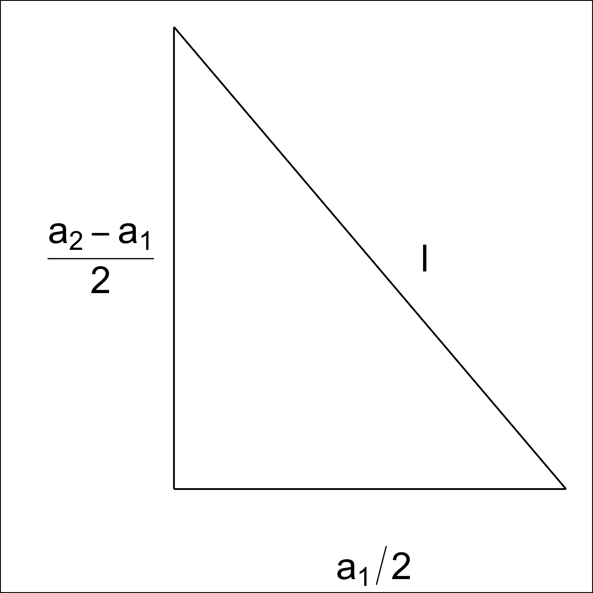

# Appendix to "Choosing Better NLDR Layouts by Evaluating the Model in the High-Dimensional Data Space" {#sec-appendix-a}


::: {.cell layout-align="center"}

:::


::: {.cell layout-align="center"}

:::


::: {.cell layout-align="center"}

:::


::: {.cell layout-align="center"}

:::


::: {.cell layout-align="center"}

:::


## Methods and hyper-parameters used to generate layouts

@tbl-fig-param contains the list of methods and hyper-parameters used for each of the layouts shown in the paper. 


::: {#tbl-fig-param .cell layout-align="center" tbl-pos='H' tbl-cap='NLDR methods and hyper-parameters used for each Figure in the main paper.'}
::: {.cell-output-display}


|Figure |NLDR method |Hyper-parameter(s)                                               |
|:------|:-----------|:----------------------------------------------------------------|
|$1$a   |UMAP        |n\_neighbors = 30, min\_dist = 0.3                               |
|$1$b   |UMAP        |n\_neighbors = 5, min\_dist = 0.8                                |
|$1$c   |UMAP        |n\_neighbors = 5, min\_dist = 0.01                               |
|$1$d   |tSNE        |perplexity = 5                                                   |
|$1$e   |tSNE        |perplexity = 30                                                  |
|$1$f   |PHATE       |knn = 5                                                          |
|$1$g   |TriMAP      |n\_inliers = 12, n\_outliers = 4, n\_random = 3                  |
|$1$h   |PaCMAP      |n\_neighbors = 30, init = random, MN\_ratio = 0.9, FP\_ratio = 5 |
|$2$    |tSNE        |perplexity = 47                                                  |
|$4$a   |tSNE        |perplexity = 47                                                  |
|$5$b   |tSNE        |perplexity = 47                                                  |
|$6$    |tSNE        |perplexity = 47                                                  |
|$8$a   |tSNE        |perplexity = 47                                                  |
|$8$b   |tSNE        |perplexity = 62                                                  |
|$8$c   |UMAP        |n\_neighbors = 15, min\_dist = 0.1                               |
|$8$d   |PHATE       |knn = 5                                                          |
|$8$e   |TriMAP      |n\_inliers = 12, n\_outliers = 4, n\_random = 3                  |
|$8$f   |PaCMAP      |n\_neighbors = 10, init = random, MN\_ratio = 0.5, FP\_ratio = 2 |
|$10$a  |UMAP        |n\_neighbors = 30, min\_dist = 0.3                               |
|$10$b  |UMAP        |n\_neighbors = 5, min\_dist = 0.8                                |
|$10$c  |UMAP        |n\_neighbors = 5, min\_dist = 0.01                               |
|$10$d  |tSNE        |perplexity = 5                                                   |
|$10$e  |tSNE        |perplexity = 30                                                  |
|$10$f  |PHATE       |knn = 5                                                          |
|$10$g  |TriMAP      |n\_inliers = 12, n\_outliers = 4, n\_random = 3                  |
|$10$h  |PaCMAP      |n\_neighbors = 30, init = random, MN\_ratio = 0.9, FP\_ratio = 5 |
|$11$a  |UMAP        |n\_neighbors = 30, min\_dist = 0.3                               |
|$11$e  |tSNE        |perplexity = 30                                                  |
|$12$a  |tSNE        |perplexity = 30                                                  |
|$12$b  |tSNE        |perplexity = 89                                                  |
|$12$c  |UMAP        |n\_neighbors = 15, min\_dist = 0.1                               |
|$12$d  |PHATE       |knn = 5                                                          |
|$12$e  |TriMAP      |n\_inliers = 12, n\_outliers = 4, n\_random = 3                  |
|$12$f  |PaCMAP      |n\_neighbors = 10, init = random, MN\_ratio = 0.5, FP\_ratio = 2 |
|$13$a  |tSNE        |perplexity = 30                                                  |
|$14$a  |tSNE        |perplexity = 30                                                  |
|$A4$a  |tSNE        |perplexity = 71                                                  |
|$A4$b  |UMAP        |n\_neighbors = 15, min\_dist = 0.1                               |
|$A4$c  |PaCMAP      |n\_neighbors = 10, init = random, MN\_ratio = 0.5, FP\_ratio = 2 |
|$A5$   |tSNE        |perplexity = 52                                                  |
|$A6$a  |UMAP        |n\_neighbors = 30, min\_dist = 0.3                               |
|$A6$b  |tSNE        |perplexity = 30                                                  |
|$A7$a  |UMAP        |n\_neighbors = 30, min\_dist = 0.3                               |
|$A7$b  |tSNE        |perplexity = 30                                                  |
|$A8$a  |UMAP        |n\_neighbors = 30, min\_dist = 0.3                               |
|$A8$b  |tSNE        |perplexity = 30                                                  |
|$A9$a  |UMAP        |n\_neighbors = 30, min\_dist = 0.3                               |
|$A9$b  |UMAP        |n\_neighbors = 5, min\_dist = 0.8                                |
|$A9$c  |UMAP        |n\_neighbors = 5, min\_dist = 0.01                               |
|$A9$d  |tSNE        |perplexity = 5                                                   |
|$A9$e  |tSNE        |perplexity = 30                                                  |
|$A9$f  |PHATE       |knn = 5                                                          |
|$A9$g  |TriMAP      |n\_inliers = 12, n\_outliers = 4, n\_random = 3                  |
|$A9$h  |PaCMAP      |n\_neighbors = 30, init = random, MN\_ratio = 0.9, FP\_ratio = 5 |
|$A10$a |tSNE        |perplexity = 30                                                  |
|$A10$b |tSNE        |perplexity = 89                                                  |
|$A10$c |UMAP        |n\_neighbors = 15, min\_dist = 0.1                               |
|$A10$d |PHATE       |knn = 5                                                          |
|$A10$e |TriMAP      |n\_inliers = 12, n\_outliers = 4, n\_random = 3                  |
|$A10$f |PaCMAP      |n\_neighbors = 10, init = random, MN\_ratio = 0.5, FP\_ratio = 2 |


:::
:::


## Videos links

Animations of the \pD{} tours that produced specific projections shown in some figures in the main paper are available on YouTube at the links given in @tbl-links.


::: {#tbl-links .cell layout-align="center" tbl-pos='H' tbl-cap='Videos of the langevitour animations and the linked plots.'}
::: {.cell-output-display}
`````{=html}
<table>
 <thead>
  <tr>
   <th style="text-align:left;"> Figure </th>
   <th style="text-align:left;"> URL </th>
  </tr>
 </thead>
<tbody>
  <tr>
   <td style="text-align:left;"> 4 </td>
   <td style="text-align:left;"> <a href="https://youtu.be/yHKTHK4UBiU">youtu.be/yHKTHK4UBiU</a> </td>
  </tr>
  <tr>
   <td style="text-align:left;"> 5 </td>
   <td style="text-align:left;"> <a href="https://youtu.be/FukiminrO90">youtu.be/FukiminrO90</a> </td>
  </tr>
  <tr>
   <td style="text-align:left;"> 11 </td>
   <td style="text-align:left;"> <a href="https://youtu.be/3VfK3M2gnZM">youtu.be/3VfK3M2gnZM</a>, <a href="https://youtu.be/Es84bwQcndU">youtu.be/Es84bwQcndU</a> </td>
  </tr>
  <tr>
   <td style="text-align:left;"> 13 </td>
   <td style="text-align:left;"> <a href="https://youtu.be/sUcGd57Swdg">youtu.be/sUcGd57Swdg</a>, <a href="https://youtu.be/QiklCjELUxo">youtu.be/QiklCjELUxo</a> </td>
  </tr>
</tbody>
</table>

`````
:::
:::


## Notation


::: {#tbl-notation .cell layout-align="center" tbl-pos='H' tbl-cap='Summary of notation for describing new methodology.'}
::: {.cell-output-display}


|Notation         |Description                                                                                      |
|:----------------|:------------------------------------------------------------------------------------------------|
|$n, p, k$        |number of observations, variables, embedding dimension, respectively                             |
|$\bm{X}, \bm{x}$ |$p$-dimensional data (population, sample)                                                        |
|$\bm{y}$         |$k$-dimensional layout                                                                           |
|$P$              |orthonormal basis, generating a $d\text{-}dimensional$ linear projection of $p$-dimensional data |
|$T$              |true  model                                                                                      |
|$g$              |functional mapping from \pD{} to \kD{}, especially as prescribed by NLDR                         |
|$\bm{\theta}$    |(Hyper-) parameters for NLDR method                                                              |
|$r$              |ranges of the embedding components                                                               |
|$C^{(j)}$        |$j$-dimensional bin centers                                                                      |
|$(b_1, b_2)$     |number of bins in each direction                                                                 |
|$(a_1, a_2)$     |binwidths, distance between centroids in each direction                                          |
|$(s_1, \ s_2)$   |starting coordinates of the hexagonal grid                                                       |
|$q$              |buffer to ensure hexgrid covers data, proportion of data range, 0-1                              |
|$m$              |number of non-empty bins                                                                         |
|$b$              |number of  hexagons in the grid                                                                  |
|$h$              |hexagonal id                                                                                     |
|$l$              |side length                                                                                      |
|$A$              |area                                                                                             |
|$n_h$            |number of points in hexagon $h$ (bin count)                                                      |
|$w_h$            |standardized number of points in hexagon $h$ (standardized bin counts)                           |


:::
:::


## Scripts


::: {#tbl-script-desc .cell layout-align="center" tbl-pos='H' tbl-cap='R and Python script files used to generate outputs in the main paper.'}
::: {.cell-output-display}


|Folder               |Script                                   |Description                                                                                                        |
|:--------------------|:----------------------------------------|:------------------------------------------------------------------------------------------------------------------|
|script               |additional\_functions.R                  |Helper functions to render the main paper.                                                                         |
|script               |evaluation.py                            |Python script implementing additional evaluation metrics such as RTA and GS.                                       |
|script               |nldr\_code.R                             |Wrapper functions for running multiple NLDR methods (UMAP, tSNE, PHATE, PaCMAP, TriMAP) with different parameters. |
|two\_nonlinear       |01\_gen\_data.R                          |Generates the 2NC7 dataset.                                                                                        |
|two\_nonlinear       |02\_gen\_true\_model.R                   |Creates the true structure of 2NC7 data.                                                                           |
|two\_nonlinear       |03\_gen\_embeddings.R                    |Computes multiple NLDR embeddings for the 2NC7 data.                                                               |
|two\_nonlinear       |04\_gen\_mse\_for\_diff\_methods.R       |Computes HBE with varying bin widths ($a_1$) for all NLDR embeddings.                                              |
|two\_nonlinear       |05\_gen\_rm\_lwd\_mse.R                  |Computes HBE with varying low density bin cutoff for all three binwidth ($a_1$) choices.                           |
|two\_nonlinear       |06\_gen\_model\_with\_tSNE.R             |Fits the model for the layout a.                                                                                   |
|two\_nonlinear       |07\_example\_evaluation\_metrics.R       |Calculates evaluation metrics for all NLDR layouts.                                                                |
|two\_nonlinear       |08\_gen\_model\_with\_PHATE.R            |Fits the model for the layout c.                                                                                   |
|five\_gau\_clusters  |01\_five\_gaussian\_cluster\_data\_emb.R |Generates data and multiple NLDR embeddings.                                                                       |
|five\_gau\_clusters  |02\_gen\_model\_with\_tSNE.R             |Fits the model for the layout a.                                                                                   |
|five\_gau\_clusters  |03\_gen\_model\_with\_UMAP.R             |Fits the model for the layout b.                                                                                   |
|five\_gau\_clusters  |04\_gen\_model\_with\_PaCMAP.R           |Fits the model for the layout c.                                                                                   |
|c\_shaped\_dens\_str |01\_gen\_data.R                          |Generates the $2\text{-}D$ curved sheet dataset.                                                                   |
|c\_shaped\_dens\_str |02\_gen\_embeddings\_uni\_dens.R         |Generates multiple NLDR embeddings.                                                                                |
|c\_shaped\_dens\_str |03\_gen\_model\_with\_tSNE.R             |Fits the model for the tSNE layout.                                                                                |
|pbmc3k               |01\_obtain\_pca\_author.R                |Obtains  author\'s PCA results.                                                                                    |
|pbmc3k               |02\_obtain\_umap\_authors.R              |Obtains  author\'s UMAP embeddings.                                                                                |
|pbmc3k               |03\_gen\_umap\_diff\_param.R             |Generates multiple UMAP embeddings with different hyper\-parameter values.                                         |
|pbmc3k               |04\_gen\_tsne\_diff\_param.R             |Generates multiple tSNE embeddings with different hyper\-parameter values.                                         |
|pbmc3k               |05\_gen\_phate.R                         |Generates a PHATE embeddings with default hyper\-parameters.                                                       |
|pbmc3k               |06\_gen\_trimap.R                        |Generates a TriMAP embeddings with default hyper\-parameters.                                                      |
|pbmc3k               |07\_gen\_pacmap.R                        |Generates a PaCMAP embeddings with default hyper\-parameters.                                                      |
|pbmc3k               |08\_gen\_mse\_for\_diff\_methods.R       |Computes HBE with varying bin widths ($a_1$) for all NLDR embeddings.                                              |
|pbmc3k               |09\_gen\_scDEED.R                        |Generates UMAP embeddings from scDEED results.                                                                     |
|pbmc3k               |10\_pre\_process\_for\_embedding.R       |Generates PBMC3k data used for scDEED results.                                                                     |
|pbmc3k               |11\_gen\_mse\_for\_diff\_tsne\_scD.R     |Computes HBE with varying bin widths ($a_1$) for tSNE embeddings.                                                  |
|pbmc3k               |12\_gen\_mse\_for\_diff\_umap\_scD.R     |Computes HBE with varying bin widths ($a_1$) for UMAP embeddings.                                                  |
|pbmc3k               |13\_gen\_model\_with\_UMAP.R             |Fits the model for the layout a.                                                                                   |
|pbmc3k               |14\_gen\_model\_with\_tSNE.R             |Fits the model for the layout e.                                                                                   |
|pbmc3k               |15\_gen\_model\_with\_UMAP\_scD.R        |Fits the model for the layout a.                                                                                   |
|pbmc3k               |16\_gen\_model\_with\_tSNE\_scD.R        |Fits the model for the layout b.                                                                                   |
|pbmc3k               |17\_evaluation\_metrics.R                |Calculates evaluation metrics for all NLDR layouts.                                                                |
|pbmc3k               |18\_evaluation\_metrics\_scD.R           |Calculates evaluation metrics for all NLDR layouts.                                                                |
|mnist                |01\_data\_preprocessing.R                |Computes first $10$ principal components and save data.                                                            |
|mnist                |02\_gen\_diff\_embeddings.R              |Generates multiple NLDR embeddings.                                                                                |
|mnist                |03\_gen\_mse\_for\_diff\_methods.R       |Computes HBE with varying bin widths ($a_1$) for all NLDR embeddings.                                              |
|mnist                |04\_gen\_model\_with\_tSNE.R             |Fits the model for the layout a.                                                                                   |
|mnist                |05\_evaluation\_metrics.R                |Calculates evaluation metrics for all NLDR layouts.                                                                |
|mnist                |06\_link\_brush\_layout\_e.R             |Creates interactive linked brushing with layout e.                                                                 |


:::
:::


## Generating the 2NC7 data

This data is constructed by simulating two clusters, each consisting of $1000$ observations. The C-shaped cluster is generated from $\theta \sim U(\text{-}3\pi/2, 0)$, $X_1 = \sin(\theta)$, $X_2 \sim U(0, 2)$ (adding thickness to the C), $X_3 = \text{sign}(\theta) \times (\cos(\theta) - 1)$, $X_4 = \cos(\theta)$. Observations lie on a \gD{} manifold in \sD{}. The other cluster is from $X_1 \sim U(0, 2)$, $X_2 \sim U(0, 3)$, $X_3 = \text{-}(X_1^3 + X_2)$, and $X_4 \sim U(0, 2)$. It is also curved, but observations lie on a \tD{} manifold in \sD{}. Three more variables, $X_5, X_6, X_7$, that are small amounts of pure noise, are added. We would consider $T=(X_1, X_2, X_3, X_4)$ to be the geometric structure (true model) that we hope to capture (@fig-true-data).


::: {.cell layout-align="center"}

:::


::: {.cell layout-align="center"}
::: {.cell-output-display}
{#fig-true-data fig-align='center' fig-alt='A two-panel figure showing two different 2-D projections of the true geometric structure underlying the 2NC7 dataset, with observed data overlaid. Each panel displays a dense cloud of points representing the simulated observations, together with smooth line structures indicating the underlying manifold. Panel (a) shows a projection in which one cluster forms a thick, curved C-shaped structure, while the second cluster appears as a distinct curved surface intersecting the projection. Panel (b) shows an alternative projection of the same data, where the relative orientation of the two clusters differs, but both curved manifolds remain visible and separable. In both views, the points lie close to the projected model curves, indicating that the observed data closely follow the underlying 4-D geometric structures despite the added noise dimensions.' width=100%}
:::
:::


## Computing hexagon grid configurations

Given range of embedding component, $r_2$, number of bins along the x-axis, $b_1$, and buffer proportion, $q$, hexagonal starting point coordinates, $s_1 = \text{-}q$, and $s_2 = \text{-}qr_2$. The purpose is to find the width of the hexagon, $a_1$, and the number of bins along the y-axis, $b_2$.

Geometric arguments give rise to the following constraints.

$\text{min }a_1 \text{ s.t.}$

$$
s_1 - \frac{a_1}{2} < 0,
$$ {#eq-equation1}

$$
s_1 + (b_1 - 1) \times a_1 \geq 1,
$$ {#eq-equation2}

$$
s_2 - \frac{a_2}{2} < 0,
$$ {#eq-equation4}

$$
s_2 + (b_2 - 1) \times a_2 \geq r_2.
$$ {#eq-equation5}

Since $a_1$ and $a_2$ are distances,

$$
a_1, a_2 > 0.
$$ Also, $(s_1, s_2) \in (\text{-}0.1, \text{-}0.05)$ as these are multiplicative offsets in the negative direction.

@eq-equation1 can be rearranged as,

$$
a_1 > 2s_1
$$

which given $s_1 < 0$ and $a_1 > 0$ will *always* be true. The same logic follows for @eq-equation4 and substituting $a_2 = \sqrt{3}a_1/{2}$, and $s_2 = \text{-}qr_2$ to @eq-equation4 can be written as,

$$
a_1 > -\frac{4}{\sqrt{3}}qr_2
$$

Also, substituting $a_2 = \sqrt{3}a_1/{2}$, $s_2 = \text{-}qr_2$ and rearranging @eq-equation5 gives:

$$
a_1 \geq \frac{2(r_2 + qr_2)}{\sqrt{3}(b_2 - 1)}.
$$ {#eq-equation6}

Similarly, substituting $s_1 = \text{-}q$ @eq-equation2 becomes,

$$
a_1 \geq \frac{(1 + q)}{(b_1 - 1)}.
$$ {#eq-equation7}

This is a linear optimization problem. Therefore, the optimal solution must occur on a vertex. So, by setting @eq-equation6 equals to @eq-equation7 gives,

$$
\frac{2(r_2 + qr_2)}{\sqrt{3}(b_2 - 1)} = \frac{(1 + q)}{(b_1 - 1)}.
$$ 

After rearranging this,

$$
b_2 = 1 + \frac{2r_2(b_1 - 1)}{\sqrt{3}}
$$

and since $b_2$ should be an integer,

$$
b_2 = \Big\lceil1 +\frac{2r_2(b_1 - 1)}{\sqrt{3}}\Big\rceil.
$$ {#eq-equation8}

Furthermore, with known $b_1$ and $b_2$, by considering @eq-equation2 or @eq-equation5 as the *binding* or *active constraint*, can compute $a_1$.

If @eq-equation2 is active, then,

$$
\frac{(1 + q)}{(b_1 - 1)} < \frac{2(r_2 + qr_2)}{\sqrt{3}(b_2 - 1)}.
$$

Rearranging this gives,

$$
r_2 > \frac{\sqrt{3}(b_2 - 1)}{2(b_1 - 1)}.
$$

Therefore, if this equality is true, then 
$$
a_1 = \frac{(1+q)}{(b_1 - 1)},
$$
otherwise, 
$$
a_1 = \frac{2r_2(1+q)}{\sqrt{3}(b_2 - 1)}.
$$

## Binning the data

Points are assigned to the bin they fall into based on the nearest centroid (@fig-assign-data). If a point is equidistant from multiple centroids, it is assigned to the centroid with the smallest bin ID.


::: {.cell layout-align="center"}

:::


::: {.cell layout-align="center"}

:::


::: {.cell layout-align="center"}
::: {.cell-output-display}
{#fig-assign-data fig-align='center' fig-pos='!ht' fig-alt='A two-panel figure showing how observations are assigned to bins using a hexagonal grid. In both panels, the x- and y-axes represent two numerical dimensions of the data, with a regular grid of hexagonal cells covering the plotting area. Each hexagon is coloured according to the bin (centroid) to which it is assigned. In the first panel, hexagons are coloured based on the nearest-centroid rule, where each cell is assigned to the closest centroid in the plane. In the second panel, hexagons that are equidistant to multiple centroids are highlighted to illustrate the tie-breaking rule: such cells are assigned to the centroid with the smallest bin identifier, resulting in a small number of hexagons changing color compared to the first panel. Overall, most hexagons form contiguous regions around each centroid, with only boundary cells affected by the tie-breaking procedure.' width=100%}
:::
:::


## Area of a hexagon

The area of a hexagon is defined as $A = 3\sqrt{3}l^2/2$, where $l$ is the side length of the hexagon (@fig-tri-param). $l$ can be computed using $a_1$ and $a_2$.


::: {.cell layout-align="center"}

:::


::: {.cell layout-align="center"}
::: {.cell-output-display}
{#fig-tri-param fig-align='center' fig-pos='!ht' fig-alt='A simple drawing of a right triangle on Cartesian axes. The x-axis runs from about 0 to 4 and the y-axis from about 0 to 3. The triangle’s vertices are at (0,0), (4,0), and (0,3), forming a right angle at the origin, where the horizontal leg lies along the x-axis and the vertical leg lies along the y-axis. The horizontal side is length 4, the vertical side is length 3, and the hypotenuse slopes down from (0,3) to (4,0). The figure illustrates the standard notation for the components of a right triangle, with the two legs aligned to the axes and the hypotenuse connecting their endpoints.' width=30%}
:::
:::


By applying the Pythagorean theorem, we obtain,

$$
l^2 = \left(\frac{a_1}{2}\right)^2 + \left(\frac{a_2 - l}{2}\right)^2.
$$
Next, rearranging the terms, we get,

$$
l^2 - \left(\frac{a_2 - l}{2}\right)^2 = \left(\frac{a_1}{2}\right)^2,
$$

$$
\left[l - \left(\frac{a_2 - l}{2}\right)\right]\left[l + \left(\frac{a_2 - l}{2}\right)\right] = \left(\frac{a_1}{2}\right)^2,
$$

$$
3l^2 + 2a_2l - (a_1^2 + a_2^2) = 0.
$$

Finally, by solving the quadratic equation, we compute,

$$
l = \frac{-2a_2 \pm \sqrt{4a_2^2 - 24[-(a_1^2 + a_2^2)]}}{6},
$$

$$
l = \frac{-a_2 \pm \sqrt{a_2^2 - 6[-(a_1^2 + a_2^2)]}}{3},
$$

where $l > 0$.

## Curiosities about NLDR results discovered by examining the model in the data space {#sec-curiosities}

With the drawing of the model in the data, several interesting differences between the NLDR methods can be observed.

### Some methods appear to order points in the layout

The \gD{} model representations generated from some NLDR methods, especially PaCMAP, are unreasonably flat or like a pancake. A simple example of this can be seen with data simulated to contain five \fD{} Gaussian clusters. Each cluster is essentially a ball in \fD{}, so there is no \gD{} representation; rather, the model in each cluster should resemble a crumpled sheet of paper that fills out \fD{}.

@fig-five-gau-projs a1, b1, c1 show the \gD{} layouts for (a) tSNE, (b) UMAP, and (c) PaCMAP, respectively. The default hyper-parameters for each method are used. In each layout, we can see an accurate representation where all five clusters are visible, although with varying degrees of separation.

The models are fitted to each of these layouts. @fig-five-gau-projs a2, b2, c2 show the fitted models in a projection of the \fD{} space, taken from a tour. These clusters are fully \fD{} in nature, so we would expect the model to be a *crumpled sheet* that stretches in all four dimensions. This is what is mostly observed for tSNE and UMAP. The curious detail is that the model for PaCMAP is closer to a *pancake* in shape in every cluster! This single projection only shows this in three of the five clusters, but if we examine a different projection, the other clusters also exhibit the pancake. While we don't know what exactly causes this, it is likely due to some ordering of points in the \gD{} PaCMAP layout that induces the flat model. One could imagine that if the method used principal components on all the data, it might induce some ordering that would produce the flat model. If this were the reason, the pancaking would be the same in all clusters, but it is not: The pancake is visible in some clusters in some projections, but in other clusters it is visible in different projections. It might be due to some ordering by nearest neighbors in a cluster. The PaCMAP documentation doesn't provide any helpful clues. That this happens, though, makes the PaCMAP layout inadequate for representing the high-dimensional data. 

<!--Projections-->
<!--five_gau_clusters/02_gen_model_with_tSNE.R-->

::: {.cell layout-align="center"}

:::


::: {.cell layout-align="center"}

:::


<!--five_gau_clusters/03_gen_model_with_UMAP.R-->

::: {.cell layout-align="center"}

:::


::: {.cell layout-align="center"}

:::


<!--five_gau_clusters/04_gen_model_with_PaCMAP.R-->

::: {.cell layout-align="center"}

:::


::: {.cell layout-align="center"}

:::


::: {.cell layout-align="center"}
::: {.cell-output-display}
![NLDR's organize points in the \gD{} layout in different ways, possibly misleadingly, illustrated using three layouts: (a) tSNE, (b) UMAP, (c) PaCMAP. The data has five Gaussian clusters in \fD{}. The bottom row of plots shows a \gD{} projection from a tour on \fD{}, revealing the differences generated by the layouts on the model fits.  We would expect the model fit to be like that in (a2), where it is distinctly separate for each cluster but like a hairball in each. This would indicate the distinct clusters, each being fully \fD{}. With (c2), the curiosity is that the model is a \gD{} pancake shape in \fD{}, indicating that there is some ordering of points done by PaCMAP, possibly along some principal component axes. Videos of the langevitour animations are available at <https://youtu.be/I-kxCwVfqiQ>, <https://youtu.be/gD1P01FUPyU>, and <https://youtu.be/MxJ_srOFQNk> respectively.](A-appA_files/figure-html/fig-five-gau-projs-1.png){#fig-five-gau-projs fig-align='center' fig-pos='!ht' fig-alt='A multi-panel figure comparing three NLDR layouts: tSNE, UMAP, and PaCMAP applied to the same dataset consisting of five Gaussian clusters in four dimensions. The top row shows the 2-D layouts produced by (a) tSNE, (b) UMAP, and (c) PaCMAP, where points are grouped into five visually distinct clusters but arranged differently by each method. The bottom row shows corresponding projections from a tour through the original four-dimensional space, with fitted models overlaid for each cluster. In the tSNE and UMAP cases, the fitted models within each cluster appear complex and highly curved, filling the projected space and indicating that the clusters retain substantial four-dimensional structure. In contrast, the PaCMAP projection shows several clusters with much flatter, pancake-like fitted surfaces, suggesting that the layout imposes an artificial ordering that reduces apparent dimensionality. Together, the panels illustrate how different NLDR methods can lead to different geometric interpretations of the same high-dimensional data.' width=100%}
:::
:::


### Sparseness creates a contracted \gD{} layout {#sec-effect-dens}

Differences in density can arise from sampling at different rates in different subspaces of \pD{}. For example, the data shown in @fig-one-dens_clust-error all lie on a \gD{} curved sheet in \fD{}, but one end of the sheet is sampled densely and the other very sparsely. It was simulated to illustrate the effect of the density difference on layout generated by an NLDR, illustrated using the tSNE results, but it happens with all methods.

@fig-one-dens_clust-error (a2, b2) shows a \gD{} layout for tSNE created using the default hyper-parameters. One would expect to see a rectangular shape if the curved sheet is flattened, but the layout is triangular. The other two displays show the residuals as a dot density plot (a1, b1), and a \gD{} projection of the data and the model from \fD{} (a3, b3). Using linked brushing between the plots, we can highlight points in the tSNE layout, and examine where they fall in the original \fD{}. The darker (maroon) points indicate points that have been highlighted by linking. In row a, the points at the top of the triangle are highlighted, and we can see these correspond to higher residuals, and also to all points at the low density end of the curved sheet. In row b, points at the lower left side of the triangle are highlighted, which corresponds to smaller residuals and one corner of the sheet at the high-density end of the curved sheet.

The tSNE behaviour is to squeeze the low-density area of the data together into the layout. This is common in other NLDR methods also, which means analysts need to be aware that if their data is not sampled relatively uniformly, apparent closeness in the \gD{} may correspond to sparseness in \pD{}.

<!--c_shaped_dens_str/03_gen_model_with_tSNE.R-->

::: {.cell layout-align="center"}

:::


::: {.cell layout-align="center"}

:::


::: {.cell layout-align="center"}

:::


::: {.cell layout-align="center"}
::: {.cell-output-display}
![Exploring the effect of density on the NLDR layout using a \gD{} curved sheet in \fD{} with different densities at each end. Three plots are linked: density plot of residuals (a1, b1), NLDR layout (a2, b2), projection of \fD{} model and data (a3, b3). The brown points indicate the selected set, which is different in each row. In (a2), the top part of the triangular shape is selected, which corresponds to higher residuals (a1) and the sparse end of the structure (a3). In (b2), one of the other corners is highlighted, which can be seen to correspond to low residuals (b1) and one side of the dense end of the data (b3). While the tSNE layout represents the dense end of the sheet correctly as two corners in the layout, it contracts the sparse end of the sheet into a single corner. Video of the langevitour animation is available at <https://youtu.be/-KsQH0rII2A>.](A-appA_files/figure-html/fig-one-dens_clust-error-1.png){#fig-one-dens_clust-error fig-align='center' fig-pos='!ht' fig-alt='A multi-panel figure illustrating how density affects a tSNE layout for a curved sheet embedded in higher-dimensional space. Each row contains three linked plots: a density plot of model residuals on the left, a tSNE layout in the middle, and a projection of the original high-dimensional model and data on the right. Points are colored, with a subset highlighted in brown to indicate a brushed selection. In the top row (a), the highlighted points form the upper corner of the triangular tSNE layout, corresponding to higher residuals in the density plot and to the sparse end of the curved sheet in the original space. In the bottom row (b), a different corner of the tSNE triangle is highlighted, corresponding to lower residuals and to one side of the dense end of the sheet. The tSNE layout represents the dense end of the sheet as two distinct corners but collapses the sparse end into a single corner, showing how variations in point density can distort the layout.' width=100%}
:::
:::


## PBMC3k: comparison with results of scDEED recommendations

<!-- ### Comparison with results of scDEED recommendations -->

<!-- XXX What this section needs: -->

<!-- - connect this with previous section, not make it seem like a completely new. connections are: nldr used to show clustering, scDEED provides a different approach to decide which is best. -->
<!-- - why these two? assume one is the published figure, and second is one recommended by scDEED, which our results confirm is better. -->
<!-- - Refer to figure in text -->
<!-- - Fig 16 not necessary -->

<!-- CHANGES WERE MADE BASED ON THIS THINKING -->


<!-- <!-- In the field of single-cell studies, clustering is a common analytical task used to identify groups of cells with similar expression profiles. Non-linear dimensional reduction (NLDR) methods are frequently employed to visualize these clusters and help validate the results. However, it is well known that the 2D embeddings produced by t-SNE and UMAP may not accurately reflect the similarities among cell clusters. ALREADY STATED IN PREVIOUS SECTION -->  

As we were writing this paper @xia2024 appeared proposing a new method called scDEED, helping to assess the validity of a \gD{} embedding. scDEED calculates a reliability score for each cell embedding based on the similarity between the cell’s \gD{} embedding neighbors and its neighbors prior to embedding. A low reliability score suggests a dubious embedding. It can help in deciding on optimal hyper-parameters. Here, we illustrate how our method compares with the results from scDEED.

Note that @xia2024 uses a different PBMC dataset than that used by @chen2024, shown by us in the main paper example, which is why this comparison is shown here and not in the main paper. Their data contains $31,021$ cells including cell type labels, and the gene expression levels were in the unit of log-transformed UMI count per $10,000$. They focused on three sequencing methods (inDrops, DropSeq, and SeqWell) and four common cell types: Cytotoxic T cell, CD4+T cell, CD14+ Monocyte, and B cell. Pre-processing follows the process in @xia2024 again using the Human Peripheral Blood Mononuclear Cells (PBMC) data. 

For illustration purposes, we only selected cells generated with inDrops ($n=5858$ cells). Also, @xia2024 used the first $9$ principal components to generate the UMAP and tSNE with default hyper-parameters. The objective is to determine what scDEED suggests is the best layout with what HBE would choose. Layout a (@fig-pbmc-mse-umap) is generated from the hyper-parameters suggested by @chen2024, and layout b (@fig-pbmc-mse-umap) is with suggested hyper-parameters by scDEED to be more accurate. <!--Layouts a and b contain $46$ and $83$ dubious cells respectively.--> The HBE vs binwidth ($a_1$) plot (@fig-pbmc-mse-umap) illustrates that our approach would suggest that scDEED is correct here, that layout b is more accurately reflecting the cluster structure in the PBMC data. This is also supported by examining the models in the data space, as shown in @fig-model-pbmc-author-proj.

<!-- @fig-pbmc-mse-umap compares the metrics rARNX, rRTA, rSC, rGS, along with HBE computed on $a_1=0.04$. This is a parallel coordinate plot where the y-axis shows a normalized score to ensure the metrics are on the same scale. Each line corresponds to one layout. Most metrics (rSC, rARNX, and HBE) consistently indicate that the optimized layout (b) provides a better representation, while rRTA, and rGS slightly favor the published layout. -->


::: {.cell layout-align="center"}

:::


<!--pbmc3k/11_gen_mse_for_diff_tsne_scD.R-->
<!--pbmc3k/11_gen_mse_for_diff_umap_scD.R-->

::: {.cell layout-align="center"}

:::


::: {.cell layout-align="center"}

:::


::: {.cell layout-align="center"}

:::


::: {.cell layout-align="center"}
::: {.cell-output-display}
![Comparing the published layout (a) with what would be suggested to be optimal by scDEED (b), using HBE for varying (i) binwidth ($a_1$), and (ii) average bin count ($\bar{n}_h$), on a subset of PBMC3k data. Color represents NLDR layouts. HBE would corroborate that the scDEED optimized layout is better than what was originally published. Plot (ii), which accounts for the density within clusters by using average bin count, shows reduced differences between layouts, indicating that part of the variation in (i) is driven by cluster density rather than true structural differences. Comparison of scaled evaluation metrics (iii) (rRTA, rSC, rGS, rARNX, and HBE using $a_1=0.04$) for two NLDR layouts of the PBMC3k data, the originally published layout (a) and the scDEED optimized layout (b). Each line represents a layout, with color matching the corresponding scatterplots. Most metrics (rSC, rARNX, and HBE) consistently indicate that the optimized layout (b) provides a better representation, while rRTA and rGS slightly favor the published layout.](A-appA_files/figure-html/fig-pbmc-mse-umap-1.png){#fig-pbmc-mse-umap fig-align='center' fig-pos='!ht' fig-alt='A multi-panel line plot compares two UMAP layouts of PBMC single-cell data. Panel (i) shows HBE score on the vertical axis versus binwidth parameter (a_1) on the horizontal axis, with two smooth lines representing layouts a (published) and b (scDEED-suggested) distinguished by color or line type. Panel (ii) shows HBE score versus average bin count (n_h), with two lines for the layouts showing similar trends as panel (i). Panel (iii) shows scaled evaluation metrics (rRTA, rSC, rGS, rARNX, HBE at a_1=0.04) on the vertical axis versus metric type on the horizontal axis, with lines for layouts a and b connecting the metric values, distinguished by color or line type. Across all panels, lines are continuous, smooth, and colors consistently represent the layouts, with no isolated points or extreme spikes.' width=100%}
:::
:::


<!--pbmc3k/15_gen_model_with_UMAP_scD.R-->

::: {.cell layout-align="center"}

:::


::: {.cell layout-align="center"}

:::


<!--pbmc3k/16_gen_model_with_tSNE_scD.R-->

::: {.cell layout-align="center"}

:::


::: {.cell layout-align="center"}

:::


::: {.cell layout-align="center"}
::: {.cell-output-display}
![Compare the published \gD{} layout (@fig-pbmc-mse-umap a) made with UMAP and the \gD{} layout made with tSNE selected as optimal by scDEED (@fig-pbmc-mse-umap b) and also HBE (@fig-pbmc-mse-umap). The two plots on the right show projections from a tour, with the models overlaid. The published layout a suggests three separated clusters, with two of them are close, but this is not present in the data. While there may be three clusters, they are not well-separated. The difference in model fit also indicates this: the published layout a does not capture the nonlinear structure of the clusters like the model generated from layout b. This supports the choice that layout b is the better representation of the data, because it shows close clusters. Videos of the langevitour animations are available at <https://youtu.be/ffiB4MGWyn8> and <https://youtu.be/e7XNL18co1c> respectively.](A-appA_files/figure-html/fig-model-pbmc-author-proj-1.png){#fig-model-pbmc-author-proj fig-align='center' fig-pos='!ht' fig-alt='A multi-panel figure showing PBMC single-cell data. The left panel shows the published UMAP layout (layout a) with the 2-D wireframe, with three clusters visible and two clusters positioned close together; axes correspond to the first two UMAP dimensions spanning the full data range, with a roughly square aspect ratio. The middle panel shows the scDEED-selected tSNE layout (layout b) overlaying a 2-D wireframe on the first two tSNE dimensions, with three clusters more evenly spaced; axes span the full range, and the aspect ratio is roughly square. Points in both panels are colored by cluster or layout. The two panels on the right show tour projections of the same data with models overlaid; points represent cells, lines or overlays indicate model structure, axes correspond to the projection dimensions, and clusters and relative distances between points are visible. Across all panels, points and lines are continuous with no extreme outliers, and cluster density, spacing, and arrangement are visually apparent.' width=90%}
:::
:::


## Compare HBE with existing evaluation metrics

@fig-comp-metric-pbmc and @fig-comp-metric-mnist compare HBE with commonly used evaluation metrics such as rRTA, rARNX, rSC, and rGS across multiple NLDR layouts. These visual comparisons highlight that HBE behaves differently from these existing metrics due to the different settings involved.


::: {.cell layout-align="center"}

:::


::: {.cell layout-align="center"}

:::


::: {.cell layout-align="center"}

:::


::: {.cell layout-align="center"}
::: {.cell-output-display}
![Comparison of scaled evaluation metrics (rRTA, rSC, rGS, rARNX, and HBE with $a_1 = 0.06$) for the eight NLDR layouts computed on the PBMC3k data, shown as a parallel coordinate plot. The color of each line corresponds to an NLDR layout. All, except rGS and rARNX agree that layout e is best or very close to best. Layout d is best according to HBE and rARNX, but considered to be much less optimal by rRTA, rSC, and rGS. Layout f is considered poor by rARNX and HBE. Layout a is considered close to the best by rGS and rSC.](A-appA_files/figure-html/fig-comp-metric-pbmc-1.png){#fig-comp-metric-pbmc fig-align='center' fig-pos='!ht' fig-alt='A parallel coordinate plot comparing five scaled evaluation metrics—rRTA, rSC, rGS, rARNX, and HBE (with a_1 = 0.06) across eight NLDR layouts computed on the PBMC3k dataset. Each vertical axis represents one metric, scaled to a common range, and each colored line corresponds to a single NLDR layout, connecting its values across all five metrics. The lines cross the axes at different heights, showing how layouts rank differently depending on the metric. Most layouts show broadly similar performance across rRTA, rSC, and rGS, with layout e consistently scoring highest or near-highest on these measures. In contrast, rARNX and HBE show stronger disagreement with the other metrics: layout d ranks best on HBE and rARNX but much lower on rRTA, rSC, and rGS, while layout f scores poorly on both rARNX and HBE. Layout a performs well on rGS and rSC but is less favored by the remaining metrics. Overall, the figure highlights both agreement and disagreement among the metrics in how they assess layout quality.' width=100%}
:::
:::


::: {.cell layout-align="center"}

:::


::: {.cell layout-align="center"}

:::


::: {.cell layout-align="center"}

:::


::: {.cell layout-align="center"}
::: {.cell-output-display}
![Comparison of scaled evaluation metrics (rARNX, rRTA, rSC, rGS, and HBE using $a_1=0.04$) for six NLDR layouts computed on the MNIST digit 1 data using a parallel coordinate plot. Each line represents a layout (a–f), with colors corresponding to the scatterplots shown on the right. The metrics display different ranking patterns, indicating that no single measure fully captures embedding quality. Layout a is identified as the best according to HBE and rRTA, but is considered much less optimal by rARNX, rSC, and rGS. Layout e is considered the worst, or close to the poorest, by all metrics. Layouts a and f show similar patterns of agreement across metrics, except for rRTA, where layout a performs the best and layout f the worst. Layout c is the worst in rARNX, rSC, and HBE.](A-appA_files/figure-html/fig-comp-metric-mnist-1.png){#fig-comp-metric-mnist fig-align='center' fig-pos='!ht' fig-alt='A parallel coordinate plot comparing five scaled evaluation metrics—rARNX, rRTA, rSC, rGS, and HBE (with a_1=0.04)—across six NLDR layouts (labelled a through f) computed on the MNIST digit 1 dataset. Each vertical axis represents one metric, scaled to a common range, and each colored line corresponds to a single layout, connecting its values across all metrics. The lines cross the axes at different heights, showing that layouts are ranked differently depending on the metric used. Layout a scores highest on HBE and rRTA but much lower on rARNX, rSC, and rGS. Layout e consistently scores lowest, or near lowest, across all metrics. Layouts a and f follow similar trends across most metrics, except for rRTA, where layout a performs best and layout f performs worst. Layout c shows particularly low values for rARNX, rSC, and HBE. Overall, the figure highlights disagreement among the metrics and illustrates that no single measure fully captures embedding quality.' width=100%}
:::
:::

