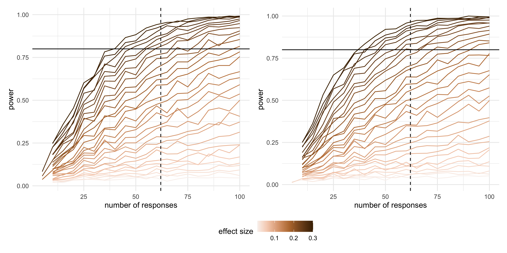

# Appendix to "Perception and Misperception of Clustering in Nonlinear Dimension Reduction: A User Study" {#sec-appendix-b}


::: {.cell layout-align="center"}

:::


::: {.cell layout-align="center"}

:::


::: {.cell layout-align="center"}

:::


::: {.cell layout-align="center"}

:::


## Scripts


::: {#tbl-script-desc .cell layout-align="center" tbl-pos='H' tbl-cap='R script files used to generate outputs in the main paper.'}
::: {.cell-output-display}


|Script                                                 |Description                                                                                                                                        |
|:------------------------------------------------------|:--------------------------------------------------------------------------------------------------------------------------------------------------|
|additional\_functions.R                                |Helper functions to render the main paper.                                                                                                         |
|01\_attention\_check\_data\_structures.R               |Function to generate three- and four- Gaussian clusters data  for attention check.                                                                 |
|01\_data\_structure\_components.R                      |Functions to generate data structure components for non-attention check.                                                                           |
|02\_data\_structures.R                                 |Functions to generate three clusters data structure for non-attention check.                                                                       |
|03\_exp\_design\_with\_method\_and\_distance\_factor.R |Creates the experimental design, varying NLDR method and distance scale factors.                                                                   |
|04\_exp\_design\_with\_new\_ds\_factors.R              |Extends the experimental design to include additional distance scale factor.                                                                       |
|05\_gen\_clust3\_attention\_check\_data.R              |Generates three-cluster data for attention check.                                                                                                  |
|05\_gen\_cluster3\_high\_d\_data.R                     |Generates three-cluster data with medium-large distance scale factor.                                                                              |
|06\_gen\_clusters3\_with\_diff\_dist.R                 |Generates three-cluster data with varying inter-cluster distance scale factors.                                                                    |
|09\_gen\_clusters\_merge\_all\_data.R                  |Merges all generated cluster data (attention and non-attention check) into a single combined dataset.                                              |
|10\_gen\_embeddings.R                                  |Computes multiple NLDR embeddings for specific distance scale factor.                                                                              |
|11\_comb\_emb\_default\_data.R                         |Combines NLDR embeddings for all distance scale factors.                                                                                           |
|12\_comb\_data.R                                       |Merge all NLDR embeddings generated for attention and non-attention check.                                                                         |
|13\_data\_processing\_method\_ds\_factor\_missings.R   |Processes collected experimental data and generates the file, containing all relevant details for the same data structure shown in both displays.  |
|13\_data\_processing\_method\_ds\_factor.R             |Processes collected experimental data and generates the  file, containing all relevant details for the same data structure shown in both displays. |
|17\_compute\_distance\_btw\_centroids.R                |Computes different distance metrics between cluster in the high-dimensional space.                                                                 |
|19\_find\_which\_replicates\_missing.R                 |Identifies missing responses across experimental conditions.                                                                                       |


:::
:::


## Data sets

@tbl-dt-str summarizes the three-cluster data sets used in the experiment. Each data set was generated using the `cardinalR` package [@jayani2025b] and comprises three clusters with distinct structures. The collection of structures spans a wide range of nonlinear, curved, and density-based configurations in $4\text{-}D$ space, providing controlled yet varied settings for assessing perceptual differences across NLDR methods. All data sets used in this experiment are available at [github.com/JayaniLakshika/Monash_PhD_thesis/data/vis-exp/high_d_data_three_clust_all.rds](https://github.com/JayaniLakshika/Monash_PhD_thesis/blob/main/data/vis-exp/high_d_data_three_clust_all.rds).


::: {#tbl-dt-str .cell layout-align="center" tbl-cap='Description of the simulated three-cluster data structures. Each data structure consists of three clusters with different geometric shapes.'}
::: {.cell-output-display}


|Data structure |Cluster1             |Cluster2   |Cluster3                 |
|:--------------|:--------------------|:----------|:------------------------|
|three_clust_01 |curv                 |elliptical |blunted_cone             |
|three_clust_02 |s_curve              |cube       |pyramid_rectangular_base |
|three_clust_03 |curvy_cylinder       |hemisphere |pyramid_triangular_base  |
|three_clust_04 |curv2                |Gaussian   |filled_hexagonal_pyramid |
|three_clust_05 |nonlinear_hyperbola  |elliptical |blunted_cone             |
|three_clust_06 |crescent             |cube       |pyramid_rectangular_base |
|three_clust_07 |nonlinear_hyperbola2 |hemisphere |pyramid_triangular_base  |
|three_clust_08 |conic_spiral         |Gaussian   |filled_hexagonal_pyramid |
|three_clust_09 |helical_hyper_spiral |cube       |blunted_cone             |
|three_clust_10 |spherical_spiral     |Gaussian   |pyramid_triangular_base  |
|three_clust_11 |curv                 |elliptical |pyramid_rectangular_base |
|three_clust_12 |s_curve              |hemisphere |filled_hexagonal_pyramid |
|three_clust_13 |curvy_cylinder       |cube       |blunted_cone             |
|three_clust_14 |curv2                |Gaussian   |pyramid_triangular_base  |
|three_clust_15 |nonlinear_hyperbola  |elliptical |pyramid_rectangular_base |
|three_clust_16 |crescent             |hemisphere |filled_hexagonal_pyramid |
|three_clust_17 |nonlinear_hyperbola2 |cube       |blunted_cone             |
|three_clust_18 |conic_spiral         |Gaussian   |pyramid_triangular_base  |
|three_clust_19 |helical_hyper_spiral |hemisphere |filled_hexagonal_pyramid |
|three_clust_20 |spherical_spiral     |elliptical |blunted_cone             |
|three_clust_21 |curv                 |Gaussian   |pyramid_rectangular_base |
|three_clust_22 |s_curve              |cube       |pyramid_triangular_base  |
|three_clust_23 |curvy_cylinder       |hemisphere |filled_hexagonal_pyramid |
|three_clust_24 |curv2                |elliptical |blunted_cone             |
|three_clust_25 |nonlinear_hyperbola2 |Gaussian   |pyramid_rectangular_base |
|three_clust_26 |crescent             |cube       |pyramid_triangular_base  |
|three_clust_27 |nonlinear_hyperbola2 |hemisphere |filled_hexagonal_pyramid |
|three_clust_28 |conic_spiral         |elliptical |blunted_cone             |
|three_clust_29 |Gaussian             |Gaussian   |Gaussian                 |
|three_clust_30 |Gaussian             |Gaussian   |Gaussian                 |


:::
:::


Animations of the $4\text{-}D$ tours that were used for the study’s non-attention-check SAME trials, non-attention-check DIFFERENT trials, and attention-check trials are available on YouTube at the links given in @tbl-links-same-html, @tbl-links-diff-html, and @tbl-links-at-html.


::: {.cell layout-align="center"}

:::


::: {#tbl-links-same-html .cell layout-align="center" tbl-pos='H' tbl-cap='Videos of datasets used for non-attention-check SAME trials'}
::: {.cell-output-display}
`````{=html}
<table>
 <thead>
  <tr>
   <th style="text-align:left;"> Data structure </th>
   <th style="text-align:left;"> small </th>
   <th style="text-align:left;"> Small-medium </th>
   <th style="text-align:left;"> Medium </th>
   <th style="text-align:left;"> Medium-large </th>
   <th style="text-align:left;"> Large </th>
  </tr>
 </thead>
<tbody>
  <tr>
   <td style="text-align:left;"> three_clust_01 </td>
   <td style="text-align:left;"> <a href="https://youtu.be/kZyZxujDz58">youtu.be/kZyZxujDz58</a> </td>
   <td style="text-align:left;"> <a href="https://youtu.be/Jz3k4uIAiRo">youtu.be/Jz3k4uIAiRo</a> </td>
   <td style="text-align:left;"> <a href="https://youtube.com/shorts/QqMDQxShke0">youtube.com/shorts/QqMDQxShke0</a> </td>
   <td style="text-align:left;"> <a href="https://youtu.be/E9msE_XX0KA">youtu.be/E9msE_XX0KA</a> </td>
   <td style="text-align:left;"> <a href="https://youtube.com/shorts/07Ya6SjNDV0">youtube.com/shorts/07Ya6SjNDV0</a> </td>
  </tr>
  <tr>
   <td style="text-align:left;"> three_clust_02 </td>
   <td style="text-align:left;"> <a href="https://youtu.be/CLMlOU4Fb2w">youtu.be/CLMlOU4Fb2w</a> </td>
   <td style="text-align:left;"> <a href="https://youtu.be/TFj0satlBBE">youtu.be/TFj0satlBBE</a> </td>
   <td style="text-align:left;"> <a href="https://youtube.com/shorts/jKarI60euSw">youtube.com/shorts/jKarI60euSw</a> </td>
   <td style="text-align:left;"> <a href="https://youtu.be/_f2WvtD2xog">youtu.be/f2WvtD2xog</a> </td>
   <td style="text-align:left;"> <a href="https://youtube.com/shorts/Vk7K5vlXiVM">youtube.com/shorts/Vk7K5vlXiVM</a> </td>
  </tr>
  <tr>
   <td style="text-align:left;"> three_clust_03 </td>
   <td style="text-align:left;"> <a href="https://youtu.be/K2oKM4mUBXM">youtu.be/K2oKM4mUBXM</a> </td>
   <td style="text-align:left;"> <a href="https://youtu.be/b-43HKN30ws">youtu.be/b-43HKN30ws</a> </td>
   <td style="text-align:left;"> <a href="https://youtube.com/shorts/edCnIfgfoU0">youtube.com/shorts/edCnIfgfoU0</a> </td>
   <td style="text-align:left;"> <a href="https://youtu.be/7NwNcD4qlLc">youtu.be/7NwNcD4qlLc</a> </td>
   <td style="text-align:left;"> <a href="https://youtube.com/shorts/-aB3PwE676E">youtube.com/shorts/-aB3PwE676E</a> </td>
  </tr>
  <tr>
   <td style="text-align:left;"> three_clust_04 </td>
   <td style="text-align:left;"> <a href="https://youtu.be/7yvvpPgiWNw">youtu.be/7yvvpPgiWNw</a> </td>
   <td style="text-align:left;"> <a href="https://youtu.be/1PhZO7cUEaI">youtu.be/1PhZO7cUEaI</a> </td>
   <td style="text-align:left;"> <a href="https://youtu.be/XO61YVXAdr8">youtu.be/XO61YVXAdr8</a> </td>
   <td style="text-align:left;"> <a href="https://youtu.be/XO61YVXAdr8">youtu.be/XO61YVXAdr8</a> </td>
   <td style="text-align:left;"> <a href="https://youtube.com/shorts/7e60CeOM50Q">youtube.com/shorts/7e60CeOM50Q</a> </td>
  </tr>
  <tr>
   <td style="text-align:left;"> three_clust_05 </td>
   <td style="text-align:left;"> <a href="https://youtu.be/pbI7UXFgc0k">youtu.be/pbI7UXFgc0k</a> </td>
   <td style="text-align:left;"> <a href="https://youtu.be/G-TvOIBj-14">youtu.be/G-TvOIBj-14</a> </td>
   <td style="text-align:left;"> <a href="https://youtube.com/shorts/I9xxCinW4Ec">youtube.com/shorts/I9xxCinW4Ec</a> </td>
   <td style="text-align:left;"> <a href="https://youtu.be/ardE0G7zevk">youtu.be/ardE0G7zevk</a> </td>
   <td style="text-align:left;"> <a href="https://youtube.com/shorts/21xj8nnnvec">youtube.com/shorts/21xj8nnnvec</a> </td>
  </tr>
  <tr>
   <td style="text-align:left;"> three_clust_06 </td>
   <td style="text-align:left;"> <a href="https://youtu.be/Mxylk4M67iA">youtu.be/Mxylk4M67iA</a> </td>
   <td style="text-align:left;"> <a href="https://youtu.be/ABrxozu8F-A">youtu.be/ABrxozu8F-A</a> </td>
   <td style="text-align:left;"> <a href="https://youtube.com/shorts/FISgM4T2xEI">youtube.com/shorts/FISgM4T2xEI</a> </td>
   <td style="text-align:left;"> <a href="https://youtu.be/soFQR9UwNsg">youtu.be/soFQR9UwNsg</a> </td>
   <td style="text-align:left;"> <a href="https://youtube.com/shorts/pX0E8E-Dbxc">youtube.com/shorts/pX0E8E-Dbxc</a> </td>
  </tr>
  <tr>
   <td style="text-align:left;"> three_clust_07 </td>
   <td style="text-align:left;"> <a href="https://youtu.be/2a89BQGK_iU">youtu.be/2a89BQGK_iU</a> </td>
   <td style="text-align:left;"> <a href="https://youtu.be/Wt4NwZSACmo">youtu.be/Wt4NwZSACmo</a> </td>
   <td style="text-align:left;"> <a href="https://youtube.com/shorts/MbGOoTrvVXk">youtube.com/shorts/MbGOoTrvVXk</a> </td>
   <td style="text-align:left;"> <a href="https://youtu.be/hVwIjSxACoo">youtu.be/hVwIjSxACoo</a> </td>
   <td style="text-align:left;"> <a href="https://youtube.com/shorts/y0kitUPbAoQ">youtube.com/shorts/y0kitUPbAoQ</a> </td>
  </tr>
  <tr>
   <td style="text-align:left;"> three_clust_08 </td>
   <td style="text-align:left;"> <a href="https://youtu.be/eID-dwpgU44">youtu.be/eID-dwpgU44</a> </td>
   <td style="text-align:left;"> <a href="https://youtu.be/ILwnlZUMj_U">youtu.be/ILwnlZUMj_U</a> </td>
   <td style="text-align:left;"> <a href="https://youtube.com/shorts/6k20OE3Fkcg">youtube.com/shorts/6k20OE3Fkcg</a> </td>
   <td style="text-align:left;"> <a href="https://youtu.be/oSBaMH9HJZ4">youtu.be/oSBaMH9HJZ4</a> </td>
   <td style="text-align:left;"> <a href="https://youtube.com/shorts/B4OiM4sfZ4g">youtube.com/shorts/B4OiM4sfZ4g</a> </td>
  </tr>
  <tr>
   <td style="text-align:left;"> three_clust_09 </td>
   <td style="text-align:left;"> <a href="https://youtu.be/6uGCDUSL60Q">youtu.be/6uGCDUSL60Q</a> </td>
   <td style="text-align:left;"> <a href="https://youtu.be/RvlSY3drV5I">youtu.be/RvlSY3drV5I</a> </td>
   <td style="text-align:left;"> <a href="https://youtube.com/shorts/TIyP-a75YmQ">youtube.com/shorts/TIyP-a75YmQ</a> </td>
   <td style="text-align:left;"> <a href="https://youtu.be/mh_rG2qy2Pc">youtu.be/mh_rG2qy2Pc</a> </td>
   <td style="text-align:left;"> <a href="https://youtube.com/shorts/hlaX3J8ibsA">youtube.com/shorts/hlaX3J8ibsA</a> </td>
  </tr>
  <tr>
   <td style="text-align:left;"> three_clust_10 </td>
   <td style="text-align:left;"> <a href="https://youtu.be/CX5O4eNZW5o">youtu.be/CX5O4eNZW5o</a> </td>
   <td style="text-align:left;"> <a href="https://youtu.be/fHxflXa9i-s">youtu.be/fHxflXa9i-s</a> </td>
   <td style="text-align:left;"> <a href="https://youtube.com/shorts/hUzYOFS8o4M">youtube.com/shorts/hUzYOFS8o4M</a> </td>
   <td style="text-align:left;"> <a href="https://youtu.be/R6vD1xJH21w">youtu.be/R6vD1xJH21w</a> </td>
   <td style="text-align:left;"> <a href="https://youtube.com/shorts/lM2sohLJS2s">youtube.com/shorts/lM2sohLJS2s</a> </td>
  </tr>
  <tr>
   <td style="text-align:left;"> three_clust_11 </td>
   <td style="text-align:left;"> <a href="https://youtu.be/1f8S7HiZ8dc">youtu.be/1f8S7HiZ8dc</a> </td>
   <td style="text-align:left;"> <a href="https://youtu.be/Fki5vIuPupE">youtu.be/Fki5vIuPupE</a> </td>
   <td style="text-align:left;"> <a href="https://youtube.com/shorts/Ar0gbKEfzQk">youtube.com/shorts/Ar0gbKEfzQk</a> </td>
   <td style="text-align:left;"> <a href="https://youtu.be/ciVOD8_sWR0">youtu.be/ciVOD8_sWR0</a> </td>
   <td style="text-align:left;"> <a href="https://youtube.com/shorts/jMWtm5gh-wU">youtube.com/shorts/jMWtm5gh-wU</a> </td>
  </tr>
  <tr>
   <td style="text-align:left;"> three_clust_12 </td>
   <td style="text-align:left;"> <a href="https://youtu.be/AZv45NGkuC4">youtu.be/AZv45NGkuC4</a> </td>
   <td style="text-align:left;"> <a href="https://youtu.be/qQ4LqHYH_c4">youtu.be/qQ4LqHYH_c4</a> </td>
   <td style="text-align:left;"> <a href="https://youtube.com/shorts/-WtgmbfY_Qo">youtube.com/shorts/-WtgmbfY_Qo</a> </td>
   <td style="text-align:left;"> <a href="https://youtu.be/Y2sfVoemVZo">youtu.be/Y2sfVoemVZo</a> </td>
   <td style="text-align:left;"> <a href="https://youtube.com/shorts/NsDzGdKsCyw">youtube.com/shorts/NsDzGdKsCyw</a> </td>
  </tr>
  <tr>
   <td style="text-align:left;"> three_clust_13 </td>
   <td style="text-align:left;"> <a href="https://youtu.be/U-bbZjzvaiE">youtu.be/U-bbZjzvaiE</a> </td>
   <td style="text-align:left;"> <a href="https://youtu.be/0MznMYr5gfo">youtu.be/0MznMYr5gfo</a> </td>
   <td style="text-align:left;"> <a href="https://youtube.com/shorts/PtAWhAz8bz8">youtube.com/shorts/PtAWhAz8bz8</a> </td>
   <td style="text-align:left;"> <a href="https://youtu.be/E7ge3kw5Q0Q">youtu.be/E7ge3kw5Q0Q</a> </td>
   <td style="text-align:left;"> <a href="https://youtube.com/shorts/6yc5gzPi6to">youtube.com/shorts/6yc5gzPi6to</a> </td>
  </tr>
  <tr>
   <td style="text-align:left;"> three_clust_14 </td>
   <td style="text-align:left;"> <a href="https://youtu.be/ynu2oUxv08I">youtu.be/ynu2oUxv08I</a> </td>
   <td style="text-align:left;"> <a href="https://youtu.be/gHDLMn5AG-8">youtu.be/gHDLMn5AG-8</a> </td>
   <td style="text-align:left;"> <a href="https://youtube.com/shorts/OSakdYTdbmU">youtube.com/shorts/OSakdYTdbmU</a> </td>
   <td style="text-align:left;"> <a href="https://youtu.be/HyCJEiwCVv0">youtu.be/HyCJEiwCVv0</a> </td>
   <td style="text-align:left;"> <a href="https://youtube.com/shorts/UJXFzkfoMH0">youtube.com/shorts/UJXFzkfoMH0</a> </td>
  </tr>
  <tr>
   <td style="text-align:left;"> three_clust_15 </td>
   <td style="text-align:left;"> <a href="https://youtu.be/xsdWsBek0eQ">youtu.be/xsdWsBek0eQ</a> </td>
   <td style="text-align:left;"> <a href="https://youtu.be/SDY64MrcWQg">youtu.be/SDY64MrcWQg</a> </td>
   <td style="text-align:left;"> <a href="https://youtube.com/shorts/w7V49k4GkEI">youtube.com/shorts/w7V49k4GkEI</a> </td>
   <td style="text-align:left;"> <a href="https://youtu.be/CFIyW7ftF9M">youtu.be/CFIyW7ftF9M</a> </td>
   <td style="text-align:left;"> <a href="https://youtube.com/shorts/SsyhvN6L7ks">youtube.com/shorts/SsyhvN6L7ks</a> </td>
  </tr>
  <tr>
   <td style="text-align:left;"> three_clust_16 </td>
   <td style="text-align:left;"> <a href="https://youtu.be/VyYyYOqhOVs">youtu.be/VyYyYOqhOVs</a> </td>
   <td style="text-align:left;"> <a href="https://youtu.be/zi-TvgVR8a4">youtu.be/zi-TvgVR8a4</a> </td>
   <td style="text-align:left;"> <a href="https://youtube.com/shorts/bRVl9y0JT8k">youtube.com/shorts/bRVl9y0JT8k</a> </td>
   <td style="text-align:left;"> <a href="https://youtu.be/hdQmD499yo8">youtu.be/hdQmD499yo8</a> </td>
   <td style="text-align:left;"> <a href="https://youtube.com/shorts/Uuy8xrnP_HU">youtube.com/shorts/Uuy8xrnP_HU</a> </td>
  </tr>
  <tr>
   <td style="text-align:left;"> three_clust_17 </td>
   <td style="text-align:left;"> <a href="https://youtu.be/yojgjcf2NQk">youtu.be/yojgjcf2NQk</a> </td>
   <td style="text-align:left;"> <a href="https://youtu.be/UJPMJ5irRbQ">youtu.be/UJPMJ5irRbQ</a> </td>
   <td style="text-align:left;"> <a href="https://youtube.com/shorts/zI-JNpMRYxY">youtube.com/shorts/zI-JNpMRYxY</a> </td>
   <td style="text-align:left;"> <a href="https://youtu.be/zdQYQvqTyGA">youtu.be/zdQYQvqTyGA</a> </td>
   <td style="text-align:left;"> <a href="https://youtube.com/shorts/P4E78ewAEJs">youtube.com/shorts/P4E78ewAEJs</a> </td>
  </tr>
  <tr>
   <td style="text-align:left;"> three_clust_18 </td>
   <td style="text-align:left;"> <a href="https://youtu.be/r-Z1Yyf2c4s">youtu.be/r-Z1Yyf2c4s</a> </td>
   <td style="text-align:left;"> <a href="https://youtu.be/2Rf2L8iey2w">youtu.be/2Rf2L8iey2w</a> </td>
   <td style="text-align:left;"> <a href="https://youtube.com/shorts/_x7kGF4xRz4">youtube.com/shorts/_x7kGF4xRz4</a> </td>
   <td style="text-align:left;"> <a href="https://youtu.be/e_-IQycglVE">youtu.be/e_-IQycglVE</a> </td>
   <td style="text-align:left;"> <a href="https://youtube.com/shorts/rY8hIqDaHKw">youtube.com/shorts/rY8hIqDaHKw</a> </td>
  </tr>
</tbody>
</table>

`````
:::
:::


::: {.cell layout-align="center"}

:::


::: {#tbl-links-diff-html .cell layout-align="center" tbl-pos='H' tbl-cap='Videos of datasets used for non-attention-check DIFFERENT trials'}
::: {.cell-output-display}
`````{=html}
<table>
 <thead>
  <tr>
   <th style="text-align:left;"> Data structure </th>
   <th style="text-align:left;"> URL </th>
  </tr>
 </thead>
<tbody>
  <tr>
   <td style="text-align:left;"> three_clust_19 </td>
   <td style="text-align:left;"> <a href="https://youtube.com/shorts/fb-gQ064JdI">youtube.com/shorts/fb-gQ064JdI</a> </td>
  </tr>
  <tr>
   <td style="text-align:left;"> three_clust_20 </td>
   <td style="text-align:left;"> <a href="https://youtube.com/shorts/5Lm03LMiC2s">youtube.com/shorts/5Lm03LMiC2s</a> </td>
  </tr>
  <tr>
   <td style="text-align:left;"> three_clust_21 </td>
   <td style="text-align:left;"> <a href="https://youtube.com/shorts/BmKzrqTWUbI">youtube.com/shorts/BmKzrqTWUbI</a> </td>
  </tr>
  <tr>
   <td style="text-align:left;"> three_clust_22 </td>
   <td style="text-align:left;"> <a href="https://youtube.com/shorts/wrn6lj7-RrQ">youtube.com/shorts/wrn6lj7-RrQ</a> </td>
  </tr>
  <tr>
   <td style="text-align:left;"> three_clust_23 </td>
   <td style="text-align:left;"> <a href="https://youtube.com/shorts/AWgG3tbfYpA">youtube.com/shorts/AWgG3tbfYpA</a> </td>
  </tr>
  <tr>
   <td style="text-align:left;"> three_clust_24 </td>
   <td style="text-align:left;"> <a href="https://youtube.com/shorts/JR_6QorZjj8">youtube.com/shorts/JR_6QorZjj8</a> </td>
  </tr>
  <tr>
   <td style="text-align:left;"> three_clust_25 </td>
   <td style="text-align:left;"> <a href="https://youtube.com/shorts/gKEZGGZcE6c">youtube.com/shorts/gKEZGGZcE6c</a> </td>
  </tr>
  <tr>
   <td style="text-align:left;"> three_clust_26 </td>
   <td style="text-align:left;"> <a href="https://youtube.com/shorts/Ar7OAtuwWsc">youtube.com/shorts/Ar7OAtuwWsc</a> </td>
  </tr>
  <tr>
   <td style="text-align:left;"> three_clust_27 </td>
   <td style="text-align:left;"> <a href="https://youtube.com/shorts/BXcLP-qqPWo">youtube.com/shorts/BXcLP-qqPWo</a> </td>
  </tr>
  <tr>
   <td style="text-align:left;"> three_clust_28 </td>
   <td style="text-align:left;"> <a href="https://youtube.com/shorts/e6cP4jC2xGM">youtube.com/shorts/e6cP4jC2xGM</a> </td>
  </tr>
</tbody>
</table>

`````
:::
:::


::: {.cell layout-align="center"}

:::


::: {#tbl-links-at-html .cell layout-align="center" tbl-pos='H' tbl-cap='Videos of datasets used for attention check trials'}
::: {.cell-output-display}
`````{=html}
<table>
 <thead>
  <tr>
   <th style="text-align:left;"> Data structure </th>
   <th style="text-align:left;"> URL </th>
  </tr>
 </thead>
<tbody>
  <tr>
   <td style="text-align:left;"> three_clust_29 </td>
   <td style="text-align:left;"> <a href="https://youtu.be/E9msE_XX0KA">youtu.be/E9msE_XX0KA</a> </td>
  </tr>
  <tr>
   <td style="text-align:left;"> three_clust_30 </td>
   <td style="text-align:left;"> <a href="https://youtu.be/_f2WvtD2xog">youtu.be/f2WvtD2xog</a> </td>
  </tr>
</tbody>
</table>

`````
:::
:::


## $2\text{-}D$ NLDR layouts

All $2\text{-}D$ NLDR layouts used in the experiment are available in the supplementary repository: [github.com/JayaniLakshika/Monash_PhD_thesis/figures/vis-exp/layouts](https://github.com/JayaniLakshika/Monash_PhD_thesis/tree/main/figures/vis-exp/layouts). These include all $2\text{-}D$ embeddings generated under different NLDR methods (tSNE, UMAP, PHATE, TriMAP, and PaCMAP) with default hyper-parameter settings for the simulated $4\text{-}D$ data sets. All embedding data used to generate the $2\text{-}D$ NLDR layouts are available at [https://github.com/JayaniLakshika/Monash_PhD_thesis/data/vis-exp/embedding_data_three_clust_all.rds](https://github.com/JayaniLakshika/Monash_PhD_thesis/blob/main/data/vis-exp/embedding_data_three_clust_all.rds).

## Distance metrics

To quantify cluster separation in the high-dimensional space, we considered several inter-cluster distance metrics that capture different aspects of separability (@fig-distance-metrics). Together, these metrics reflect both global separation between clusters and more local boundary proximity.


::: {.cell layout-align="center"}

:::


::: {.cell layout-align="center"}
::: {.cell-output-display}
![Pairwise relationships among six distance metrics used to quantify cluster separation in the high-dimensional space: between–within (BW) ratio, exponentiated scaled minimum distance, quantile-ranked average between-cluster distance, Pearson–Gamma coefficient, average silhouette distance, and square-root–transformed Dunn and Dunn2 indices. The diagonal panels show the distribution of each metric, while the lower panels show scatterplots colored by distance scaling factor (S, SM, M, ML, L). Upper panels report Pearson correlation coefficients for all pairs, with significance indicated by asterisks ($p < 0.001$ '`***`'). Metrics show high positive correlation, confirming that they capture consistent structural variation. The BW ratio and exponentiated minimum distance were chosen for the main analysis because they provide complementary summaries of global cluster separation and local boundary distance.](B-appB_files/figure-html/fig-distance-metrics-1.png){#fig-distance-metrics fig-align='center' width=100%}
:::
:::


As shown in @fig-distance-metrics, most metric pairs are strongly positively correlated, indicating that they respond similarly as cluster separation increases. This suggests that the distance scaling used in the simulations effectively controls separability and that the metrics capture related structural changes. The scatterplots also show differences in sensitivity across scaling levels, with some metrics responding more clearly at smaller separations and others providing better discrimination at larger separations.

Based on these patterns, we selected the BW ratio and the exponentiated scaled minimum distance for the main analyses. The BW ratio captures overall separation by contrasting between- and within-cluster dispersion, while the exponentiated minimum distance focuses on the closest boundaries between clusters. Both measures are strongly correlated with the other metrics (upper panels of @fig-distance-metrics) but reflect complementary aspects of separability, allowing us to assess whether perceptual accuracy is driven more by global structure, local proximity, or both.

## Power analysis

To determine the number of responses required per treatment combination, we based the power analysis on conditions that exhibited the greatest perceptual ambiguity in the pilot study. Specifically, we focused on tSNE and UMAP embeddings at distance scale factors 0.1 and 0.6, which correspond to small and small–medium cluster separation. These conditions produced neither floor nor ceiling effects and showed substantial variation in correct identification rates, making them well suited for estimating detectable effect sizes. Distance factor 1.0 was not used for power estimation, as performance was near ceiling and provided limited sensitivity for detecting differences.


::: {.cell layout-align="center"}

:::


::: {.cell layout-align="center"}
::: {.cell-output-display}
{fig-align='center' width=100%}
:::
:::


<!-- To determine a suitable number of participants per treatment combination (method × distance scale factor), we conducted a simulation-based power analysis. The outcome of interest was binary (correct vs. incorrect identification), and differences between conditions were evaluated using tests for differences in proportions. -->

<!-- Rather than performing separate power analyses for each of the 25 treatment combinations, we focused on determining whether the experiment had sufficient power to detect *meaningful differences in accuracy* across conditions. This is appropriate because all conditions are analyzed jointly within the same statistical model, and power is primarily driven by the number of observations per condition and the expected effect size. -->

<!-- A baseline accuracy rate of (p_1 = 0.61) was estimated from pilot data. Alternative accuracy rates (p_2) were generated by adding differences ranging from 0.01 to 0.30, representing small to large effects. For each combination of sample size (n) and effect size ((p_2 - p_1)), 1,000 simulated experiments were run. In each simulation, two binomial samples were generated and compared using a one-sided test for differences in proportions at the 5% significance level. -->

<!-- Power was estimated as the proportion of simulations in which a significant difference was detected. Results showed that moderate effect sizes (approximately 0.05–0.10 difference in accuracy) achieved at least 80% power with sample sizes comparable to those used in the experiment. This supports the adequacy of the chosen design for detecting differences across methods and distance scale factors. -->

## Data collection process

### Recruite participants

Subjects were recruited from Prolific [@palan2018], an online platform, to evaluate the trials. The study expects that the participants are uninvolved judges with no prior knowledge of the data to avoid inadvertently affecting results. Potential subjects needed with fluent in English and have completed at least $10$ Prolific studies with a $98\%$ approval rate. The Prolific server only considers participants who are age $18$ and older.

All subjects were trained using three example displays to orient them to the evaluation trials and provided [introductory materials](https://drive.google.com/file/d/14o-nSjy50Qw2eoQArK5AhjowLIOe6m14/view). All subjects who completed the task were compensated $9.96$ GBP per hour for their time via the Prolific payment system.

### Web application to collect responses

The survey web application, [Match-a-roo](https://ebsmonash.shinyapps.io/web_game/), is designed to collect survey responses and demographics using the `shiny` [@winston2025a] package in R. Each subject had access to the survey via the [shiny.io server](https://www.shinyapps.io/). The first interface of the survey app contained an introduction, instructions for the survey (@fig-intro-page), a consent form (@fig-consent), and buttons to access, for example, actual trials. Participants can try three examples prior to the study where the answers were not recorded (@fig-example). The subjects were first asked for their consent to the responses being used for analysis.

A total of $1905$ evaluations from $127$ participants has been collected.

After giving consent, the participant can start the trials. Two visual displays of data are shown where the data may be the same or different (@fig-act). One of the visual displays is a $2\text{-}D$ NLDR plot, and the other is a tour made of many $2\text{-}D$ plots. The participants were asked to decide whether that data was the same in both displays and to report their confidence about their choice and any comments about the answer.

When the participants completed the twenty-three evaluations, they were asked for their demographics which included preferred pronoun, the highest level of education achieved, their age category, whether they used principal component analysis in their work, and whether they applied NLDR techniques such as tSNE and UMAP (@fig-demo). Finally, the participants need to click on prolific URL ([https://app.prolific.co/submissions/](https://app.prolific.co/submissions/complete?cc=CLDDOZ10)) to redirect back to the Prolific app (@fig-end). 


::: {.cell layout-align="center"}
::: {.cell-output-display}
{#fig-exp-setup fig-align='center' width=100%}
:::
:::


::: {.cell layout-align="center"}
::: {.cell-output-display}
{#fig-intro-page fig-align='center' width=100%}
:::
:::


::: {.cell layout-align="center"}
::: {.cell-output-display}
{#fig-consent fig-align='center' width=100%}
:::
:::


::: {.cell layout-align="center"}
::: {.cell-output-display}
{#fig-example fig-align='center' width=100%}
:::
:::


::: {.cell layout-align="center"}
::: {.cell-output-display}
{#fig-act fig-align='center' width=100%}
:::
:::


::: {.cell layout-align="center"}
::: {.cell-output-display}
{#fig-demo fig-align='center' width=100%}
:::
:::


::: {.cell layout-align="center"}
::: {.cell-output-display}
{#fig-end fig-align='center' width=100%}
:::
:::


Once a participant starts the study (@fig-exp-setup), the "eligibility_subject_IDs" Google Sheet is connected and read in the Shiny app to identify which subject IDs have not yet been assigned to anyone, as indicated by the "used" column. If the "used" column is marked as NA, it means that the subject ID has not been assigned. 

After identifying the eligible subject IDs, one is randomly assigned to the participant, and "1" is recorded in the "used" column corresponding to that subject ID. This subject ID will later assist in connecting the experiment design, high-dimensional data, and embedding data.

Once a subject ID is allocated to a participant, the experiment design data is loaded, and the relevant attempts, data structure, and methods are presented to the participant. This process continues until the participant completes all attempts. After determining the data structure and methods, the relevant high-dimensional and embedding data is loaded from "high_d_data_three_clust_all.rds" and "embedding_data_three_clust_all.rds," respectively, and displayed in both tour and $2\text{-}D$ NLDR plots. 

Once the participant records their answers, a new row is added to the "result_df" Google Sheet with their responses. This continues until the participant finishes the study. Finally, after completing the evaluations, participants are asked to fill out a demographics questionnaire. Their responses are then recorded in a new row of the "demographic_details" Google Sheet.

## Variability across data sets and subjects

Two sources of variability in the experimental design that are important to assess relative to the fitted model: data sets and subjects. Data sets are effectively treated as replicates in the experiment, providing random samples of a range of types of clusters. Humans have different perceptual skills which is why it is important to include a subject random effect in the model. 

Across the data sets used in the experiment, the proportion of correct responses ranges from approximately $0.3$ to $0.7$ (@fig-var-sum a). The overall pattern is consistent with variability due to random sampling. <!-- Many data sets behave similarly, which is not surprising given that they are constructed from a shared set of underlying data structures. Because the data sets exhibit comparable levels of difficulty rather than forming distinct groups, treating data set as a separate experimental factor is unlikely to add explanatory power. Instead, variation across data sets reflects structural differences already captured by the design of the simulation.-->

The proportion correct across subjects is symmetric and unimodal, reasonably consistent with the assumption that they are normally distributed random effects (@fig-var-sum b). Some subjects performed extremely well, and others poorly. This is similar to what has been observed in other human subjects experiments involving visual tasks. A high score could be obtained by selecting SAME on each trial but this was not the case when all their data was examined. <!-- Most subjects achieve moderate accuracy, centred around a correct proportion of roughly $0.5$ , with fewer subjects at the lower and higher ends. Importantly, this distribution is balanced rather than polarized. High-accuracy subjects do not succeed simply by always choosing "SAME"; they still make occasional errors. Similarly, subjects with lower accuracy are not consistently choosing "DIFFERENT" and do show some correct responses. As a result, no subject has a correct proportion of exactly $0$ or $1$.--> 

<!-- This pattern suggests that subjects differ in overall sensitivity to visual structure, but not in a way that reflects systematic bias or disengagement. These individual differences are therefore well-represented as random effects, allowing us to account for baseline variation in performance without attributing it to the experimental conditions themselves. Modeling subjects as a random effect captures this heterogeneity while preserving the focus on how NLDR methods and cluster separation influence perceptual accuracy.-->

<!-- #### Summary -->
<!-- data structure wise analysis-->


::: {.cell layout-align="center"}

:::


::: {.cell layout-align="center"}

:::


::: {.cell layout-align="center"}
::: {.cell-output-display}
![Examining the variability of proportion correct across data sets and subjects. Panel (a) shows the proportion of correct responses for each data set. The variability ranges from $0.3$ to $0.7$ and is consistent with considering the data sets as replication variability due to random sampling. Panel (b) shows the distribution of proportion correct across subjects. It is relatively Gaussian with a few participants performing exceptionally well and some poorly. This is consistent with other human subject experiments and reflects individual visual skills, illustrating the need to include subject-specific random effects in the model.](B-appB_files/figure-html/fig-var-sum-1.png){#fig-var-sum fig-align='center' width=100%}
:::
:::


## Analysis of results relative to data collection process

### Data cleaning

The initial step in the data cleaning process involves the selection of subjects who have completed the requisite twenty-three trials, including the demographics and the attention check trial. Participants who exceeded the average time of $5-10$ minutes were excluded, as determined from the pilot study. Following this, individuals who didn't accurately detect the attention check trial were also removed. Furthermore, the attention check trials were removed, as they did not contribute to the further analyses. Finally, the collected data set is further refined by filtering out all the responses, which showed the same data structures in $2\text{-}D$ NLDR plot and tour.

### Demographics

Along with the responses to the trials, we have collected a series of demographic information including preferred pronoun, age range category, education background, and previous experience in PCA and Non-linear dimension reduction techniques. @tbl-pronoun, @tbl-age, @tbl-education, @tbl-pca, and @tbl-nldr provide summaries of the demographic data.  

The participants are fairly balanced in terms of pronouns, with similar proportions identifying as *she/her* ($50.4\%$) and *he/him* ($48.0\%$), and a small number identifying as *they/them* ($1.6\%$). Participants cover a wide age range, with most between $25$ and $34$ years old ($35.4\%$), followed by those aged $18–24$ ($20.5\%$) and $35–44$ ($19.7\%$). The sample has more younger and mid-adult age groups, while still including representation from older participants.

Most participants have completed an undergraduate degree ($44.9\%$) or a postgraduate qualification ($26.8\%$), with others reporting some undergraduate study ($21.3\%$). Only a small proportion did not complete high school. Prior experience with dimension reduction methods is limited: the majority report no previous experience with PCA ($84.2\%$) or nonlinear dimension reduction techniques ($86.6\%$). This suggests that most participants approached the task without strong prior familiarity, allowing the results to reflect general perceptual interpretation rather than expert knowledge.


::: {.cell layout-align="center"}

:::


::: {#tbl-pronoun .cell layout-align="center" tbl-cap='Summary of the pronoun distribution of participants recruited for this study.'}
::: {.cell-output-display}


|Pronoun   | Period I| Period II| Total|      %|
|:---------|--------:|---------:|-----:|------:|
|he/him    |        7|        54|    61|  48.03|
|she/her   |       11|        53|    64|  50.39|
|they/them |        0|         2|     2|   1.57|
|Total     |       18|       109|   127| 100.00|


:::
:::


::: {#tbl-age .cell layout-align="center" tbl-cap='Summary of the age distribution of participants recruited for this study.'}
::: {.cell-output-display}


|Age group | Period I| Period II| Total|      %|
|:---------|--------:|---------:|-----:|------:|
|18 - 24   |        3|        23|    26|  20.47|
|25 - 34   |        9|        36|    45|  35.43|
|35 - 44   |        3|        22|    25|  19.69|
|45 - 54   |        1|        12|    13|  10.24|
|Over 55   |        2|        16|    18|  14.17|
|Total     |       18|       109|   127| 100.00|


:::
:::


::: {#tbl-education .cell layout-align="center" tbl-cap='Summary of the educational distribution of participants recruited for this study.'}
::: {.cell-output-display}


|Education                            | Period I| Period II| Total|      %|
|:------------------------------------|--------:|---------:|-----:|------:|
|Completed some undergraduate courses |        4|        23|    27|  21.26|
|Did not complete high school         |        0|         4|     4|   3.15|
|Higher degree master or doctorate    |        3|        31|    34|  26.77|
|Prefer not to answer                 |        3|         2|     5|   3.94|
|Undergraduate degree (A bachelor)    |        8|        49|    57|  44.88|
|Total                                |       18|       109|   127| 100.00|


:::
:::


::: {#tbl-pca .cell layout-align="center" tbl-cap='Summary of the previous experience in PCA of participants recruited for this study.'}
::: {.cell-output-display}


|Experience with PCA | Period I| Period II| Total|      %|
|:-------------------|--------:|---------:|-----:|------:|
|No                  |       15|        92|   107|  84.25|
|Yes                 |        3|        17|    20|  15.75|
|Total               |       18|       109|   127| 100.00|


:::
:::


::: {#tbl-nldr .cell layout-align="center" tbl-cap='Summary of the previous experience in Nonlinear dimension reduction techniques of participants recruited for this study.'}
::: {.cell-output-display}


|Experience with NLDR | Period I| Period II| Total|      %|
|:--------------------|--------:|---------:|-----:|------:|
|No                   |       15|        95|   110|  86.61|
|Yes                  |        3|        14|    17|  13.39|
|Total                |       18|       109|   127| 100.00|


:::
:::


