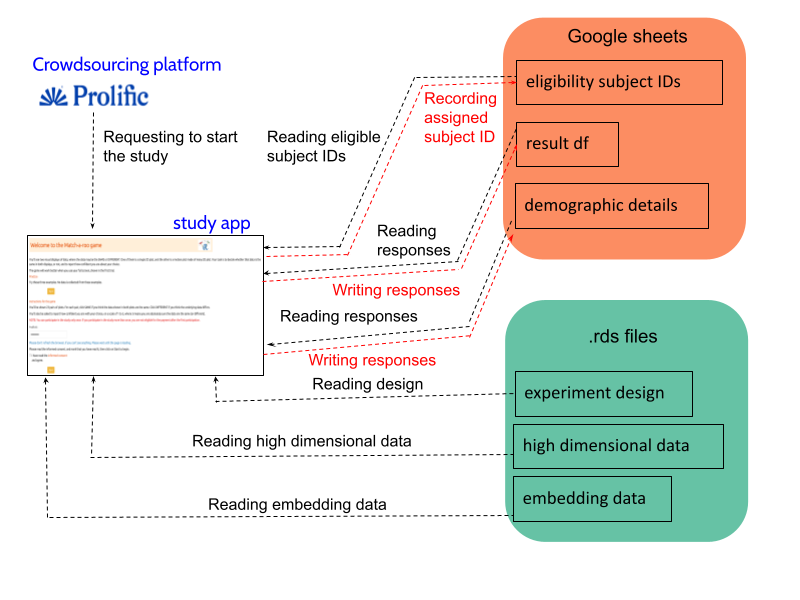
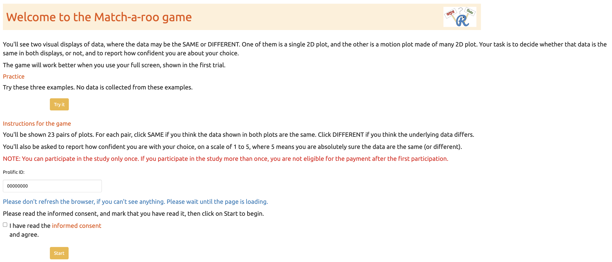
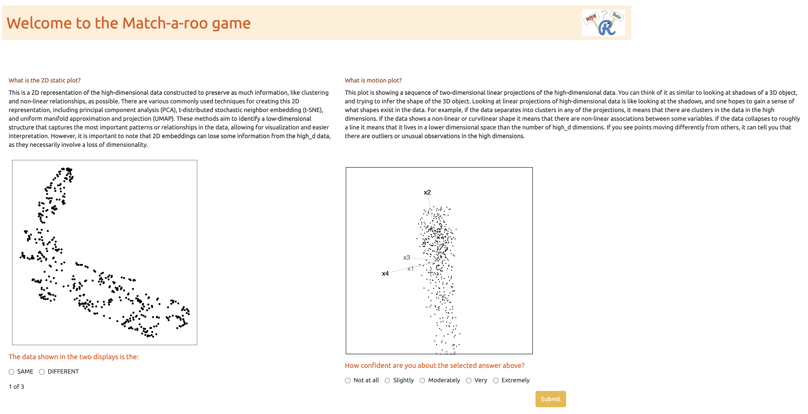
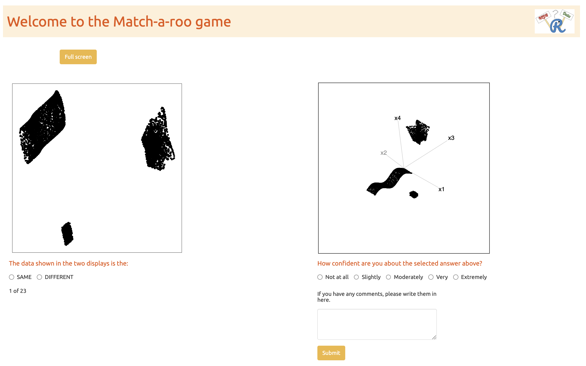
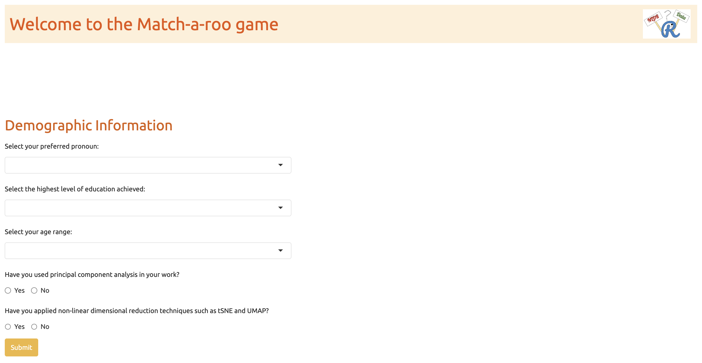
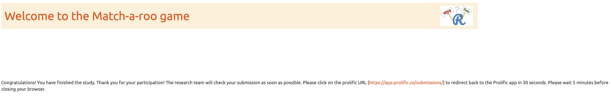

# Appendix to "Perception and Misperception of Clustering in Nonlinear Dimension Reduction: A User Study" {#sec-appendix-b}


::: {.cell layout-align="center"}

:::


::: {.cell layout-align="center"}

:::


::: {.cell layout-align="center"}

:::


::: {.cell layout-align="center"}

:::


## Videos links

Animations of the $p\text{-}D$ tours that used for the study are available on YouTube at the links given in @tbl-links-html.


::: {.cell layout-align="center"}

:::


::: {#tbl-links-html .cell layout-align="center" tbl-pos='H' tbl-cap='Videos'}
::: {.cell-output-display}
`````{=html}
<table>
 <thead>
  <tr>
   <th style="text-align:left;"> data structure </th>
   <th style="text-align:left;"> small </th>
   <th style="text-align:left;"> medium </th>
   <th style="text-align:left;"> large </th>
  </tr>
 </thead>
<tbody>
  <tr>
   <td style="text-align:left;"> three_clust_01 </td>
   <td style="text-align:left;"> <a href="https://youtu.be/kZyZxujDz58">youtu.be/kZyZxujDz58</a> </td>
   <td style="text-align:left;"> <a href="https://youtu.be/Jz3k4uIAiRo">youtu.be/Jz3k4uIAiRo</a> </td>
   <td style="text-align:left;"> <a href="https://youtu.be/E9msE_XX0KA">youtu.be/E9msE_XX0KA</a> </td>
  </tr>
  <tr>
   <td style="text-align:left;"> three_clust_02 </td>
   <td style="text-align:left;"> <a href="https://youtu.be/CLMlOU4Fb2w">youtu.be/CLMlOU4Fb2w</a> </td>
   <td style="text-align:left;"> <a href="https://youtu.be/TFj0satlBBE">youtu.be/TFj0satlBBE</a> </td>
   <td style="text-align:left;"> <a href="https://youtu.be/_f2WvtD2xog">youtu.be/f2WvtD2xog</a> </td>
  </tr>
  <tr>
   <td style="text-align:left;"> three_clust_03 </td>
   <td style="text-align:left;"> <a href="https://youtu.be/K2oKM4mUBXM">youtu.be/K2oKM4mUBXM</a> </td>
   <td style="text-align:left;"> <a href="https://youtu.be/b-43HKN30ws">youtu.be/b-43HKN30ws</a> </td>
   <td style="text-align:left;"> <a href="https://youtu.be/7NwNcD4qlLc">youtu.be/7NwNcD4qlLc</a> </td>
  </tr>
  <tr>
   <td style="text-align:left;"> three_clust_04 </td>
   <td style="text-align:left;"> <a href="https://youtu.be/7yvvpPgiWNw">youtu.be/7yvvpPgiWNw</a> </td>
   <td style="text-align:left;"> <a href="https://youtu.be/1PhZO7cUEaI">youtu.be/1PhZO7cUEaI</a> </td>
   <td style="text-align:left;"> <a href="https://youtu.be/XO61YVXAdr8">youtu.be/XO61YVXAdr8</a> </td>
  </tr>
  <tr>
   <td style="text-align:left;"> three_clust_05 </td>
   <td style="text-align:left;"> <a href="https://youtu.be/pbI7UXFgc0k">youtu.be/pbI7UXFgc0k</a> </td>
   <td style="text-align:left;"> <a href="https://youtu.be/G-TvOIBj-14">youtu.be/G-TvOIBj-14</a> </td>
   <td style="text-align:left;"> <a href="https://youtu.be/ardE0G7zevk">youtu.be/ardE0G7zevk</a> </td>
  </tr>
  <tr>
   <td style="text-align:left;"> three_clust_06 </td>
   <td style="text-align:left;"> <a href="https://youtu.be/Mxylk4M67iA">youtu.be/Mxylk4M67iA</a> </td>
   <td style="text-align:left;"> <a href="https://youtu.be/ABrxozu8F-A">youtu.be/ABrxozu8F-A</a> </td>
   <td style="text-align:left;"> <a href="https://youtu.be/soFQR9UwNsg">youtu.be/soFQR9UwNsg</a> </td>
  </tr>
  <tr>
   <td style="text-align:left;"> three_clust_07 </td>
   <td style="text-align:left;"> <a href="https://youtu.be/2a89BQGK_iU">youtu.be/2a89BQGK_iU</a> </td>
   <td style="text-align:left;"> <a href="https://youtu.be/Wt4NwZSACmo">youtu.be/Wt4NwZSACmo</a> </td>
   <td style="text-align:left;"> <a href="https://youtu.be/hVwIjSxACoo">youtu.be/hVwIjSxACoo</a> </td>
  </tr>
  <tr>
   <td style="text-align:left;"> three_clust_08 </td>
   <td style="text-align:left;"> <a href="https://youtu.be/eID-dwpgU44">youtu.be/eID-dwpgU44</a> </td>
   <td style="text-align:left;"> <a href="https://youtu.be/ILwnlZUMj_U">youtu.be/ILwnlZUMj_U</a> </td>
   <td style="text-align:left;"> <a href="https://youtu.be/oSBaMH9HJZ4">youtu.be/oSBaMH9HJZ4</a> </td>
  </tr>
  <tr>
   <td style="text-align:left;"> three_clust_09 </td>
   <td style="text-align:left;"> <a href="https://youtu.be/6uGCDUSL60Q">youtu.be/6uGCDUSL60Q</a> </td>
   <td style="text-align:left;"> <a href="https://youtu.be/RvlSY3drV5I">youtu.be/RvlSY3drV5I</a> </td>
   <td style="text-align:left;"> <a href="https://youtu.be/mh_rG2qy2Pc">youtu.be/mh_rG2qy2Pc</a> </td>
  </tr>
  <tr>
   <td style="text-align:left;"> three_clust_10 </td>
   <td style="text-align:left;"> <a href="https://youtu.be/CX5O4eNZW5o">youtu.be/CX5O4eNZW5o</a> </td>
   <td style="text-align:left;"> <a href="https://youtu.be/fHxflXa9i-s">youtu.be/fHxflXa9i-s</a> </td>
   <td style="text-align:left;"> <a href="https://youtu.be/R6vD1xJH21w">youtu.be/R6vD1xJH21w</a> </td>
  </tr>
  <tr>
   <td style="text-align:left;"> three_clust_11 </td>
   <td style="text-align:left;"> <a href="https://youtu.be/1f8S7HiZ8dc">youtu.be/1f8S7HiZ8dc</a> </td>
   <td style="text-align:left;"> <a href="https://youtu.be/Fki5vIuPupE">youtu.be/Fki5vIuPupE</a> </td>
   <td style="text-align:left;"> <a href="https://youtu.be/ciVOD8_sWR0">youtu.be/ciVOD8_sWR0</a> </td>
  </tr>
  <tr>
   <td style="text-align:left;"> three_clust_12 </td>
   <td style="text-align:left;"> <a href="https://youtu.be/AZv45NGkuC4">youtu.be/AZv45NGkuC4</a> </td>
   <td style="text-align:left;"> <a href="https://youtu.be/qQ4LqHYH_c4">youtu.be/qQ4LqHYH_c4</a> </td>
   <td style="text-align:left;"> <a href="https://youtu.be/Y2sfVoemVZo">youtu.be/Y2sfVoemVZo</a> </td>
  </tr>
  <tr>
   <td style="text-align:left;"> three_clust_13 </td>
   <td style="text-align:left;"> <a href="https://youtu.be/U-bbZjzvaiE">youtu.be/U-bbZjzvaiE</a> </td>
   <td style="text-align:left;"> <a href="https://youtu.be/0MznMYr5gfo">youtu.be/0MznMYr5gfo</a> </td>
   <td style="text-align:left;"> <a href="https://youtu.be/E7ge3kw5Q0Q">youtu.be/E7ge3kw5Q0Q</a> </td>
  </tr>
  <tr>
   <td style="text-align:left;"> three_clust_14 </td>
   <td style="text-align:left;"> <a href="https://youtu.be/ynu2oUxv08I">youtu.be/ynu2oUxv08I</a> </td>
   <td style="text-align:left;"> <a href="https://youtu.be/gHDLMn5AG-8">youtu.be/gHDLMn5AG-8</a> </td>
   <td style="text-align:left;"> <a href="https://youtu.be/HyCJEiwCVv0">youtu.be/HyCJEiwCVv0</a> </td>
  </tr>
  <tr>
   <td style="text-align:left;"> three_clust_15 </td>
   <td style="text-align:left;"> <a href="https://youtu.be/xsdWsBek0eQ">youtu.be/xsdWsBek0eQ</a> </td>
   <td style="text-align:left;"> <a href="https://youtu.be/SDY64MrcWQg">youtu.be/SDY64MrcWQg</a> </td>
   <td style="text-align:left;"> <a href="https://youtu.be/CFIyW7ftF9M">youtu.be/CFIyW7ftF9M</a> </td>
  </tr>
  <tr>
   <td style="text-align:left;"> three_clust_16 </td>
   <td style="text-align:left;"> <a href="https://youtu.be/VyYyYOqhOVs">youtu.be/VyYyYOqhOVs</a> </td>
   <td style="text-align:left;"> <a href="https://youtu.be/zi-TvgVR8a4">youtu.be/zi-TvgVR8a4</a> </td>
   <td style="text-align:left;"> <a href="https://youtu.be/hdQmD499yo8">youtu.be/hdQmD499yo8</a> </td>
  </tr>
  <tr>
   <td style="text-align:left;"> three_clust_17 </td>
   <td style="text-align:left;"> <a href="https://youtu.be/yojgjcf2NQk">youtu.be/yojgjcf2NQk</a> </td>
   <td style="text-align:left;"> <a href="https://youtu.be/UJPMJ5irRbQ">youtu.be/UJPMJ5irRbQ</a> </td>
   <td style="text-align:left;"> <a href="https://youtu.be/zdQYQvqTyGA">youtu.be/zdQYQvqTyGA</a> </td>
  </tr>
  <tr>
   <td style="text-align:left;"> three_clust_18 </td>
   <td style="text-align:left;"> <a href="https://youtu.be/r-Z1Yyf2c4s">youtu.be/r-Z1Yyf2c4s</a> </td>
   <td style="text-align:left;"> <a href="https://youtu.be/2Rf2L8iey2w">youtu.be/2Rf2L8iey2w</a> </td>
   <td style="text-align:left;"> <a href="https://youtu.be/e_-IQycglVE">youtu.be/e_-IQycglVE</a> </td>
  </tr>
</tbody>
</table>

`````
:::
:::


## Data structures

## $2\text{-}D$ layouts

All $2\text{-}D$ layouts used in the experiment are available in the supplementary repository: [github.com/JayaniLakshika/paper-vis-experiment/tree/main/figures/layouts](https://github.com/JayaniLakshika/paper-vis-experiment/tree/main/figures/layouts). These include all $2\text{-}D$ embeddings generated under different NLDR methods with default hyper-parameter settings for the simulated $4\text{-}D$ data structures.

## Distance metrics

To evaluate how well NLDR methods preserve the underlying structure of high-dimensional data, we considered several inter-cluster distance metrics that quantify the degree of cluster separation. These metrics provide complementary perspectives on how distinct or overlapping clusters are in the original space, allowing quantitative comparison of separability across NLDR methods.


::: {.cell layout-align="center"}

:::


::: {.cell layout-align="center"}
::: {.cell-output-display}
![Pairwise relationships among six distance metrics used to quantify cluster separation in the high-dimensional space: between–within (BW) ratio, exponentiated scaled minimum distance, quantile-ranked average between-cluster distance, Pearson–Gamma coefficient, average silhouette distance, and square-root–transformed Dunn and Dunn2 indices. The diagonal panels show the distribution of each metric, while the lower panels depict scatterplots colored by distance scaling factor (0.1–1.1). Upper panels report Pearson correlation coefficients for all pairs, with significance indicated by asterisks (*** p < 0.001). Metrics show high positive correlation, confirming that they capture consistent structural variation. The BW ratio and exponentiated minimum distance were chosen for the main analysis because they provide complementary summaries of global cluster separation and local boundary distance, which are directly interpretable in the context of NLDR evaluation.](C-appC_files/figure-html/fig-distance-metrics-1.png){#fig-distance-metrics fig-align='center' width=100%}
:::
:::


## Data collection process

### Recruite participants

Subjects were recruited from Prolific [@palan2018], an online platform, to evaluate the trials. The study expects that the participants are uninvolved judges with no prior knowledge of the data to avoid inadvertently affecting results. Potential subjects needed with fluent in English and have completed at least $10$ Prolific studies with a $98\%$ approval rate. The Prolific server only considers participants who are age $18$ and older.

All subjects were trained using three example displays to orient them to the evaluation trials and provided [introductory materials](https://drive.google.com/file/d/14o-nSjy50Qw2eoQArK5AhjowLIOe6m14/view). All subjects who completed the task were compensated $9.96$ GBP per hour for their time via the Prolific payment system.

### Web application to collect responses

The survey web application, [Match-a-roo](https://ebsmonash.shinyapps.io/web_game/), is designed to collect survey responses and demographics using the `shiny` [@winston2025a] package in R. Each subject had access to the survey via the [shiny.io server](https://www.shinyapps.io/). The first interface of the survey app contained an introduction, instructions for the survey (@fig-intro-page), a consent form (@fig-consent), and buttons to access, for example, actual trials. Participants can try three examples prior to the study where the answers were not recorded (@fig-example). The subjects were first asked for their consent to the responses being used for analysis.

A total of $1905$ evaluations from $127$ participants has been collected.

After giving consent, the participant can start the trials. Two visual displays of data are shown where the data may be the same or different (@fig-act). One of the visual displays is a $2\text{-}D$ static plot, and the other is a motion plot made of many $2\text{-}D$ plots. The participants were asked to decide whether that data was the same in both displays and to report their confidence about their choice and any comments about the answer.

When the participants completed the twenty-three evaluations, they were asked for their demographics which included preferred pronoun, the highest level of education achieved, their age category, whether they used principal component analysis in their work, and whether they applied NLDR techniques such as tSNE and UMAP (@fig-demo). Finally, the participants need to click on prolific URL ([https://app.prolific.co/submissions/](https://app.prolific.co/submissions/complete?cc=CLDDOZ10)) to redirect back to the Prolific app (@fig-end). 


::: {.cell layout-align="center"}
::: {.cell-output-display}
{#fig-exp-setup fig-align='center' width=100%}
:::
:::


::: {.cell layout-align="center"}
::: {.cell-output-display}
{#fig-intro-page fig-align='center' width=100%}
:::
:::


::: {.cell layout-align="center"}
::: {.cell-output-display}
{#fig-consent fig-align='center' width=100%}
:::
:::


::: {.cell layout-align="center"}
::: {.cell-output-display}
{#fig-example fig-align='center' width=100%}
:::
:::


::: {.cell layout-align="center"}
::: {.cell-output-display}
{#fig-act fig-align='center' width=100%}
:::
:::


::: {.cell layout-align="center"}
::: {.cell-output-display}
{#fig-demo fig-align='center' width=100%}
:::
:::


::: {.cell layout-align="center"}
::: {.cell-output-display}
{#fig-end fig-align='center' width=100%}
:::
:::


Once a participant starts the study (@fig-exp-setup), the "eligibility_subject_IDs" Google Sheet is connected and read in the Shiny app to identify which subject IDs have not yet been assigned to anyone, as indicated by the "used" column. If the "used" column is marked as NA, it means that the subject ID has not been assigned. 

After identifying the eligible subject IDs, one is randomly assigned to the participant, and "1" is recorded in the "used" column corresponding to that subject ID. This subject ID will later assist in connecting the experiment design, high-dimensional data, and embedding data.

Once a subject ID is allocated to a participant, the experiment design data is loaded, and the relevant attempts, data structure, and methods are presented to the participant. This process continues until the participant completes all attempts. After determining the data structure and methods, the relevant high-dimensional and embedding data is loaded from "high_d_data_three_clust_all.rds" and "embedding_data_three_clust_all.rds," respectively, and displayed in both motion and $2\text{-}D$ static plots. 

Once the participant records their answers, a new row is added to the "result_df" Google Sheet with their responses. This continues until the participant finishes the study. Finally, after completing the evaluations, participants are asked to fill out a demographics questionnaire. Their responses are then recorded in a new row of the "demographic_details" Google Sheet.

## Analysis of results relative to data collection process

### Data cleaning

The initial step in the data cleaning process involves the selection of subjects who have completed the requisite twenty-three trials, including the demographics and the attention check trial. Participants who exceeded the average time of $5-10$ minutes were excluded, as determined from the pilot study. Following this, individuals who didn't accurately detect the attention check trial were also removed. Furthermore, the attention check trials were removed, as they did not contribute to the further analyses. Finally, the collected data set is further refined by filtering out all the responses, which showed the same data structures in $2\text{-}D$ static and motion plots.

### Demographics

Along with the responses to the trials, we have collected a series of demographic information including preferred pronoun, age range category, education background, and previous experience in PCA and Non-linear dimension reduction techniques. @tbl-pronoun, @tbl-age, @tbl-education, @tbl-pca, and @tbl-nldr provide summaries of the demographic data.  

XXX After collecting data need to add interpretations


::: {.cell layout-align="center"}

:::


::: {#tbl-pronoun .cell layout-align="center" tbl-cap='Summary of the pronoun distribution of participants recruited for this study.'}
::: {.cell-output-display}
\begin{table}
\centering
\resizebox{\ifdim\width>\linewidth\linewidth\else\width\fi}{!}{
\begin{tabular}{lrrrr}
\toprule
Pronoun & Period I & Period II & Total & \%\\
\midrule
he/him & 7 & 54 & 61 & 48.03\\
she/her & 11 & 53 & 64 & 50.39\\
they/them & 0 & 2 & 2 & 1.57\\
Total & 18 & 109 & 127 & 100.00\\
\bottomrule
\end{tabular}}
\end{table}


:::
:::


::: {#tbl-age .cell layout-align="center" tbl-cap='Summary of the age distribution of participants recruited for this study.'}
::: {.cell-output-display}
\begin{table}
\centering
\resizebox{\ifdim\width>\linewidth\linewidth\else\width\fi}{!}{
\begin{tabular}{lrrrr}
\toprule
Age group & Period I & Period II & Total & \%\\
\midrule
18 - 24 & 3 & 23 & 26 & 20.47\\
25 - 34 & 9 & 36 & 45 & 35.43\\
35 - 44 & 3 & 22 & 25 & 19.69\\
45 - 54 & 1 & 12 & 13 & 10.24\\
Over 55 & 2 & 16 & 18 & 14.17\\
\addlinespace
Total & 18 & 109 & 127 & 100.00\\
\bottomrule
\end{tabular}}
\end{table}


:::
:::


::: {#tbl-education .cell layout-align="center" tbl-cap='Summary of the educational distribution of participants recruited for this study.'}
::: {.cell-output-display}
\begin{table}
\centering
\resizebox{\ifdim\width>\linewidth\linewidth\else\width\fi}{!}{
\begin{tabular}{lrrrr}
\toprule
Education & Period I & Period II & Total & \%\\
\midrule
Completed some undergraduate courses & 4 & 23 & 27 & 21.26\\
Did not complete high school & 0 & 4 & 4 & 3.15\\
Higher degree master or doctorate & 3 & 31 & 34 & 26.77\\
Prefer not to answer & 3 & 2 & 5 & 3.94\\
Undergraduate degree (A bachelor) & 8 & 49 & 57 & 44.88\\
\addlinespace
Total & 18 & 109 & 127 & 100.00\\
\bottomrule
\end{tabular}}
\end{table}


:::
:::


::: {#tbl-pca .cell layout-align="center" tbl-cap='Summary of the previous experience in PCA of participants recruited for this study.'}
::: {.cell-output-display}
\begin{table}
\centering
\resizebox{\ifdim\width>\linewidth\linewidth\else\width\fi}{!}{
\begin{tabular}{lrrrr}
\toprule
Experience with PCA & Period I & Period II & Total & \%\\
\midrule
No & 15 & 92 & 107 & 84.25\\
Yes & 3 & 17 & 20 & 15.75\\
Total & 18 & 109 & 127 & 100.00\\
\bottomrule
\end{tabular}}
\end{table}


:::
:::


::: {#tbl-nldr .cell layout-align="center" tbl-cap='Summary of the previous experience in Non-linear dimension reduction techniques of participants recruited for this study.'}
::: {.cell-output-display}
\begin{table}
\centering
\resizebox{\ifdim\width>\linewidth\linewidth\else\width\fi}{!}{
\begin{tabular}{lrrrr}
\toprule
Experience with NLDR & Period I & Period II & Total & \%\\
\midrule
No & 15 & 95 & 110 & 86.61\\
Yes & 3 & 14 & 17 & 13.39\\
Total & 18 & 109 & 127 & 100.00\\
\bottomrule
\end{tabular}}
\end{table}


:::
:::


