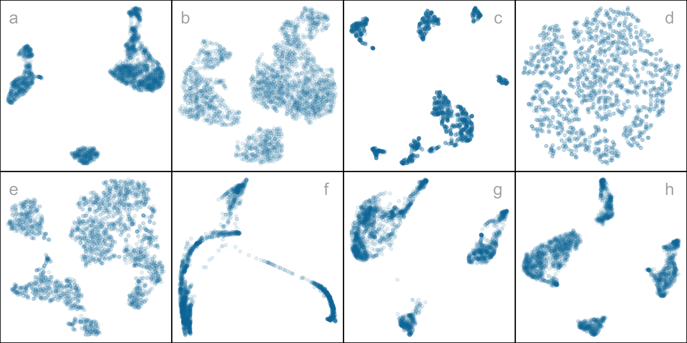
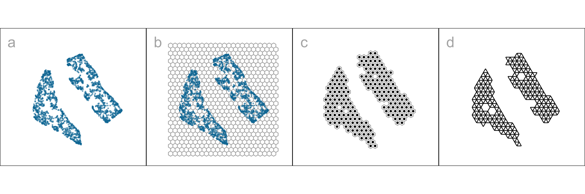
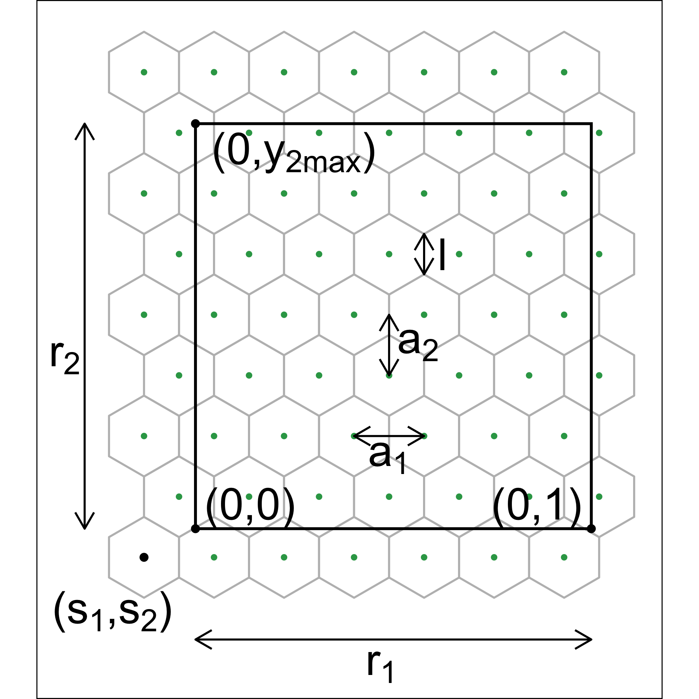

# Choosing Better NLDR Layouts by Evaluating the Model in the High-Dimensional Data Space {#sec-first-paper}

Nonlinear dimension reduction (NLDR) techniques such as tSNE, and UMAP provide a low-dimensional representation of high-dimensional data ($p\text{-}D$) by applying a nonlinear transformation. NLDR often exaggerates random patterns. But NLDR views have an important role in data analysis because, if done well, they provide a concise visual (and conceptual) summary of $p\text{-}D$ distributions. The NLDR methods and hyper-parameter choices can create wildly different representations, making it difficult to decide which is best, or whether any or all are accurate or misleading. To help assess the NLDR and decide on which, if any, is the most reasonable representation of the structure(s) present in the $p\text{-}D$ data, we have developed an algorithm to show the $2\text{-}D$ NLDR model in the $p\text{-}D$ space, viewed with a tour, a movie of linear projections. From this, one can see if the model fits everywhere, or better in some subspaces, or completely mismatches the data. Also, we can see how different methods may have similar summaries or quirks.

::: {.cell layout-align="center"}

:::

::: {.cell layout-align="center"}

:::

::: {.cell layout-align="center"}

:::

::: {.cell layout-align="center"}

:::

## Introduction

Nonlinear dimension reduction (NLDR) is popular for making a convenient low-dimensional ($k\text{-}D$) representation of high-dimensional ($p\text{-}D$) data ($k < p$). Recently developed methods include t-distributed stochastic neighbor embedding (tSNE) [@laurens2008], uniform manifold approximation and projection (UMAP) [@leland2018], potential of heat-diffusion for affinity-based trajectory embedding (PHATE) algorithm [@moon2019], large-scale dimensionality reduction using triplets (TriMAP) [@amid2022], and pairwise controlled manifold approximation (PaCMAP) [@yingfan2021]. 

However, the representation generated can vary dramatically from method to method, choice of hyper-parameter, or even random seed, as illustrated by @fig-NLDR-variety. The specific method and hyper-parameters used to produce each layout (see [Supplementary materials](#sec-appendix-a)) are not essential for the discussion. The dilemma for the analyst is which representation to use. The choice might result in different procedures used in the downstream analysis or different inferential conclusions. Various academics have expressed concerns with current practices and procedures for choosing (e.g.  @irizarry2024, @chari2023). The research described here provides new numerical and visual tools to aid with this decision. 

::: {.cell layout-align="center"}

:::

::: {.cell layout-align="center"}
::: {.cell-output-display}
{#fig-NLDR-variety fig-align='center' fig-alt='A multi-panel figure shows several two‑dimensional scatterplots of the same high‑dimensional data, each panel representing a different NLDR method or set of hyper‑parameters. In every panel, the x‑ and y‑axes are unlabeled but span comparable ranges (roughly symmetric around zero or a mid‑point), and each point corresponds to one observation. Points are typically the same color. Across panels, the apparent shapes and separations of clusters change markedly: some layouts show well‑separated, compact clusters, while others show overlapping or elongated groups, or different relative positions of the same clusters. There are no obvious single‑point outliers, but the global configuration of clusters varies substantially between methods, illustrating that the visual impression of structure in the data—such as how many clusters exist and how distinct they appear—depends strongly on the chosen NLDR method and hyper‑parameters.' width=80%}
:::
:::

The chapter is organized as follows. @sec-background-visalgo provides a summary of the literature on NLDR and high-dimensional data visualization methods. @sec-method-visalgo contains the details of the new methodology, including a simulated data example. In @sec-bestfit-visalgo, we describe how to assess the best fit and identify the most accurate $2\text{-}D$ layout based on the proposed model diagnostics.  Two applications illustrating the use of the new methodology for bioinformatics and image classification are in @sec-applications-visalgo. Limitations and future directions are provided in @sec-discussion-visalgo. 

## Background {#sec-background-visalgo}

<!-- - Connection between NLDR and MDS-->
Historically, low-dimensional ($k\text{-}D$) representations of high-dimensional ($p\text{-}D$) data have been computed using multidimensional scaling (MDS) [@kruskal1964], which includes principal components analysis (PCA) (for an overview see @jolliffe2011). (A contemporary comprehensive guide to MDS can be found in @borg2005.) The $k\text{-}D$ representation can be considered to be a layout of points in $k\text{-}D$   produced by an embedding procedure that maps the data from $p\text{-}D$. In MDS, the $k\text{-}D$ layout is constructed by minimizing a stress function that differs distances between points in $p\text{-}D$ with potential distances between points in $k\text{-}D$. Various formulations of the stress function result in non-metric scaling [@saeed2018] and isomap [@silva2002]. Challenges in working with high-dimensional data, including visualization, are outlined in @johnstone2009. 

Many new methods for NLDR have emerged in recent years, all designed to better capture specific structures potentially existing in $p\text{-}D$. Here we focus on five currently popular techniques: tSNE, UMAP, PHATE, TriMAP, and PaCMAP. The methods tSNE, UMAP, TriMAP, and PaCMAP can be considered for producing the $k\text{-}D$ representation by minimizing the divergence between two inter-point distance distributions. PHATE is an example of a diffusion process spreading to capture geometric shapes that include both global and local structure. (See @coifman2005 for an explanation of diffusion processes.)  

The array of layouts in @fig-NLDR-variety illustrates what can emerge from the choices of method and hyper-parameters, and the random seed that initiates the computation. Key structures interpreted from these views suggest: (1) highly **separated clusters** (a, b, e, g, h) with the number ranging from 3-6; (2) **stringy branches** (f), and (3) **barely separated clusters** (c, d), which would **contradict** the other representations. These contradictions arise because these methods and hyper-parameter choices provide different lenses on the interpoint distances in the data.

The alternative approach to visualizing the high-dimensional data is to use linear projections. PCA is the classical approach, resulting in a set of new variables that are linear combinations of the original variables. Tours, defined by @As85, broaden the scope by providing movies of linear projections that provide views of the data from all directions. (See @lee2021 for a review of tour methods.) There are many tour algorithms implemented, with many available in the R package `tourr` [@wickham2011], and versions enabling better interactivity in `langevitour` [@harisson2024] and `detourr` [@casper2025]. Linear projections are a safe way to view high-dimensional data because they do not warp the space, so they are more faithful representations of the structure. However, linear projections can be cluttered, and global patterns can obscure local structure. The simple activity of projecting data from $p\text{-}D$   suffers from piling [@laa2022], where data concentrates in the center of projections. NLDR is designed to escape these issues, to exaggerate structure so that it can be observed. But as a result, NLDR can hallucinate wildly, to suggest patterns that are not actually present in the data. 

Our proposed solution is to use the tour to examine how the NLDR is warping the space. It follows what @wickham2015 describes as *model-in-the-data-space*. The fitted model should be overlaid on the data to examine the fit relative to the spread of the observations. While this is straightforward and commonly done when data is $2\text{-}D$, it is also possible in $p\text{-}D$, for many models, when a tour is used. 

@wickham2015 provides several examples of models overlaid on the data in $p\text{-}D$. In hierarchical clustering, a representation of the dendrogram using points and lines can be constructed by augmenting the data with points marking the merging of clusters. Showing the movie of linear projections reveals how the algorithm sequentially fitted the cluster model to the data. For linear discriminant analysis or model-based clustering, the model can be indicated by $(p-1)\text{-}D$ ellipses. It is possible to see whether the elliptical shapes appropriately match the variance of the relevant clusters, and to compare and contrast different fits. For PCA, one can display the model (a $k\text{-}D$ plane of the reduced dimension) using wireframes of transformed cubes. Using a wireframe is the approach we take here to represent the NLDR model in $p\text{-}D$.

## Method {#sec-method-visalgo}

### What is the NLDR model?

At first glance, thinking of NLDR as a modeling technique might seem strange. It is a simplified representation or abstraction of a system, process, or phenomenon in the real world. The $p\text{-}D$   observations are the realization of the phenomenon, and the $k\text{-}D$ NLDR layout is the simplified representation. Typically, $k=2$ is used for the rest of this chapter. From a statistical perspective, we can consider the distances between points in the $2\text{-}D$   layout to be variance that the model explains, and the (relative) difference with their distances in $p\text{-}D$   is the error, or unexplained variance. We can also imagine that the positioning of points in $2\text{-}D$    represents the fitted values, which will have some prescribed position in $p\text{-}D$   that can be compared with their observed values. This is the conceptual framework underlying the more formal versions of factor analysis [@joreskog1969] and MDS. (Note that, for this thinking, the full $p\text{-}D$   data needs to be available, not just the interpoint distances.)

We define the NLDR as a function $g\text{:}~ \mathbb{R}^{n\times p} \rightarrow \mathbb{R}^{n\times 2}$, with hyper-parameters $\bm{\theta}$. These parameters, $\bm{\theta}$, depend on the choice of $g$, and can be considered part of model fitting in the traditional sense. Common choices for $g$ include functions used in tSNE, UMAP, PHATE, TriMAP, PaCMAP, or MDS, although in theory any function that does this mapping is suitable. 

With our goal being to make a representation of this $2\text{-}D$ layout that can be lifted into high-dimensional space, the layout needs to be augmented to include neighbor information. A simple approach would be to triangulate the points and add edges. A more stable approach is to first bin the data, reducing it from $n$ to $m\leq n$ observations, and connect the bin centroids. We recommend using a hexagon grid because it better reflects the data distribution and has fewer artifacts than a rectangular grid. This process serves to reduce some noisiness in the resulting surface shown in $p\text{-}D$. The steps in this process are shown in @fig-NLDR-two-curvy, and documented below.

<!--two_nonlinear/06_gen_model_with_tSNE.R-->

::: {.cell layout-align="center"}

:::

<!--Full hexagon grid with UMAP data-->

::: {.cell layout-align="center"}

:::

<!--Non-empty bins with bin centroids-->

::: {.cell layout-align="center"}

:::

<!--2D model-->

::: {.cell layout-align="center"}

:::

::: {.cell layout-align="center"}

:::

::: {.cell layout-align="center"}

:::

To illustrate the method and how to use it to choose a reasonable layout, we use $7\text{-}D$ simulated data, which we call the "2NC7" data. It has two separated nonlinear clusters, one forming a $2\text{-}D$ curved shape, and the other a $3\text{-}D$ curved shape, each consisting of $1000$ observations. The first four variables hold this cluster structure, and the remaining three are purely noise. We would consider $(X_1, X_2, X_3, X_4)$ to hold the geometric structure (true model) that we hope to capture. This data is sufficiently simple, with just two complexities (two separated curvilinear clusters and two different implicit dimensions), to adequately explain the new method. The applications section contains two practical examples where NLDR has been used in published work. This data has both global and local structure. The two separated clusters would be considered to be a global structure, and the nonlinear low-dimensional shapes could be considered to be a local structure, one being $2\text{-}D$ and the other $3\text{-}D$. An ideal NLDR layout would reveal the two clusters with moderate separation, and flatten the curvilinear forms while preserving the proximity of points.

<!-- The remaining variables $X_4, X_5, X_6, X_7$ are all uniform error, with small variance.  -->

::: {.cell layout-align="center"}
::: {.cell-output-display}
{#fig-NLDR-two-curvy fig-align='center' fig-alt='Four-panel figure illustrating the steps used to construct a model on a 2-D tSNE layout for the 2NC7 data. Panel (a) shows the original data displayed in a 2-D tSNE layout. Individual observations are plotted as points positioned using two unlabeled tSNE coordinates on the horizontal and vertical axes, which serve as abstract 2-D embedding dimensions. Points form multiple clusters with nonlinear shapes and varying local densities. Panel (b) shows the same 2-D layout overlaid with a hexagonal binning grid. The points are aggregated into hexagon-shaped bins that tile the plane, with denser regions of points filling multiple adjacent hexagons and sparser regions filling fewer bins. Panel (c) displays the centroids of the hexagonal bins. Each bin is represented by a single point located at the center of the hexagon, producing a reduced set of points that summarizes the local structure of the original data in the 2-D layout. Panel (d) shows a Delaunay triangulation constructed on the bin centroids. Straight line segments connect neighboring centroids to form a mesh of non-overlapping triangles across the 2-D layout. Regions with closely spaced centroids contain smaller triangles, while regions with more widely spaced centroids contain larger triangles. The axes remain unlabeled throughout and represent abstract 2-D embedding coordinates.' width=100%}
:::
:::

### Algorithm to represent the model in $2\text{-}D$  

#### Scale the data

Because we are working with distances between points, starting with data having a standard scale, e.g., [0, 1], is recommended. The default should take the aspect ratio produced by the NLDR $(r_1, r_2, ..., r_k)$ into account. When $k=2$, as in hexagon binning, the default range is $[0, y_{i,\text{max}}], i=1,2$, where $y_{1,\text{max}}=1$ and $y_{2,\text{max}} = r_2/r_1$ (@fig-NLDR-two-curvy). If the NLDR aspect ratio is ignored then set $y_ {2,\text{max}} = 1.$ 

#### Hexagon grid configuration

Although there are several implementations of hexagon binning [@carr1987] and a published paper [@dan2023], surprisingly, none have sufficient detail or components that produce everything needed for this project. So we described the process used here. @fig-hex-param illustrates the notation used. 

The $2\text{-}D$ hexagon grid is defined by its bin centroids. Each hexagon, $H_h$ ($h = 1, \dots, b$) is uniquely described by centroid, $C_{h}^{(2)} = (c_{h1}, c_{h2})$. The number of bins in each direction is denoted as $(b_1, b_2)$, with  $b = b_1 \times b_2$ being the total number of bins. We expect the user to provide just $b_1$, and we calculate $b_2$ using the NLDR ratio to compute the grid. 

To ensure that the grid covers the range of data values, a buffer parameter ($q$) is set as a proportion of the range. By default,  $q=0.1$. The buffer should be extending a full hexagon width ($a_1$) and height ($a_2$) beyond the data, in all directions. The lower left position where the grid starts is defined as $(s_1, s_2)$, and corresponds to the centroid of the lowest left hexagon, $C_{1}^{(2)} = (c_{11}, c_{12})$. This must be smaller than the minimum data value. Because it is one buffer unit, $q$ below the minimum data values, $s_1 = -q$ and $s_2 = -qr_2$. 

<!-- The value for $b_2$ is computed by fixing $b_1$. Considering the upper bound of the first NLDR component, $a_1 > (1+2q)/(b_1 -1)$. Similarly, for the second NLDR component,  -->

<!-- $$ -->
<!-- a_2 \geq \frac{r_2 + q(1 + r_2)}{(b_2 - 1)}. -->
<!-- $$ -->

<!-- Since $a_2 = \sqrt{3}a_1/2$ for regular hexagons, -->

<!-- $$ -->
<!-- a_1 \geq \frac{2[r_2 + q(1 + r_2)]}{\sqrt{3}(b_2 - 1)}. -->
<!-- $$ -->

<!-- This is a linear optimization problem. Therefore, the optimal solution must occur on a vertex. Therefore, -->

<!-- $$ -->
<!-- b_2 = \Big\lceil1 +\frac{2[r_2 + q(1 + r_2)](b_1 - 1)}{\sqrt{3}(1 + 2q)}\Big\rceil. -->
<!-- $${#eq-bin2} -->

Using the relationship for regular hexagons, $a_2 = \sqrt{3}a_1/2$, the coverage constraints can be written as
$$
a_1 \geq \frac{1 + 2q}{b_1 - 1}, \quad
a_1 \geq \frac{2[r_2 + q(1 + r_2)]}{\sqrt{3}(b_2 - 1)}.
$$

For fixed $b_1$, we determine $b_2$ by ensuring both constraints are satisfied while using the smallest grid that covers the data. This can be formulated as the following optimization problem:
$$
\begin{aligned}
\text{minimize} \quad & b_2 \
\text{subject to} \quad
& a_1 \geq \frac{1 + 2q}{b_1 - 1}, \
& a_1 \geq \frac{2[r_2 + q(1 + r_2)]}{\sqrt{3}(b_2 - 1)}, \
& b_2 \in \mathbb{Z}^+.
\end{aligned}
$$

Substituting the smallest feasible value of $a_1 = \frac{1 + 2q}{b_1 - 1}$ into the second constraint and solving for $b_2$ yields
$$
b_2 \geq 1 + \frac{2[r_2 + q(1 + r_2)](b_1 - 1)}{\sqrt{3}(1 + 2q)}.
$$

Taking the smallest integer satisfying this constraint gives
$$
b_2 = \Big\lceil 1 + \frac{2[r_2 + q(1 + r_2)](b_1 - 1)}{\sqrt{3}(1 + 2q)} \Big\rceil.
$${#eq-bin2}

::: {.cell layout-align="center"}

:::

::: {.cell layout-align="center"}
::: {.cell-output-display}
{#fig-hex-param fig-align='center' fig-alt='A schematic diagram illustrating the notation for hexagon binning parameters. The horizontal x-axis and vertical y-axis represent generic data coordinates (no specific numeric scales are shown). A central regular hexagon is drawn with its six vertices marked; labeled line segments and arrows indicate key geometric quantities such as hexagon side length, width, height, spacing between adjacent hexagons, and how these relate to the x and y directions. Additional arrows or braces may show how hexagon centers are arranged in a grid pattern. No color or data values are mapped; the figure is purely geometric, focusing on how hexagon dimensions and spacing are defined for use in hexagon binning.' width=30%}
:::
:::

#### Binning the data

Observations are grouped into bins based on their nearest centroid. This produces a reduction in size of the data from $n$ to $m$, where $m\leq b$ (total number of bins). This can be defined using the function $u: \mathbb{R}^{n\times 2} \rightarrow \mathbb{R}^{m\times 2}$, where
$$u(i) = \arg\min_{j = 1, \dots, b} \sqrt{(y_{i1} - C^{(2)}_{j1})^2 + (y_{i2} - C^{(2)}_{j2})^2},$$ maps observation $i$ into $H_h = \{i| u(i) = h\}$. 

By default, the bin centroid is used for describing a hexagon (as done in @fig-NLDR-two-curvy (c)), but any measure of center, such as a mean or weighted mean of the points within each hexagon, could be used. The bin centers and the binned data are the two important components needed to render the model representation in high dimensions.  

#### Indicating neighborhood

Delaunay triangulation [@lee1980;@albrecht2024] is used to connect points so that edges indicate neighboring observations, in both the NLDR layout (@fig-NLDR-two-curvy (d)) and the $p\text{-}D$ model representation. When the data has been binned, the triangulation connects centroids. The edges preserve the neighborhood information from the $2\text{-}D$ representation when the model is lifted into $p\text{-}D$. 

### Rendering the model in $p\text{-}D$

The last step is to lift the $2\text{-}D$ model into $p\text{-}D$ by computing $p\text{-}D$ vectors that represent bin centroids (@fig-best-fit-tsne). We use the $p\text{-}D$ mean of the points in a given hexagon, $H_h$, denoted $C_{h}^{(p)}$, to map the centroid $C_{h}^{(2)} = (c_{h1}, c_{h2})$ to a point in $p\text{-}D$. Let the $j^{th}$ component of the $p\text{-}D$ mean be

$$C_{hj}^{(p)} = \frac{1}{n_h}\sum_{i =1}^{n_h} x_{hij}, ~~~h = 1, \dots, b;~ j=1, \dots, p; ~ n_h > 0.$$

::: {.cell layout-align="center"}

:::

::: {.cell layout-align="center"}

:::

::: {.cell layout-align="center"}
::: {.cell-output-display}
![Lifting the $2\text{-}D$ fitted model into $p\text{-}D$. Two projections of the $p\text{-}D$ fitted model overlaying the data are shown in b, c. The fit is reasonably tight with the data in one cluster (top one in b), but slightly less so in the other cluster, probably because it is $3\text{-}D$. Notice also that, in the $2\text{-}D$ layout, the two clusters have internal gaps which create a model with some holes. This lacy pattern happens regardless of the hyper-parameter choice, but this doesn't severely impact the $p\text{-}D$ model representation.](02-chap2_files/figure-html/fig-best-fit-tsne-1.png){#fig-best-fit-tsne fig-align='center' fig-pos='!ht' fig-alt='Multi-panel figure illustrating the lifting of a fitted 2-D model into p-D space. Panel (a) shows a 2-D tSNE layout displayed overlaying a 2-D wireframe. The horizontal and vertical axes correspond to the two tSNE dimensions. Individual observations are aggregated into hexagonal bins over the 2-D scatterplot. Each hexagon contains a centroid in 2-D. Lines connect each 2-D hexagon centroid to a corresponding centroid in p-D space, defined as the mean of the original p-D observations assigned to that hexagon. Panels (b) and (c) show two different 2-D projections of the fitted p-D model overlaid on the original data. In both panels, the axes represent linear projections of the p-D space. Points from the original data and the fitted model appear together, forming two main clusters in each projection. One cluster appears more compact and closely aligned between data and model, while the other shows slightly greater spread.' width=100%}
:::
:::

### Measuring the fit {#sec-summary}

<!-- Existing approaches -->

All NLDR methods internally optimize an objective function to produce a layout for a given set of hyper-parameters. These objective functions are not always made available to the user in the model output and or comparable across methods.

A range of established metrics is commonly used to assess the quality of NLDR embeddings, each emphasizing different aspects of structure preservation. For example, the $RNX$ curve summarizes neighborhood agreement between \pD{} and \kD{} spaces across a range of scales, with its area under the curve (ARNX) reflecting a balance between local and global structure preservation [@john2015]. Random Triplet Accuracy (RTA) evaluates the consistency of distance orderings among triplets of points in \gD{} and \pD{} spaces, providing a measure of geometric preservation [@yingfan2021]. The Shepard diagram [@shepard1962], together with its associated Spearman correlation (SC) [@spearman1961], assesses the monotonic relationship between pairwise distances in the two spaces and is often interpreted as a measure of global structure preservation. The Global Score (GS) compares the embedding to a PCA baseline and evaluates how well the overall geometry is retained [@amid2022].

These metrics provide useful but complementary perspectives, as they capture different and often competing objectives, such as preserving local neighborhoods versus global distances. As a result, it is common for these measures to rank embeddings differently, reflecting the multi-objective nature of NLDR rather than a deficiency of any single metric.

To facilitate comparison with our proposed measure, we use reversed forms of these metrics (rRTA, rSC, rGS, and rARNX), so that lower values consistently indicate better performance.

 <!-- Fitted values,  Error calculation-->

None of the above measures is particularly well-suited to assessing our model fit, as we will show later. Thus, we need a different approach to measuring model fit. Because the model here is similar to a confirmatory factor analysis model (see a general explanation in @brown2015), our approach is similar to the ones used in this area. It is based on "residuals" computed as the difference between the fitted model and observed values in $p\text{-}D$. Observations are associated with their bin center, $C_{h}^{(p)}$, which are also considered to be the *fitted values*. The error is computed by taking the squared $p\text{-}D$ Euclidean distance of points from their bin centroid, which we will call the hexbin error (HBE):

$$ HBE = \sqrt{\frac{1}{n}\sum_{h = 1}^{m}\sum_{i = 1}^{n_h}\sum_{j = 1}^{p} (\bm{x}_{hij} - C^{(p)}_{hj})^2}$${#eq-equation1} 

where $n$ is the number of observations, $m$ is the number of non-empty bins, $n_h$ is the number of observations in $h^{th}$ bin, $p$ is the number of variables and $\bm{x}_{hij}$ is the $j^{th}$ dimensional data of $i^{th}$ observation in $h^{th}$ hexagon. We can consider $e_{hi} = \sqrt{\sum_{j = 1}^{p} (\bm{x}_{hij} - C^{(p)}_{hj})^2}$ to be the residual for each observation. @fig-p-d-error-in-2d-two-curvy shows plots of $e$ as a density (a), coloring the points in the NLDR layout (b), and the points in a tour (c). It can be seen that the biggest residuals are in one cluster, which occurs due to the intentional design that this cluster is slightly $3\text{-}D$ and thus not able to be perfectly represented by a $2\text{-}D$ layout. 

::: {.cell layout-align="center"}

:::

::: {.cell layout-align="center"}
::: {.cell-output-display}
{#fig-p-d-error-in-2d-two-curvy fig-align='center' fig-alt='A small multiple of three plots shows the distribution of residual error values, denoted e, for a 3‑D cluster represented in 2‑D. Panel (a) is a univariate density plot of e on the horizontal axis, with error values increasing from left to right and density on the vertical axis; the curve is unimodal with a long upper tail, indicating a few observations with much larger residuals than most. Panel (b) is a 2‑D scatterplot of an NLDR layout, with two layout coordinates on the axes (roughly symmetric around zero), where each point is colored by its residual e on a continuous scale from low to high; points with the largest residuals form a distinct, compact cluster in one region of the layout. Panel (c) is a 2‑D scatterplot from a tour (two projected dimensions of the original data on the axes), again colored by e in the same continuous scale; the high‑e points remain grouped together, showing that the largest residuals all belong to one intentionally slightly 3‑D cluster that is otherwise well represented in 2‑D. Overall, color encodes error magnitude, positions encode either layout or tour coordinates, and the main visible pattern is a single cluster of points with much higher residual error than the rest.' width=100%}
:::
:::

### Prediction into $2\text{-}D$

NLDR methods are primarily designed for visualization and exploration rather than reconstruction, and do not explicitly provide out-of-sample prediction. Of the five methods studied here, only UMAP provides a `predict()` function for embedding new data points based on the learned manifold [@tomasz2023]. Several other approaches, not used here, PCA, neural network autoencoders [@hinton2006], and parametric tSNE [@van2009] support prediction. 

A benefit of our approach is that for any NLDR method, it provides a way to predict the layout position of a new observation, $x'$. The steps are (1) determine the closest bin centroid in $p\text{-}D$, $C^{(p)}_{h}$, and (2) predict the embedding to be the bin centroid in $2\text{-}D$, $C^{(2)}_{h}$. 

### Tuning

The model fitting is based on several parameters, including the hexagon bin parameters and the low-count bin removal process. The hexagon bin parameters define the bottom-left bin position $(s_1, \ s_2)$, the number of bins in the horizontal direction ($b_1$), which also determines the number of bins in the vertical direction ($b_2$), the total number of bins ($b$), and the total number of non-empty bins ($m$). Low count bins are removed using standardized bin counts, defined as $w_h = n_h/n, ~~h=1, \dots m$.

Default values are provided for each of these, but deciding on the best model fit is assisted by examining a range of values. The default number of bins $b=b_1\times b_2$ is computed based on the sample size, by setting $b_1=n^{1/3}$, consistent with the Diaconis-Freedman rule [@freedman1981]. The value of $b_2$ is determined analytically by $b_1, q, r_2$ (@eq-bin2). Values of $b_1$ between $2$ and $b_1 = \sqrt{n/r_2}$ are recommended, where the dependence on $r_2$ reflects the preservation of aspect ratio in the NLDR layout.

@fig-bins-two-curvy shows the hexbin grids for three choices of $b_1$. While the number of bins is the common parameter to modify, bin start positions $(s_1, \ s_2)$ can also be worth experimenting with also because they can change bin counts. 

::: {.cell layout-align="center"}
::: {.cell-output-display}
{#fig-bins-two-curvy fig-align='center' fig-alt='A multi-panel figure of three side‑by‑side hexbin heatmaps comparing different bin settings (three values of parameter b1). In each panel, the x- and y-axes represent two continuous variables on similar numeric ranges (roughly spanning the main cloud of points; exact tick labels are not specified). Data are aggregated into hexagonal bins; the color intensity within each hexagon encodes the number of observations in that bin, with darker or more saturated colors indicating higher counts. Across panels, the underlying curved, two‑dimensional structure of the data is broadly similar, but the apparent shapes and local peaks of density shift as the binning parameter b1 changes. Some panels show smoother, broader blobs of high density, whereas others reveal more fragmented or sharply defined ridges and clusters, illustrating how different bin sizes can substantially alter visible bin counts and perceived patterns, even when the underlying data are unchanged.' width=100%}
:::
:::

<!-- #### Handling of low density bins-->

It is worthwhile to consider what desirable aspects of a hexbin result, which maps to summarizing the $p\text{-}D$ fit well. The binning should capture the underlying data distribution closely, with a minimum number of necessary bins. An ideal binning might be indicated by a more uniform distribution of bin counts or having few relatively empty bins. To help with this assessment average bin count ($\bar{n} = \sum{n_h}/m$), average standardized bin count ($\bar{w} = \sum{w_h}/m$) and proportion of non-empty bins ($m/b$), are also computed. @fig-param-two-curvy shows some choices of plots of these quantities for a single NLDR layout, with three choices of $a_1$ indicated. Some expectations and reasoning for these plots are:

- HBE will increase as $a_1$ increases, so good choices will be just before a big increase. In plot a, HBE changes fairly steadily, so there is no easy choice to make.
- HBE can also be examined against the average standardized bin count or the average bin count (plot b). This is similar to the comparison with $a_1$, but to used when comparing different NLDR layouts. Different layouts might produce different densities of points, which will not be captured well by a comparison of HBE vs $a_1$.
- The proportion of non-empty bins is interesting to examine across different binwidths (plot c). A good binning should have just the right number of bins to neatly cover the shape of the data, and no more or less. As binwidth gets smaller, $m/b$ should roughly get bigger.
- Bins with a small number of observations might be removed to sharpen the wireframe model. This can have adverse effects, though - failing to extend the wireframe into sparse areas, or resulting in holes in the wireframe. Plot d shows the relationship between HBE (computed for all observations despite some bin removal) and the standardized bin count cutoff used to remove bins. For all three chosen binwidths, a small number of bins can be removed without affecting HBE.

<!--two_nonlinear/05_gen_rm_lwd_mse.R-->

::: {.cell layout-align="center"}

:::

::: {.cell layout-align="center"}
::: {.cell-output-display}
![Various plots to help tune the model fit: (a) HBE vs $a_1$, (b) HBE vs $\bar{n}_h$, (c) proportion of non-empty bins ($m/b$) vs $a_1$, (d) HBE vs $w_h$ cutoff used for removing low count bins. Color indicates the three binwidths shown in Figure 6: $0.03$ (orange dashed), $0.05$ (blue solid), and $0.08$ (green dotted). The better model fit will have low HBE, but reasonably sized bins that capture the data sufficiently. Proportion of non-empty bins tends to increase with $a_1$ (c). Removing a few low-count bins doesn't substantially change HBE, for all three binwidths (d).](02-chap2_files/figure-html/fig-param-two-curvy-1.png){#fig-param-two-curvy fig-align='center' fig-alt='A multi-panel line plot compares three summary statistics of hexbin results across different binning parameter values. Each panel has the binning parameter (such as number or scale of bins) on the horizontal axis, increasing from left to right; the vertical axes show, respectively, average bin count per hexagon, average standardized bin count, and the proportion of non-empty bins, each on a roughly 0 to 1 or low-to-moderate positive scale. Within each panel, three curves represent different choices of the tuning parameter a1, visually distinguished by line color and/or type. As the binning parameter changes, the curves show how the mean bin count and mean standardized count typically rise and then level off or fluctuate, indicating where binning becomes too coarse (few, heavily populated bins) or too fine (many nearly empty bins), while the proportion of non-empty bins generally increases toward a plateau. Differences between the three a1 curves highlight that some parameter settings yield a more even distribution of bin counts and fewer empty bins, suggesting they provide a better match between the hexbin summary and the underlying model fit.' width=100%}
:::
:::

### Interactive graphics

Matching points in the $2\text{-}D$ layout with their positions in $p\text{-}D$ is useful when tuning the fit. This can be used to examine the fitted model in some subspaces in $p\text{-}D$, in particular in association with residual plots. 

The interactive $2\text{-}D$ layout [@chapman2020] and the `langevitour` [@harisson2024] view with the fitted model overlaid can be linked using a browsable HTML widget (@joe2025, @joe2024). A rectangular "brush" is used to select points in one plot, which will highlight the corresponding points in the other plot(s). Because the `langevitour` is dynamic, brush events that become active will pause the animation, so that a user can interrogate the current view. This approach will be illustrated on the examples to show how it can help to understand how the NLDR has organized the observations, and learn where it does not do well.

## Choosing the best $2\text{-}D$ layout {#sec-bestfit-visalgo} 

@fig-toy-rmse illustrates the approach to compare the fits for different representations and assess the strength of any fit. What does it mean to be a best fit for this problem? Analysts use an NLDR layout to display the structure present in high-dimensional data in a convenient $2\text{-}D$ display. It is a competitor to linear dimension reduction that can better represent nonlinear associations, such as clusters. However, these methods can hallucinate, suggesting patterns that don't exist, and grossly exaggerate other patterns. Having a layout that best fits the high-dimensional structure is desirable, but more important is to identify bad representations so they can be avoided. The goal is to help users decide on the most useful and appropriate low-dimensional representation of the high-dimensional data. 

A particular pattern that we commonly see is that analysts tend to pick layouts with clusters that have big separations between them. When you examine their data in a tour, it is almost always that we see there are no big separations, and actually, often the suggested clusters are not even present. While we don't expect that analysts include animated gifs of tours in their papers, we should expect that any $2\text{-}D$ representation adequately indicates the clustering that is present, and honestly shows lack of separation or lack of clustering when it doesn't exist. It is important for analysts to have tools to select the accurate representation, not the pretty but wrong representation.

To decide on a reasonable layout, an analyst needs a selection of NLDR representations generated using a range of hyper-parameter choices and possibly different methods, such as tSNE and UMAP. They also require a range of model fits created by varying the binwidths and the level of low count bin removal, along with the calculated HBE values for each layout after transformation into the $p\text{-}D$ space. Finally, the analyst must be able to visually examine how well each model fits the data in the original data space.

Comparing the HBE to obtain the best fit is appropriate if the same NLDR method is used. However, because the HBE is computed on $p\text{-}D$ data, it measures the fit between model and data, so it can also be used to compare the fit of different NLDR methods. A lower HBE indicates a better NLDR representation.

::: {.cell layout-align="center"}

:::

<!--two_nonlinear/04_gen_mse_for_diff_methods.R-->

::: {.cell layout-align="center"}

:::

::: {.cell layout-align="center"}

:::

<!--two_nonlinear/07_example_evaluation_metrics.R-->

::: {.cell layout-align="center"}

:::

::: {.cell layout-align="center"}
::: {.cell-output-display}
![Assessing which of the 6 NLDR layouts (a-f) on the 2NC7 data is the better representation using HBE for varying (i) binwidth ($a_1$), (ii) average bin count ($\bar{n}_h$), and (iii) scaled evaluation metrics (rRTA, rSC, rGS, rARNX, and HBE using $a_1=0.05$). Color represents the NLDR layout. Using HBE (i), layouts a and f are nearly indistinguishable from each other but have universally lower values than the others: either layout could adequately represent the data. Plot (ii), which compares HBE values with respect to average bin count, helps account for differences in cluster density; here, the variation among layouts is reduced, showing that some differences observed in (i) arise from density rather than true structure. HBE mostly agrees with rARNX, except for layout d. The other metrics rank the layouts in reverse order! The problem, though, is that they favor more separation, which is misleading for this data. This can be validated by viewing the data in a tour.](02-chap2_files/figure-html/fig-toy-rmse-1.png){#fig-toy-rmse fig-align='center' fig-alt='Multi-panel figure comparing six NLDR layouts on the 2NC7 dataset using HBE-based and other evaluation metrics. Panel (i) shows a line plot of HBE values as a function of binwidth a1. The horizontal axis represents binwidth, increasing from left to right, and the vertical axis shows HBE values. Six colored lines are plotted, one for each NLDR layout (a–f), with color consistently identifying the layout across all panels. Points along each line mark HBE values at specific binwidth settings. Panel (ii) shows a similar line plot of HBE values against average bin count n_h. The horizontal axis represents average bin count, and the vertical axis again shows HBE values. The same six colored lines appear, allowing comparison of how HBE changes with bin count for each layout. The overall spread of the lines is visually narrower than in panel (i). Panel (iii) is a parallel coordinates plot comparing five normalized evaluation metrics: rARNX, rRTA, rSC, rGS, and HBE at a1=0.05. Each metric is shown as a vertical axis with a common normalized scale from low to high. Six colored polylines, one per NLDR layout, connect the corresponding values across the metric axes. The lines overlap and cross, indicating differences in relative metric values across layouts. Across all panels, color is used consistently to identify the same NLDR layout.' width=100%}
:::
:::

@fig-toy-rmse compares the metrics rARNX, rRTA, rSC, rGS, along with HBE computed on $a_1=0.05$ for the six layouts shown in @fig-toy-rmse. This is a parallel coordinate plot where the y-axis shows a normalized score to ensure the metrics are on the same scale. Each line corresponds to one layout. 

There is some agreement between the metrics. All, except rARNX and HBE, agree that layout d is best. rARNX and HBE agree that layout f is best or very close to best. Layout a is best according to HBE and rARNX but considered to be much less optimal by rRTA, rSC, and rGS. Layout c is considered poor by rRTA, rSC, rGS, and rARNX. This illustrates how difficult it is to use the numerical metrics alone to decide on the best layout. 

The problem with rSC is that correlation is not a good measure in the presence of clusters - the further the clusters are apart in the layout, produces the Shepard plot with two clusters of distances will produce a high correlation value. Similar reasoning would explain why rRTA and rGS behave similarly: they put too much emphasis on the global structure. Thus, for the 2NC7 data, further apart clusters score better, overly emphasizing that there are two clusters, even though this separation is not accurately reflecting the difference in $p\text{-}D$.

When the metrics disagree, it causes confusion for the analyst, and thus provides a temptation to choose the nicest looking layout (very separated clusters), even though it may be a hallucination. Because HBE is accompanied by a representation of the layout in $p\text{-}D$ to compare with the observed data, it can help to add more clarity in making decisions. @fig-fit-tsne-phate shows the fitted models for layouts a (rated high by HBE and rARNX) and c (rated poorly). These are $2\text{-}D$ projections from the tour, with black indicating the fitted model overlaid on the blue points of the data. The reason for the poor fit is that the PHATE layout (c) twists extremely along the 2- and $3\text{-}D$ manifolds where the data lies. We have learned that all the NLDR methods tend to have twists in the fit in $p\text{-}D$, but this is extreme. This is likely why layout c has poor metrics relative to the other layouts, and it suggests that it does not adequately capture the local structure in the 2NC7 data.

<!--two_nonlinear/06_gen_model_with_tSNE.R-->

::: {.cell layout-align="center"}

:::

<!--two_nonlinear/08_gen_model_with_PHATE.R-->

::: {.cell layout-align="center"}

:::

::: {.cell layout-align="center"}
::: {.cell-output-display}
{#fig-fit-tsne-phate fig-align='center' fig-alt='Side‑by‑side pair of 2-D scatterplots showing fitted model projections compared with observed data for two different NLDR layouts (a and c). In each panel, the x‑ and y‑axes are unlabeled 2-D projection coordinates, spanning roughly similar ranges around the origin. Blue points represent the observed high‑dimensional 2NC7 data projected into 2-D, and a continuous black curve or surface‑like trace represents the fitted manifold overlaid on those points. In layout a (rated highly by HBE and rARNX), the black fitted model broadly follows the shape of the blue point cloud, staying relatively smooth and aligned with the main structure of the data, indicating a reasonably good fit. In layout c (rated poorly), the black fitted model twists sharply and repeatedly across the plotted region, bending away from the main concentration of blue points and cutting across the cloud in complex curves, indicating an extreme distortion of the underlying 2D–3D manifold and a poor representation of local structure.' width=100%}
:::
:::

## Applications {#sec-applications-visalgo}

To illustrate the approach, we use two examples: PBMC3k data (single cell gene expression), where an NLDR layout is used to represent cluster structure present in the $p\text{-}D$ data, and MNIST hand-written digits, where NLDR is used to represent a low-dimensional nonlinear manifold in $p\text{-}D$.

### PBMC3k {#sec-pbmc}

This is a benchmark single-cell RNA-Seq data set collected on Human Peripheral Blood Mononuclear Cells (PBMC3k) as used in @pbmc2016. Single-cell data measures the gene expression of individual cells in a sample of tissue (see, for example, @haque2017). This type of data is used to obtain an understanding of cellular level behavior and heterogeneity in their activity. Clustering of single-cell data is used to identify groups of cells with similar expression profiles. NLDR is often used to summarize the cluster structure. Usually, NLDR does not use the cluster labels to compute the layout, but uses color to represent the cluster labels when it is plotted. 

In this data, there are $2622$ single cells and $1000$ gene expressions (variables). Following the same pre-processing as @chen2024, different NLDR techniques were performed on the first nine principal components. @fig-NLDR-variety shows this data using a variety of methods and different hyper-parameters. You can see that the result is wildly different depending on the choices. Layout a is a reproduction of the layout that was published in @chen2024. This layout suggests that the data has three very well-separated clusters, each with an odd shape. The question is whether this accurately represents the cluster structure in the data, or whether they should have chosen b or c or d or e or f or g or h. This is what our new method can help with -- to decide which is the more accurate $2\text{-}D$ representation of the cluster structure in the $p\text{-}D$ data. 

@fig-pbmc-rmse shows HBE across a range of binwidths ($a_1$) for each of the layouts in @fig-NLDR-variety. The layouts were generated using tSNE and UMAP with various hyper-parameter settings, while PHATE, PaCMAP, and TriMAP were applied using their default settings. Lines are color-coded to match the color of the layouts shown on the right. Lower HBE indicates a better fit. Using a range of binwidths shows how the model changes, with possibly the best model being one that is universally low HBE across all binwidths. It can be seen that layout f is sub-optimal with universally higher HBE. Layout a, the published one, is better, but it is not as good as layouts b, d, or e. With some imagination layout d perhaps shows three barely distinguishable clusters. Layout e shows three, possibly four, clusters that are more separated. The choice reduces from eight to these two. Layout d has slightly better HBE when the $a_1$ is small, but layout e beats it at larger values. Thus, we could argue that layout e is the most accurate representation of the cluster structure of these eight.

To further assess the choices, we need to look at the model in the data space, by using a tour to show the wireframe model overlaid on the data in the $9\text{-}D$ space (@fig-model-pbmc-author-proj). Here we compare the published layout (a) versus what we argue is the best layout (e). The top row (a1, a2, a3) corresponds to the published layout, and the bottom row (e1, e2, e3) corresponds to the optimal choice according to our procedure. The middle and right plots show two projections. The primary difference between the two models is that the model of layout e does not fill out to the extent of the data but concentrates in the center of each point cloud. Both suggest that three clusters are a reasonable interpretation of the structure, but the layout e more accurately reflects the separation between them, which is small.

<!--Fit the best model for author suggestion and compute error-->
<!--pbmc3k/13_gen_model_with_UMAP.R-->

::: {.cell layout-align="center"}

:::

::: {.cell layout-align="center"}

:::

<!--pbmc3k/08_gen_mse_for_diff_methods.R-->

::: {.cell layout-align="center"}

:::

::: {.cell layout-align="center"}

:::

::: {.cell layout-align="center"}
::: {.cell-output-display}
![Assessing which of the 8 NLDR layouts on the PBMC3k data  (shown in @fig-NLDR-variety) is the better representation using HBE for varying (i) binwidth ($a_1$), and (ii) average bin count ($\bar{n}_h$). Color used for the lines and points in the left plot and in the scatterplots represents the NLDR layout (a-h). Layout f is universally poor. Layouts a, c, g, and h that show large separations between clusters are universally suboptimal. Layout d with little separation performs well at tiny binwidth (where most points are in their own bin) and poorly as binwidth increases. The choice of the best is between layouts b and e, which have small separations between oddly shaped clusters. Layout e is chosen as the best. Plot (ii), which accounts for the density within clusters by using average bin count, shows reduced differences between layouts, indicating that part of the variation in (i) is driven by cluster density rather than true structural differences.](02-chap2_files/figure-html/fig-pbmc-rmse-1.png){#fig-pbmc-rmse fig-align='center' fig-alt='Line chart showing HBE versus binwidth (a₁) for eight NLDR layouts of the PBMC data. The horizontal axis is binwidth a₁, increasing from small to larger positive values; the vertical axis is HBE, with lower values indicating a better fit. Each layout (a through h) is represented by a separate colored line that matches the colors used for the corresponding tSNE, UMAP, PHATE, PaCMAP, and TriMAP layouts shown elsewhere. Across almost all binwidths, layout f’s line stays noticeably higher than the others, indicating it is consistently the poorest fit. Layout a is generally lower than f but not among the best. Layouts b, d, and e run among the lowest HBE values overall. Layout d’s line is slightly lower (better) at small binwidths, while layout e’s line dips below d’s at moderate to larger binwidths, making e the best-performing layout when averaging performance across the full range of a₁.' width=100%}
:::
:::

<!--best choice-->
<!--Fit the best model and compute error-->
<!--pbmc3k/14_gen_model_with_tSNE.R-->

::: {.cell layout-align="center"}

:::

::: {.cell layout-align="center"}

:::

::: {.cell layout-align="center"}
::: {.cell-output-display}
![Compare the published $2\text{-}D$ layout (a) made with UMAP and the $2\text{-}D$ layout selected by HBE plot (e) made by tSNE. The two plots on the right show  projections from a tour, with the models overlaid. The published layout a suggests three very separate clusters, but this is not present in the data. While there may be three clusters, they are not well-separated. The difference in model fit also indicates this: the published layout a does not spread out fully into the point cloud like the model generated from layout e. This supports the choice that layout e is the better representation of the data, because it does not exaggerate separation between clusters.](02-chap2_files/figure-html/fig-model-pbmc-author-proj-1.png){#fig-model-pbmc-author-proj fig-align='center' fig-pos='!ht' fig-alt='Three pairs of overlaid scatterplots compare two 2‑D NLDR layouts, with points for observed data and a wireframe surface for the fitted model, shown in 2‑D projections. The top row (a1, a2, a3) displays the published layout, and the bottom row (e1, e2, e3) displays the proposed optimal layout; within each row, the middle and right panels show two different projections of the same 9‑D structure. Axes in each panel represent different linear combinations of the original variables and are on a common standardized, roughly symmetric scale (for example, about −3 to 3), though not labeled with specific variable names. In all panels, points cluster into three partially overlapping clouds, while the model is drawn as a smooth wireframe surface that passes through or near the clouds. For the published layout (top row), the wireframe tends to extend to the outer edges of the point clouds, suggesting that the model spreads across most of the data extent. For the optimal layout (bottom row), the wireframe is more compact and concentrated toward the center of each cloud, not fully filling the extremes of the data. Across both layouts, three clusters remain visible, but the optimal layout makes clear that the separation between clusters is relatively small and subtle.' width=90%}
:::
:::

### MNIST hand-written digits {#sec-mnist}

The digit "1" of the MNIST dataset [@lecun1998] consists of $7877$ grayscale images of handwritten "1"s. Each image is $28 \times 28$ pixels, which corresponds to $784$ variables. The first $10$ principal components, explaining $83\%$ of the total variation, are used. This data essentially lies on a nonlinear manifold in high dimensions, defined by the shapes that "1"s make when sketched. We expect that the best layout captures this type of structure and does not exhibit distinct clusters. 

::: {.cell layout-align="center"}

:::

<!--mnist/03_gen_mse_for_diff_methods.R-->

::: {.cell layout-align="center"}

:::

::: {.cell layout-align="center"}

:::

::: {.cell layout-align="center"}
::: {.cell-output-display}
![Assessing which of the 6 NLDR layouts of the MNIST digit 1 data is the better representation using HBE for varying (i) binwidth ($a_1$), and (ii) average bin count ($\bar{n}_h$). Color is used for the lines and points in the left plot to match the scatterplots of the NLDR layouts (a-f). Layout c is universally poor. Layouts a, f that show a big cluster and a small circular cluster are universally optimal. Layout a performs well at tiny binwidth (where most points are in their own bin) and not as well as f with larger binwidth, thus layout f is the best choice. Plot (ii), which accounts for the density within clusters by using average bin count, shows reduced differences between layouts, indicating that part of the variation in (i) is driven by cluster density rather than true structural differences.](02-chap2_files/figure-html/fig-mnist-rmse-1.png){#fig-mnist-rmse fig-align='center' fig-pos='!ht' fig-alt='Multi-panel figure consisting of six scatterplots and two line plots. The top portion of the figure contains six 2-D scatterplots arranged in two rows and three columns, labeled panels (a) through (f). Each scatterplot shows an NLDR layout of the MNIST digit 1 data, with the first embedding dimension on the horizontal axis and the second embedding dimension on the vertical axis; axes are unlabeled and use similar numeric ranges across panels. Points are shown as small dots, each representing a single observation. Panel (a) shows t-SNE with default settings; panel (f) shows t-SNE with higher perplexity; panels (b), (c), (d), and (e) show UMAP, PHATE, TriMAP, and PaCMAP layouts, respectively. Most points form a single main cluster-like region in each panel. In panels (a) and (f), a smaller group of points appears separated from the main group. Panels (b) and (c) show points arranged in a curved or arched shape, while panel (e) shows a more elongated, roughly linear arrangement with one point or a small group far from the main structure. Below or beside the scatterplots are two line plots summarizing HBE values across layouts. In the first line plot, the horizontal axis represents binwidth ($a_1$), and the vertical axis represents HBE. In the second line plot, the horizontal axis represents average bin count ($\bar{n}_h$), and the vertical axis again represents HBE. Each NLDR layout corresponds to a distinct colored line with matching colored points. The colors used for the lines and points in the HBE plots match the colors used to identify the corresponding NLDR scatterplots in panels (a) through (f), visually linking the summary plots to the individual layouts.' width=100%}
:::
:::

@fig-mnist-rmse compares the fit of six layouts computed using UMAP (b), PHATE (c), TriMAP (d), PaCMAP (e) with default hyper-parameter setting and two tSNE runs, one with default hyper-parameter setting (a) and the other changing perplexity to $89$ (f). The layouts are reasonably similar in that they all have the observations in a single blob. Some (b, c) have a more curved shape than others. Layout e is the most different, having a linear shape and a single very large outlier. Both a and f have a small clump of points, perhaps slightly disconnected from the other points, in the lower to middle right. 

The layout plots are colored to match the lines in the HBE vs binwidth ($a_1$) plot. Layouts a, b, and f fit the data better than c, d, e, and layout f appears to be the best fit. @fig-clust-mnist shows this model in the data space in two projections from a tour. The data is curved in the $10\text{-}D$ space, and the fitted model captures this curve. The small clump of points in the $2\text{-}D$ layout is highlighted in both displays. These are almost all inside the curve of the bulk of points and are sparsely located. The fact that they are packed together in the $2\text{-}D$ layout is likely due to the handling of density differences by the NLDR. 

An interesting aside is that the rather strange layout e, which has what looks like a single point far from the remaining observations, is actually similar to this one. That point is actually a clump of points corresponding to some of the diffuse points interior to the curve of the bulk of points. This is easy to see using the linked brushing tool.

The next step is to investigate the $2\text{-}D$ layout to understand what information is learned from this representation. @fig-model-error-mnist summarizes this investigation. Plot a shows the layout with points colored by their residual value - darker color indicates larger residual and poor fit. The plots b, c, d, e show samples of hand-written digits taken from inside the colored boxes. Going from top to bottom around the curve shape, we can see that the "1"s are drawn from right slant to a left slant. The "1"s in d (black box) tend to have the extra up stroke, but are quite varied in appearance. The "1"s shown in the plots labelled e correspond to points with big residuals. They can be seen to be more strangely drawn than the others. Overall, this $2\text{-}D$ layout shows a useful way to summarize the variation in ways "1"s are drawn.

<!--PaCMAP param: n_components=2, n_neighbors=10, init=random, MN_ratio=0.9, FP_ratio=2.0-->

<!-- Fit the model and compute error-->
<!--mnist/04_gen_model_with_tSNE.R-->

::: {.cell layout-align="center"}

:::

::: {.cell layout-align="center"}

:::

::: {.cell layout-align="center"}
::: {.cell-output-display}
![Summary from exploring tSNE layout of the MNIST digit 1 data (@fig-mnist-rmse a) using linked brushing. There is a big nonlinear cluster (grey) and a small cluster (orange) located very close to one corner of the big cluster in $2\text{-}D$ (a). The MNIST digit 1 data has a nonlinear structure in $10\text{-}D$. Two $2\text{-}D$ projections from a tour on $10\text{-}D$ (b and c) reveal that the small orange cluster is actually a diffuse set of points wrapped within the grey cluster, which is C-shaped in the high dimensions.](02-chap2_files/figure-html/fig-clust-mnist-1.png){#fig-clust-mnist fig-align='center' fig-pos='!ht' fig-alt='Multi-panel figure showing linked visualizations of the MNIST digit 1 data. The figure contains two 2-D scatterplots arranged side by side and one accompanying summary plot. Each scatterplot displays a two-dimensional projection from a tour of the original 10-D data, with the horizontal and vertical axes representing linear combinations of the original variables; axis values are approximately centered at zero and span a similar range across panels. Points represent individual observations. In both scatterplots, most points form a broad curved band, while a smaller group of points appears as a compact cluster located near one end of the larger structure. Points are colored to distinguish between two groups, with the larger group shown in grey and the smaller group highlighted in orange. The same observations appear in both panels, allowing comparison of their positions across different projections. A linked summary plot shows HBE values as a function of binwidth for multiple NLDR layouts. The horizontal axis represents binwidth, and the vertical axis represents HBE. Lines and points are colored by layout, labeled (a) through (f). The colors used in this plot correspond to the layout labels used elsewhere in the figure, providing a visual connection between the scatterplots and the HBE summary.' width=100%}
:::
:::

::: {.cell layout-align="center"}

:::

::: {.cell layout-align="center"}
::: {.cell-output-display}
![Summary of the layout structure, and large errors, relative to the MNIST digit 1 shape: (a) layout colored by residual value, and at right (b-e) are images of samples of observations taken at locations around the layout, showing similarity in how the 1's were drawn. Set (f) are images corresponding to large residuals in the big cluster (darker orange in plot a). Along the big cluster, the angle of digit 1 changes (b-d). The small cluster has larger residuals, and the images show that these tend to be European style with a flag at the top and a base at the bottom. The set in (f) shows various poorly written digits.](02-chap2_files/figure-html/fig-model-error-mnist-1.png){#fig-model-error-mnist fig-align='center' fig-pos='!ht' fig-alt='A 2-D scatterplot shows an NLDR layout of hand‑written digit 1 images, with each point representing one image. The x‑ and y‑axes are abstract coordinates from the 2-D embedding (no explicit units shown), roughly spanning a curved, arc‑shaped band across the plot. Points are colored by their residual error from the model fit, using a light‑to‑dark scale where darker points indicate larger residuals and poorer fits. Along the main curve, the images transition from “1”s slanting to the right at one end, through more upright shapes in the middle, to “1”s slanting to the left further along the curve. A boxed region near the middle (labelled d in the reference) contains “1”s that often have an extra up‑stroke but are otherwise varied, while boxed regions at the darker, high‑residual end of the curve (labelled e) contain unusually or irregularly drawn “1”s. Overall, the layout organizes digits so that gradual changes in writing style follow the curve, and the darkest points highlight atypical or poorly fitted digits.' width=100%}
:::
:::

## Discussion {#sec-discussion-visalgo}

We have developed an approach to help assess and compare NLDR layouts, generated by different methods and hyper-parameter choice(s). It depends on conceptualizing the $2\text{-}D$ layout as a model, allowing for the creation of a wireframe representation of the model that can be lifted into $p\text{-}D$. The fit is assessed by viewing the model in the data space, computing residuals, and HBE. Different layouts can be compared using the HBE, providing a quantitative metric to decide on the most suitable NLDR layout to represent the $p\text{-}D$ data. Global and local preservation of structure is assessed by examining the HBE across a range of binwidths. It also provides a way to predict the values of new $p\text{-}D$ observations in the $2\text{-}D$, which could be useful for implementing uncertainty checks, such as using training and testing samples.

The new methodology is accompanied by an R package called `quollr`, so that it is readily usable and broadly accessible. The package has methods to fit the model, compute diagnostics, and also visualize the results, with interactivity. We have primarily used the `langevitour` software [@harisson2024] to view the model in the data space, but other tour software such as `tourr` [@wickham2011] and `detourr` [@casper2025] could also be used.

Two examples illustrating usage are provided: the PBMC3k data, where the NLDR is summarizing clustering in $p\text{-}D$, and hand-written digits illustrating how NLDR represents an intrinsically low-dimensional nonlinear manifold. We examined a typical published usage of UMAP with the PBMC3k dataset [@chen2024]. As is typical of UMAP layout with default settings, the separation between clusters is grossly exaggerated. The layout even suggests separation where there is none.  Our approach provides a way to choose a reasonable layout and avoids the use of misleading layouts in the future. In the hand-written digits [@lecun1998], we illustrate how our model fit statistics show that a flat disc layout is superior to the curved-shaped layouts, and how to identify oddly written "1"s using the residuals of the fitted model.

This work can be applied with existing metrics for evaluating NLDR layout, such as ARNX, RTA, SC, and RGS. It provides an additional evaluation metric, and importantly allows any layout to be viewed in the $p\text{-}D$ data space. This latter aspect can help to disentangle conflicting suggestions by the different metrics. 

Additional exploration of distance measures to summarize the fit could be a valuable direction for future work. We have used Euclidean distance, but other measures, such as geodesic distances [@joshua2000], may better capture curved or nonlinear relationships in the data and are worth exploring.

This work has also revealed some interesting behaviors of NLDR methods, including twisting, flattened "pancake" clusters in $p\text{-}D$, and severe effects of density differences. These are described in more detail in the supplementary materials.

Researchers usually use $2\text{-}D$ layouts, but if a $k\text{-}D$ ($k>2$) layout is provided, the approach developed here could be extended. Potential approaches include $3\text{-}D$ binning, $k$-means clustering, or even special implementations of convex hulls. 

## Supplementary materials {#sec-supplementary}

All the materials to reproduce the chapter can be found at [https://github.com/JayaniLakshika/paper-nldr-vis-algorithm](https://github.com/JayaniLakshika/paper-nldr-vis-algorithm). 

The [supplementary materials](#sec-appendix-a) provide additional details on the methods and hyper-parameters used to generate layouts, video links of animated $p\text{-}D$ tours, notation summaries, and the R and Python scripts used in the study. They also describe the generation of the 2NC7 data, computation of hexagon grid configurations, and data binning procedures. Further sections highlight interesting NLDR behaviors observed in the data space and compare HBE with existing evaluation metrics for the PBMC3k and MNIST datasets.

The R package `quollr`, available on CRAN and at [https://jayanilakshika.github.io/quollr/](https://jayanilakshika.github.io/quollr/), provides software accompanying this chapter to fit the wireframe model representation, compute diagnostics, visualize the model in the data with `langevitour`, and link multiple plots interactively. 

## Acknowledgments

These `R` packages were used for the work: `tidyverse` [@hadley2019], `Rtsne` [@jesse2015], `umap` [@tomasz2023], `patchwork` [@thomas2024], `colorspace` [@achim2020], `langevitour` [@harisson2024], `conflicted` [@hadley2023], `reticulate` [@kevin2024], `kableExtra` [@hao2024]. These Python packages were used for the work: `trimap` [@amid2022] and `pacmap` [@yingfan2021]. The article was created with `R` packages `quarto` [@jjallaire2024]. 
