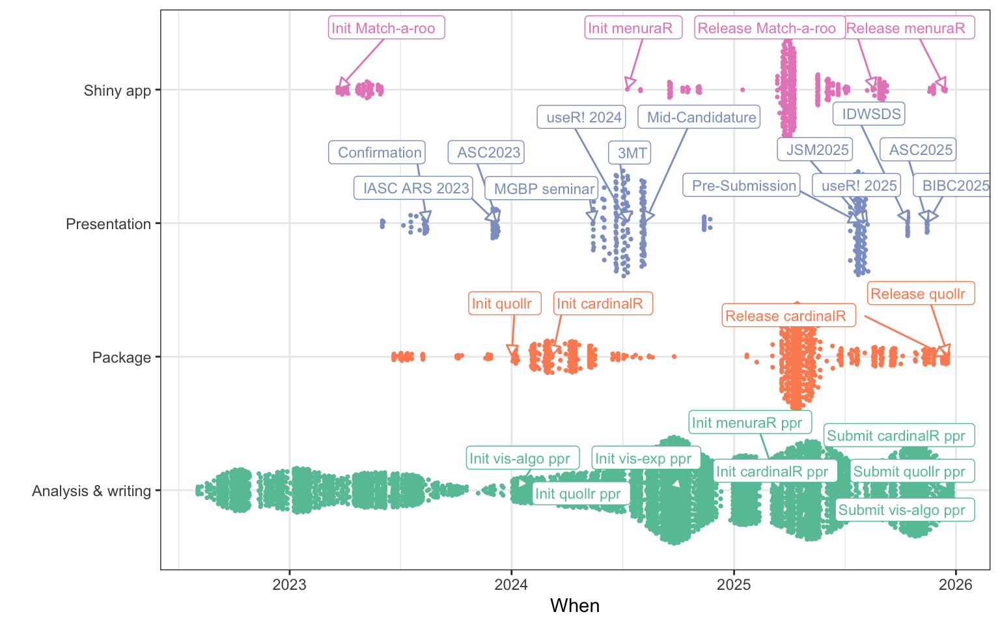
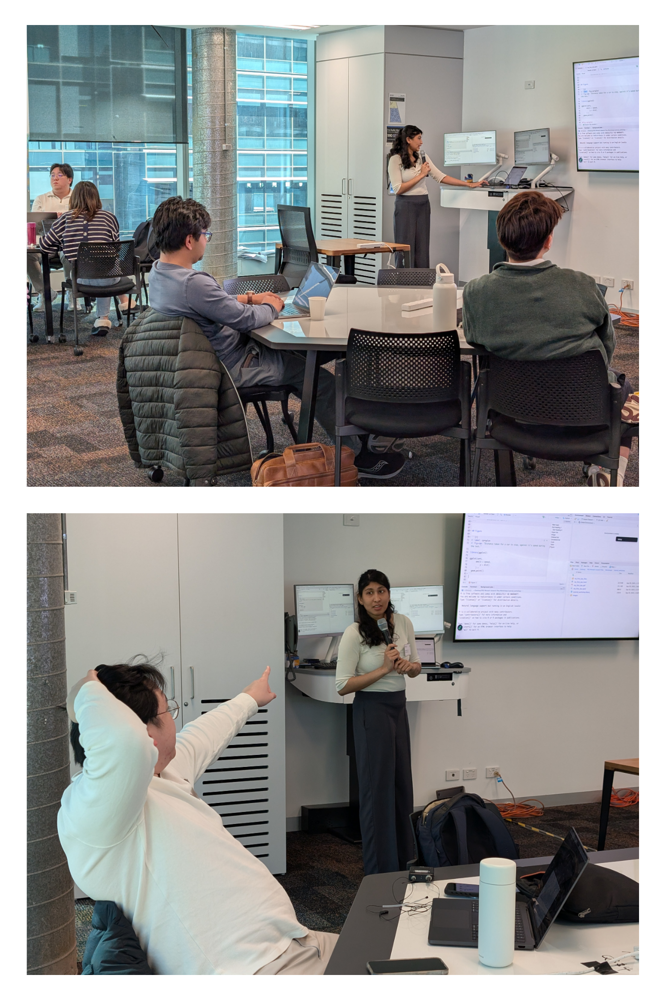
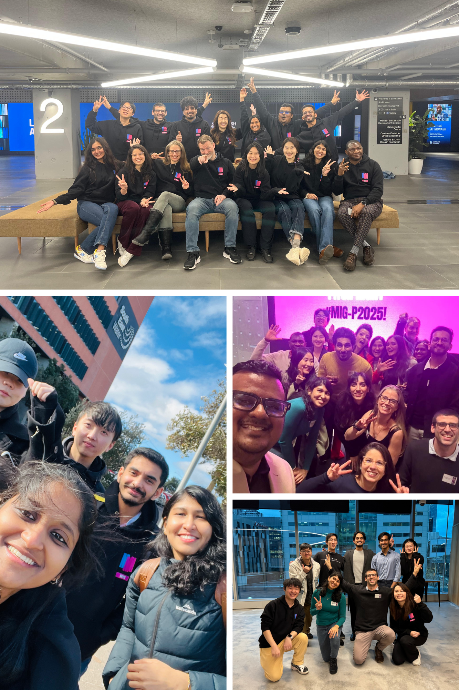

::: {.cell}

:::

# Conclusion and future plans {#sec-conclusion}

This thesis presents five key contributions that collectively advance the understanding and evaluation of NLDR methods. The work introduces a new method and software for NLDR diagnostics, provides insights into how people identify data structures when NLDR layouts and tour views are shown together, develops methods for generating clustering data structures, and implements user-friendly tools that support exploratory analysis and visualization.

## Contributions

The primary contributions of this research are fivefold. First, we introduce a novel method for visualizing how NLDR warps data, thereby improving the diagnostics of NLDR techniques. Second, we develop an R package, `quollr`, which implements the proposed diagnostic method. Third, we create `cardinalR`, a package that generates high-dimensional clustering data structures with enhanced features such as added noise dimensions and background noise. Fourth, we conduct a human-subject experiment to investigate the perception and misperception of NLDR representations, providing evidence on how data structures are identified in NLDR layouts compared to tours. Finally, we develop a Shiny application that offers analysts a user-friendly interface for selecting the most accurate NLDR representation.

## Using a published $2\text{-}D$ NLDR layout as a case study

In the Introduction, a published UMAP layout (*n_neighbors = 30* and *min_dist = 0.3*) of a human PBMC CITE-seq dataset [@hao2021] is used as a motivating example. 
XX Add what we can see in the UMAP layout?

The visualization suggests several clusters with different shapes, including tight, well-separated groups as well as longer, partially overlapping structures. At first glance, it looks convincing. But this immediately raises an important question: *is this really the best way to represent the structure in the high-dimensional PBMC CITE-seq data?*

Looking more closely, the data contain six clusters that sit fairly close to one another. Three of these clusters have nonlinear shapes, two are roughly Gaussian, and one is elliptical, with some background noise mixed in. These kinds of features are common in high-dimensional data and can be difficult to capture accurately in a two-dimensional view. Using the `cardinalR` package, data with this mix of cluster shapes and noise can be generated deliberately, making it easier to explore how different layouts respond to such structure.

To check how well the UMAP layout reflects the original data, the `quollr` framework is used to examine how the layout distorts the high-dimensional space. In this case, a model fitted with a bin width of 0.06 shows that the layout does a reasonably good job overall, but also hints that it may not be the best possible representation.

This naturally leads to the idea of comparing several NLDR layouts rather than relying on just one. The Shiny app `menuraR` makes this comparison easier by allowing different layouts and parameter settings to be explored side by side. Together, these tools highlight the core motivation of this thesis: helping analysts move beyond default settings and visually appealing plots to make more informed decisions about which NLDR layouts can be trusted.

::: {.cell}

:::

::: {.cell}

:::

## Future work

There are several directions that this work can be developed.

<!--add section on Do you have any plans/ideas to extend this to NDR results that project into more than 2D / do you think that would even be possible (say, for up to 5D projections or so)?. You’ve got one bullet point for your thesis future work section now! You could point Fabian to your paper conclusions where some ideas are suggested.-->

### Extending our algorithm to NLDR representations beyond $2\text{-}D$

A potential direction for future work is extending the current algorithm to NLDR results that project into more than two dimensions. While most existing tools including those developed in this thesis focus on $2\text{-}D$ embeddings, exploring projections into higher dimensions like $3\text{-}D$ or $5\text{-}D$ spaces could provide richer structural information in some settings.

Binning into cubes ($3\text{-}D$ or higher) could be performed relatively easily and used as the basis for constructing a wireframe representation of the fitted model. The algorithm for convex hull computation in $p$-dimensions, as described by @barber1996 and implemented in related software [@stephane2023], serves as inspiration for this approach. Alternatively, a simpler method using $k$-means clustering to obtain centroids in higher-dimensional embeddings might be feasible; however, the challenge would lie in determining how to connect these centroids to form an appropriate wireframe structure.

### Scagnostics to evaluate NLDR

One promising direction for future work is the integration of scagnostics [@leland2008; @dang2014] as an additional tool for evaluating NLDR results. Scagnostics provide a set of quantitative shape-based metrics (e.g., convexity, skewness, stringiness, clumpiness) that describe the geometric characteristics of scatterplots. By applying these metrics to $2\text{-}D$ scatterplots generated by NLDR methods, we could obtain an objective assessment of how well these methods preserve or distort data structures, particularly in relation to their characteristics (eg: nonlinearity).

Moreover, investigating how scagnostic profiles vary with different sample sizes for specific underlying data structures would provide valuable insight into the stability and robustness of NLDR methods. This could help identify which methods are more resilient to changes in sample size and which structures are more prone to distortion under small sample sizes.

### Compare prediction approaches

Future work includes evaluating and comparing the prediction capabilities of different NLDR methods. Only some methods such as UMAP provide built-in functionality [@tomasz2023] to project new high-dimensional observations into an existing low-dimensional embedding. Our approach introduces a general prediction framework that can be applied to any NLDR method. It works by identifying the nearest high-dimensional bin centroid for a new observation and assigning its corresponding $2\text{-}D$ centroid from the fitted model.

Having predictions from both the built-in functions (when available) and our centroid-based method allows for direct performance comparisons. This enables a systematic evaluation of how well different approaches preserve structure when projecting new observations into an existing NLDR space.

### Interactive diagnostic tool for NLDR evaluation

A promising direction for future work is the development of an interactive tool that enables diagnostic evaluation of NLDR methods, particularly in the context of clustering. Since different NLDR techniques and parameter settings can lead to varied low-dimensional representations and possible misclassifications. It is essential to have tools that help users explore and understand the sources of these discrepancies.

We propose building a Shiny-based interactive application that allows users to upload: $2\text{-}D$ and high-dimensional Euclidean distance matrices, NLDR embeddings, and results from spin-and-brush analysis [@cook2000; @wilhelm1999].

Spin-and-brush is a dynamic visual method used to explore clustering structures in high-dimensional numerical data. It is especially helpful in identifying the influence of nuisance variables, structural differences among clusters (e.g., shape or variance), and detecting low-dimensional manifolds embedded in higher dimensions. This functionality can be implemented using the `detourr` package [@casper2025], which supports recording and replaying brushing sequences.

The envisioned tool would allow users to select a specific cluster and a data point of interest and inspect how the data point relates to its cluster through interactive $2\text{-}D$ and high-dimensional distance visualizations.

The user interface could be organized into two panels. The left panel would display the selected cluster and the specific point within the $2\text{-}D$ embedding. The right panel would show a distribution of distances from the selected point to all other points within the same cluster.

Interactive brushing between these panels would help users explore where NLDR methods preserve or distort clustering structure. This tool would not only support more intuitive diagnosis of NLDR performance but could also serve as a foundation for building automated evaluation metrics that align with human interpretation.

### Lineup protocols to evaluate NLDR sensitivity and structure preservation

A valuable extension of this work would be to develop lineup-based evaluation protocols [@andreas2009] for NLDR methods. Lineups, originally introduced as a statistical inference tool for graphical perception, involve presenting a true data plot randomly embedded among a set of null plots generated under a null model. Observers are asked to identify the plot that appears most different, allowing for an assessment of whether a visual structure stands out beyond what might be expected by chance.

Applied to NLDR, lineups could help evaluate how well a $2\text{-}D$ layout preserves the structure of the original high-dimensional data. For example, a lineup could contain one plot of the true NLDR layout and multiple null layouts generated from shuffled or noise-added versions of the data. If participants consistently identify the true layout, it suggests that the NLDR method has effectively preserved meaningful structure.

Lineups could also be extended to study the sensitivity of NLDR methods to hyperparameters. Multiple layouts could be shown, each corresponding to a different hyperparameter setting (e.g., number of neighbors in UMAP or perplexity in tSNE), to evaluate whether small parameter changes lead to perceptually different results. This would allow researchers to quantify the robustness of each method and guide more stable parameter selection.

### Visualizing experimental designs

The main objective of this tool is to visualize and validate results from experiments. It includes a web application that allows users to easily upload their experiment design data and results data for  visualization. Additionally, we plan to incorporate interactive features such as linked selections and filters. While the tool primarily visualizes categorical data, transforming continuous data into intervals can provide a useful way to visualize continuous data as well. 

The initial workflow includes importing the experimental design and results, data preprocessing, $2\text{-}D$ static visualization, $2\text{-}D$ interactive visualization, and dynamic visualization. The data preprocessing steps involve mapping the design data and finding missing responses in the results, transforming the data to a wide format to compute the number of responses for each factor level combination (missing combinations are recorded as $0$), and converting the data into a long format suitable for visualization. For $2\text{-}D$ static plots, `ggplot2` [@hadley2016] is used to provide a clear view of the distribution of counts across various factor levels. `plotly` [@chapman2020] is used to add interactivity, and hovering over the tiles reveals additional information, enhancing the user's ability to interact with and understand the data. The dynamic visualization will show each vertex as a factor level combination, with jittered points representing the number of responses for each factor combination and edges connected with one level change in a factor. Currently, the `detourr` [@casper2025] package is used for the implementation.

<!-- ::: {#fig-fritillaR_sc layout-ncol="1"} -->
<!--  -->

<!-- Screenshots of the (a) 2D, and (b) dynamic  visualizations of **fritillaR**. The [video](https://drive.google.com/file/d/1P1kNR_3aQEC5XXM8IWJCMlDhYz52pK3y/view?usp=sharing) shows the implementation of the `fritillaR`. -->
<!-- ::: -->

### Investigating perception and misperception in NLDR with additional factors

While our current user study has focused on how the distance between clusters affects human perception of NLDR layouts, there remain several important factors that could further influence perception and misperception. A promising direction for future work is to systematically explore how variations in data characteristics impact a user's ability to correctly interpret dimensionality-reduced representations.

Specifically, we propose extending the perceptual study to consider:

- Background noise: Adding uniformly or normally distributed noise to the data can obscure true structure, and it is important to understand how different NLDR methods handle such interference and how users respond to it visually.

- Number of clusters: As the number of clusters increases, distinguishing them in $2\text{-}D$ may become more challenging, particularly if the separation is subtle or overlaps occur.

- Noise dimensions: Including additional high-dimensional features that contain no signal (i.e., noise variables) can affect NLDR outcomes. We aim to evaluate how this impacts perceived structure.

- Sample size: Varying the number of observations may change both the visual density and the stability of the NLDR projection, influencing the interpretability of patterns.

- Random seed: Since many NLDR methods are stochastic (e.g., tSNE, UMAP), different seeds can lead to different embeddings. It is valuable to understand whether these differences are perceptible to users and how they affect interpretability.

By extending the study to incorporate these data-driven variables, we can build a more comprehensive understanding of when and why human misperception occurs in NLDR layouts, and which methods are more resilient to such distortions. This work will support the development of more robust diagnostics and improve the practical use of NLDR.

### Comparative perceptual study of PCA and NLDR Methods

Another valuable direction for future work is to investigate how PCA compares to NLDR methods in terms of human perception and interpretability. PCA is a linear method widely used for its simplicity and mathematical transparency, whereas NLDR methods often involve nonlinear transformations and hyper-parameter tuning.

By comparing how users interpret and misinterpret PCA layouts versus NLDR generated layouts, we can gain insights into whether linear techniques are inherently easier to understand or whether they may lead to different types of visual distortions. This work would help clarify when PCA is sufficient for visual analysis and when the added complexity of NLDR is warranted, particularly for exploratory tasks that rely on visual intuition.

### Extension for `quollr`

A useful extension to `quollr` would be to link cluster selections between the tour view and the $2\text{-}D$ NLDR layout. This would let users select a cluster in one view and immediately see how it appears in the other, making it easier to compare cluster structure across views.

## Reproducibility and availability

All materials associated with this thesis are openly available to support transparency and reproducible research. The thesis is written in Quarto [@jjallaire2024] and is available in both **HTML** and **PDF** formats. The **HTML version**, which includes interactive figures and linked visualizations, is published at
[jayani-lakshika-phd-thesis.netlify](https://jayani-lakshika-phd-thesis.netlify.app). The **PDF version** of the thesis is available at
[github.com/JayaniLakshika/Monash_PhD_thesis/_book/New-Interactive-Visual-Tools-and-Statistical-Methodology-for-Selecting-and-Evaluating-Non-linear-Dimension-Reduction-Layouts-of-High-Dimensional-Data.pdf](https://github.com/JayaniLakshika/Monash_PhD_thesis/blob/main/_book/New-Interactive-Visual-Tools-and-Statistical-Methodology-for-Selecting-and-Evaluating-Non-linear-Dimension-Reduction-Layouts-of-High-Dimensional-Data.pdf). All source code, data, and software used to generate the analyzes, figures, and results are maintained in a public GitHub repository at
[github.com/JayaniLakshika/Monash_PhD_thesis](https://github.com/JayaniLakshika/Monash_PhD_thesis), enabling full reproduction of this work.

<!--scripts/pkg_cran_info.R-->
The software outputs of this research have been made publicly available to support transparency and reproducibility. The R package `quollr` has been on CRAN since March $2024$ and has received $5041$ downloads from the CRAN mirror; its development version is hosted on GitHub at [github.com/jayanilakshika/quollr](https://github.com/jayanilakshika/quollr). The R package `cardinalR` has been available on CRAN since April $2024$ and has received $4283$ downloads from the CRAN mirror, with the latest development version at [github.com/jayanilakshika/cardinalR](https://github.com/jayanilakshika/cardinalR). @fig-pkg-commit gives an overview of my Git commits to these repositories.

A Shiny application for `quollr` is accessible via one of the mirror sites at [menurar.netlify.app/](https://menurar.netlify.app/), with its source code available at [github.com/JayaniLakshika/menuraR](https://github.com/JayaniLakshika/menuraR). The survey web application, **Match-a-roo** ([https://ebsmonash.shinyapps.io/Match-a-roo/](https://ebsmonash.shinyapps.io/Match-a-roo/)), was designed and implemented in Shiny to collect participant responses and demographic information. Each subject accessed the survey through the [shinyapps.io](https://www.shinyapps.io/) server.

<!--scripts/git_commits.R-->

::: {.cell}
::: {.cell-output-display}
{#fig-pkg-commit width=768}
:::
:::

## Supporting R packages

<!--need to update at the end of writing-->
In addition, a number of R packages were essential in the development of this work, including `tidyverse` [@hadley2019], `ggbeeswarm` [@erik2023], `ggrepel` [@kamil2024], `GGally` [@barret2025], `colorspace` [@achim2020], `scales` [@hadley2025], `patchwork` [@thomas2024], `plotly` [@chapman2020], `crosstalk` [@joe2023], `htmltools` [@joe2024], `quollr` [@jayani2025a], `cardinalR` [@jayani2025b], `detourr` [@casper2025], `geozoo` [@barret2016], `knitr` [@yihui2015], `kableExtra` [@hao2024], `lme4` [@douglas2015], `broom.mixed` [@ben2024], `emmeans` [@russell2025], `mclust` [@scrucca2023], `fpc` [@christian2024], `binom` [@sundar2022], `conflicted` [@hadley2023], `ggforce` [@thomas2025], `here` [@kirill2025], `grid` [@core2025], `gridExtra` [@baptiste2017], and `png` [@simon2022].

To generate alt-text for figures, the [autoAlt](https://github.com/numbats/autoAlt) package is used as an initial guide.

## Research workflow and project organization

Presentations, package development, and writing are the three primary types of activities that shape this thesis. I have developed a habit of using Git and Github to track and synchronize my academic work since I started the PhD program. All commits are grouped by the activity types, with annotations of important milestones, shown in @fig-task-commit. It has been a fruitful program.

<!--scripts/git_commits.R-->

::: {.cell}
::: {.cell-output-display}
{#fig-task-commit width=100%}
:::
:::

## Planning and design software

In addition to the completed methods and software presented in this thesis, a large amount of exploratory planning and design work went into the development of the R packages `quollr` (@fig-workquollr) and `cardinalR` (@fig-workcardinalR), as well as the Shiny application `menuraR` (@fig-workmenuraR). This includes personal working sheets, sketches, and early conceptual diagrams that show how initial ideas gradually evolved into the implemented software tools.

::: {.cell}
::: {.cell-output-display}
{#fig-workquollr fig-pos='H' width=80%}
:::
:::

::: {.cell}
::: {.cell-output-display}
{#fig-workcardinalR fig-pos='H' width=80%}
:::
:::

::: {.cell}
::: {.cell-output-display}
{#fig-workmenuraR fig-pos='H' width=80%}
:::
:::

## Software names

Each software name is inspired by an animal. `quollr` is named after the **quoll**, a carnivorous, curious, and endangered marsupial from Australia. `cardinalR` is inspired by the North American **cardinal bird**. `menuraR` comes from Australia’s lyrebirds (**Menura**), famous for their elaborate courtship displays and extraordinary ability to mimic sounds.

## Presentations

I presented my research work at $12^{th}$-Conference of the Asian Regional Section of the International Association for Statistical Computing (IASC-ARS 2023) (Wollongon, Australia), Australian Statistical Conference (ASC 2023) (Wollongon, Australia), Bioinformatics Seminar 2024, Victorian branch of the Australian and New Zealand Industrial and Applied Mathematics Society (VicANZIAM) 2024 (RMIT university, Melbourne, Australia), Faculty of BusEco Three Minute Thesis (3MT) competition 2024, useR! 2024 (Salzburg, Austria), Graphics Group Presentation 2024 (Nebraska, USA), UNO Data Science Club 2024 (Omaha, USA), Joint Statistical Meetings (JSM) 2025 (Nashville, USA), useR! 2025 (Durham, USA), Biometrics in the Bush Capital (BIBC2025) (Canberra, Australia), and Australian Statistical Conference (ASC 2025) (Perth, Western Australia) (@fig-mem).

## Visiting

In July $2024$, I had the privilege of visiting A/Prof Ursula Laa at the University of Natural Resources and Life Sciences, Vienna (BOKU University), accompanied by Prof Di Cook, Prof Eun-Kyung Lee, and Dr Natalia da Silva. During this visit, I engaged with academic staff, students, and fellow visitors at BOKU University, gaining valuable insights into their research and receiving constructive feedback on my work and its potential contributions to ongoing projects (@fig-mem Vienna). <!--I am deeply grateful to my main supervisor, Prof. Di Cook, for organizing this visit, and to A/Prof. Ursula Laa for graciously hosting me.-->

From late October to late December $2024$, I visited Prof Heike Hofmann, A/Prof Susan VanderPlas, and Dr Michelle Graham at the University of Nebraska, Lincoln, USA (UNL) (@fig-mem Nebraska). During this time, I presented my research on high-dimensional data visualization and dimension reduction techniques, participated in the Nebraska R User Group meetings, and joined discussions with the Graphics Group, which provided rich opportunities for collaboration and learning. <!--I am grateful to Prof. Di Cook for organizing this visit, to Prof. Heike Hofmann and A/Prof. Susan VanderPlas for inviting me, and to Dr. Michelle Graham for taking the time to meet during my stay.-->

These visits were invaluable for broadening my perspective, fostering meaningful exchanges with experts, and deepening my understanding of dynamic visualization and multivariate data analysis. I also explored several resources that informed my work, including research on dynamic tours for high-dimensional data, parallel coordinate plots, perceptual accuracy in visualizations, and interactive visualization tools such as *langevitour* and *tourr*.

## Academic service & community engagment

During my PhD, I contributed to the academic and statistical communities through service, leadership, and outreach, supporting inclusive research and knowledge exchange. My roles include NUMBATs Seminar Organizer (Monash University, 2025), Session Chair at useR! 2024 (Salzburg) and ASC 2023 (Wollongong), Tutorial Helper for WOMBATs Tutorials (Monash University, 2022), and organizer for R-Ladies Melbourne (2023). These activities let me connect with diverse audiences, support early-career researchers, and share ideas about stats and computational methods.

## Workshops

I have been part of delivering and preparing materials for [workshops](https://jayanilakshika.netlify.app/workshops) on *Reproducible Reporting and Research with Quarto* (September 2025) and *Reproducible Reporting, Academic Papers, Presentations, and Theses with Quarto* (July 2025), contributing to hands-on training for researchers on reproducible practices and effective research communication (@fig-workshop).

::: {.cell}
::: {.cell-output-display}
{#fig-workshop fig-pos='H' width=30%}
:::
:::

## Mentoring

In July $2025$, I had the privilege of serving as a coach in the Monash Innovation Guarantee Postgraduate (MIG-P) program (@fig-migp). Over three inspiring weeks, I worked with a diverse cohort of master’s students as they tackled real-world, industry-defined challenges. It was an incredible experience to support their journey from exploration and ideation through to prototyping and pitching—witnessing their creativity, resilience, and ability to thrive in ambiguity.

::: {.cell}
::: {.cell-output-display}
{#fig-migp fig-pos='H' width=30%}
:::
:::

## Additional contributions

I contributed to open-source software development by co-supervising the creation of the `polarisR` package [@divendra2025] during a Google Summer of Code project with Dr. Ursula Laa and Prof. Eun-Kyung Lee, whom I met during my visit to the University of Natural Resources and Life Sciences in Vienna, Austria. `polarisR` is a Shiny application for diagnosing $2\text{-}D$ NLDR layouts using the `quollr` implementation. It also supports comparing how the data appear in high dimensions through various tour methods, including scatter, sage, and slice.

## Teaching

I have contributed to teaching a range of undergraduate and postgraduate courses in statistics, data analysis, and machine learning. These include *Statistical Thinking* ([ETC5242], 2025; [ETC2420], 2025), *Introduction to Data Analysis* ([ETC5510], 2024; [ETC1010], 2024), *Introduction to Machine Learning* ([ETC3250], 2023–2024; [ETC5250], 2023–2025), and *Exploratory Data Analysis* ([ETC5521], 2023). 

## Final thoughts

This journey has been as much about exploring the unknown as it has been about developing resilience and insight along the way. I am deeply grateful for the people, places, and lessons that have shaped both this work and the path forward.

::: {.cell layout-align="center"}
::: {.cell-output-display}
{#fig-mem fig-align='center' width=768}
:::
:::

