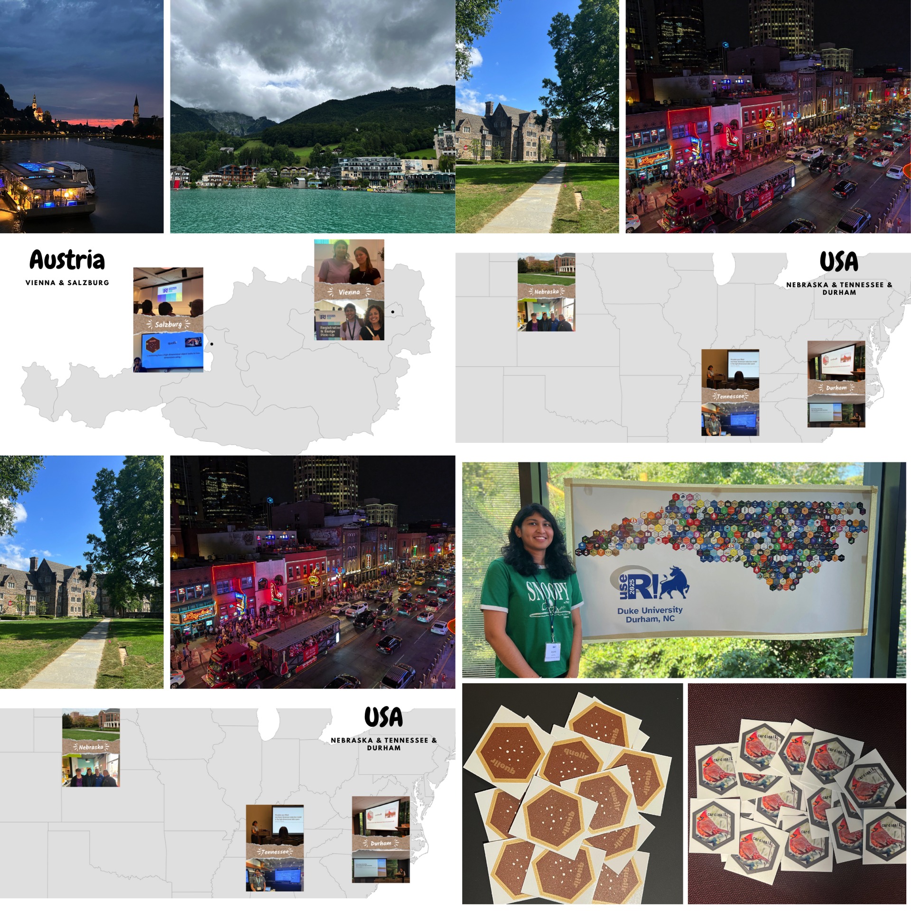

# Conclusion and future plans {#sec-conclusion}

This thesis presents four key contributions that collectively advance the understanding and evaluation of NLDR methods. The work improves NLDR diagnostics, provides insights into human perception of high-dimensional structures, develops methods for generating clustering data structures, and implements user-friendly software tools that support exploratory analysis and visualization.

## Contributions

The primary contributions of this research are fourfold. First, we introduce a novel method for visualizing how NLDR warps data, thereby improving the diagnostics of NLDR techniques. Second, we conduct a human subject experiment to investigate the perception and misperception of NLDR representations, providing evidence on how clusters at varying distances are identified in comparison to high-dimensional tours. Third, we develop two R packages: `quollr`, which implements the proposed diagnostic method, and `cardinalR`, which generates high-dimensional data structures with enhanced features such as added noise dimensions and background noise. Finally, we create a Shiny application that provides analysts with a user-friendly interface for obtaining the most accurate NLDR representation.

<!--scripts/pkg_cran_info.R-->
The software outputs of this research have been made publicly available to support transparency and reproducibility. The R package `quollr` has been on CRAN since March $2024$ and has received $3656$ downloads from the CRAN mirror; its development version is hosted on GitHub at [https://github.com/jayanilakshika/quollr](https://github.com/jayanilakshika/quollr). The R package `cardinalR` has been available on CRAN since April $2024$ and has received $3862$ downloads from the CRAN mirror, with the latest development version at [https://github.com/jayanilakshika/cardinalR](https://github.com/jayanilakshika/cardinalR). A Shiny application for `quollr` is accessible via one of the mirror sites at [https://menurar.netlify.app/](https://menurar.netlify.app/), with its source code available at [https://github.com/JayaniLakshika/menuraR](https://github.com/JayaniLakshika/menuraR).

<!--scripts/git_commits.R-->

::: {.cell}
::: {.cell-output-display}
{width=768}
:::
:::

The survey web application, **Match-a-roo** ([https://ebsmonash.shinyapps.io/Match-a-roo/](https://ebsmonash.shinyapps.io/Match-a-roo/)), was designed and implemented in Shiny to collect participant responses and demographic information. Each subject accessed the survey through the shinyapps.io server.

All materials associated with this thesis are openly available at [https://github.com/JayaniLakshika/Monash\_PhD\_thesis](https://github.com/JayaniLakshika/Monash_PhD_thesis), reflecting the principles of transparency and reproducible research. The thesis itself is written in Quarto [@Allaire_Quarto_2024] and published online at [https://jayani-lakshika-phd-thesis.netlify.app](https://jayani-lakshika-phd-thesis.netlify.app).

In addition, a number of R packages were essential in the development of this work, including `tidyverse` [@tidyverse], `lmtest` [@lmtest], `kableExtra` [@kableextra], `patchwork` [@patchwork], `glue` [@glue], `ggpcp` [@ggpcp], `here` [@here], and `knitr` [@knitr]. (Final package list to be confirmed upon completion of writing.)

## Add about polarisR as well.

## Future work

There are several directions that this work can be developed.

<!-- - Scagnostics to evaluate NLDR -->
<!-- - 3D NLDR investigation (rather than using hexbin centroids, use kmeans to investigate the model in 3D) -->
<!-- - Prediction with model built (UMAP has already develped prediction function, can compare that with ours) -->
<!-- - More diagnostics for NLDR (diadem app) -->
<!-- - Visualizations to validate experiment design/results -->
<!-- - Investigate perception and misperception happening with background noise, number of clusters, noise dimensions, sample size, seed. -->
<!-- - lineup for NLDR (preservation of the data struture, sensitivity of hyperparameters) -->
<!-- - With different sample sizes how scagnostics change for specific data structures -->

<!--add section on Do you have any plans/ideas to extend this to NDR results that project into more than 2D / do you think that would even be possible (say, for up to 5D projections or so)?. You’ve got one bullet point for your thesis future work section now! You could point Fabian to your paper conclusions where some ideas are suggested.-->

### Extending our algorithm to NLDR representations beyond $2\text{-}D$

A potential direction for future work is extending the current algorithm to NLDR results that project into more than two dimensions. While most existing tools including those developed in this thesis focus on $2\text{-}D$ embeddings, exploring projections into higher dimensions like $3\text{-}D$ or $5\text{-}D$ spaces could provide richer structural information in some settings.

Binning into cubes ($3\text{-}D$ or higher) could be performed relatively easily and used as the basis for constructing a wireframe representation of the fitted model. The algorithm for convex hull computation in $p$-dimensions, as described by @barber1996 and implemented in related software (@stephane2023), serves as inspiration for this approach. Alternatively, a simpler method using $k$-means clustering to obtain centroids in higher-dimensional embeddings might be feasible; however, the challenge would lie in determining how to connect these centroids to form an appropriate wireframe structure.

### Scagnostics to evaluate NLDR

One promising direction for future work is the integration of scagnostics (@leland2008, @dang2014) as an additional tool for evaluating NLDR results. Scagnostics provide a set of quantitative shape-based metrics (e.g., convexity, skewness, stringiness, clumpiness) that describe the geometric characteristics of scatterplots. By applying these metrics to $2\text{-}D$ scatterplots generated by NLDR methods, we could obtain an objective assessment of how well these methods preserve or distort data structures, particularly in relation to their characteristics (eg: non-linearity).

Moreover, investigating how scagnostic profiles vary with different sample sizes for specific underlying data structures would provide valuable insight into the stability and robustness of NLDR methods. This could help identify which methods are more resilient to changes in sample size and which structures are more prone to distortion under small sample sizes.

<!-- ### Extend our algorithm to $3-\text{D}$ -->

<!-- A natural extension of this work is to explore and evaluate NLDR methods in $3-\text{D}$ space, as $3-\text{D}$ can also be considered a low-dimensional space. While the current framework relies on hexagonal binning to model structure in the $2\text{-}D$ space, adapting this approach to $3-\text{D}$ requires alternative strategies for spatial partitioning. One promising idea is to use k-means clustering in $3-\text{D}$ embeddings to define neighborhood structures and centroids for model fitting. This would enable diagnostic assessment of NLDR performance in $3-\text{D}$ layouts, which may better preserve complex structures in high-dimensional data. -->

<!-- Following this, a comparative evaluation can be conducted to assess whether $2\text{-}D$ or $3-\text{D}$ representations are more appropriate for preserving the underlying structure of the high-dimensional data. -->

### Compare prediction approaches

Future work includes evaluating and comparing the prediction capabilities of different NLDR methods. Only some methods such as UMAP provide built-in functionality (@tomasz2023) to project new high-dimensional observations into an existing low-dimensional embedding. Our approach introduces a general prediction framework that can be applied to any NLDR method. It works by identifying the nearest high-dimensional bin centroid for a new observation and assigning its corresponding $2\text{-}D$ centroid from the fitted model.

Having predictions from both the built-in functions (when available) and our centroid-based method allows for direct performance comparisons. This enables a systematic evaluation of how well different approaches preserve structure when projecting new observations into an existing NLDR space.

### Interactive diagnostic tool for NLDR evaluation

A promising direction for future work is the development of an interactive tool that enables diagnostic evaluation of NLDR methods, particularly in the context of clustering. Since different NLDR techniques and parameter settings can lead to varied low-dimensional representations and possible misclassifications. It is essential to have tools that help users explore and understand the sources of these discrepancies.

We propose building a Shiny-based interactive application that allows users to upload: $2\text{-}D$ and high-dimensional Euclidean distance matrices, NLDR embeddings, and results from spin-and-brush analysis (@cook2000, @wilhelm1999).

Spin-and-brush is a dynamic visual method used to explore clustering structures in high-dimensional numerical data. It is especially helpful in identifying the influence of nuisance variables, structural differences among clusters (e.g., shape or variance), and detecting low-dimensional manifolds embedded in higher dimensions. This functionality can be implemented using the `detourr` package (@casper2024), which supports recording and replaying brushing sequences.

The envisioned tool would allow users to select a specific cluster and a data point of interest and inspect how the data point relates to its cluster through interactive $2\text{-}D$ and high-dimensional distance visualizations.

The user interface could be organized into two panels. The left panel would display the selected cluster and the specific point within the $2\text{-}D$ embedding. The right panel would show a distribution of distances from the selected point to all other points within the same cluster.

Interactive brushing between these panels would help users explore where NLDR methods preserve or distort clustering structure. This tool would not only support more intuitive diagnosis of NLDR performance but could also serve as a foundation for building automated evaluation metrics that align with human interpretation.

### Lineup protocols to evaluate NLDR sensitivity and structure preservation

A valuable extension of this work would be to develop lineup-based evaluation protocols (@andreas2009) for NLDR methods. Lineups, originally introduced as a statistical inference tool for graphical perception, involve presenting a true data plot randomly embedded among a set of null plots generated under a null model. Observers are asked to identify the plot that appears most different, allowing for an assessment of whether a visual structure stands out beyond what might be expected by chance.

Applied to NLDR, lineups could help evaluate how well a $2\text{-}D$ layout preserves the structure of the original high-dimensional data. For example, a lineup could contain one plot of the true NLDR layout and multiple null layouts generated from shuffled or noise-added versions of the data. If participants consistently identify the true layout, it suggests that the NLDR method has effectively preserved meaningful structure.

Lineups could also be extended to study the sensitivity of NLDR methods to hyperparameters. Multiple layouts could be shown, each corresponding to a different hyperparameter setting (e.g., number of neighbors in UMAP or perplexity in tSNE), to evaluate whether small parameter changes lead to perceptually different results. This would allow researchers to quantify the robustness of each method and guide more stable parameter selection.

### Visualising experimental designs

The main objective of this tool is to visualise and validate results from experiments. It includes a web application that allows users to easily upload their experiment design data and results data for visualisation. Additionally, we plan to incorporate interactive features such as linked selections and filters. While the tool primarily visualises categorical data, transforming continuous data into intervals can provide a useful way to visualise continuous data as well. 

The initial workflow includes importing the experimental design and results, data preprocessing, $2\text{-}D$ static visualization, $2\text{-}D$ interactive visualization, and dynamic visualization. The data preprocessing steps involve mapping the design data and finding missing responses in the results, transforming the data to a wide format to compute the number of responses for each factor level combination (missing combinations are recorded as $0$), and converting the data into a long format suitable for visualization. For $2\text{-}D$ static plots, `ggplot2` [@hadley2016] is used to provide a clear view of the distribution of counts across various factor levels. `plotly` [@carson2020] is used to add interactivity, and hovering over the tiles reveals additional information, enhancing the user's ability to interact with and understand the data. The dynamic visualization will show each vertex as a factor level combination, with jittered points representing the number of responses for each factor combination and edges connected with one level change in a factor. Currently, the `detourr` [@casper2024] package is used for the implementation.

<!-- ::: {#fig-fritillaR_sc layout-ncol="1"} -->
<!--  -->

<!-- Screenshots of the (a) 2D, and (b) dynamic visualisations of **fritillaR**. The [video](https://drive.google.com/file/d/1P1kNR_3aQEC5XXM8IWJCMlDhYz52pK3y/view?usp=sharing) shows the implementation of the `fritillaR`. -->
<!-- ::: -->

### Investigating perception and misperception in NLDR with additional factors

While our current user study has focused on how the distance between clusters affects human perception of NLDR layouts, there remain several important factors that could further influence perception and misperception. A promising direction for future work is to systematically explore how variations in data characteristics impact a user's ability to correctly interpret dimensionality-reduced representations.

Specifically, we propose extending the perceptual study to consider:

- Background noise: Adding uniformly or normally distributed noise to the data can obscure true structure, and it is important to understand how different NLDR methods handle such interference and how users respond to it visually.

- Number of clusters: As the number of clusters increases, distinguishing them in $2\text{-}D$ may become more challenging, particularly if the separation is subtle or overlaps occur.

- Noise dimensions: Including additional high-dimensional features that contain no signal (i.e., noise variables) can affect NLDR outcomes. We aim to evaluate how this impacts perceived structure.

- Sample size: Varying the number of observations may change both the visual density and the stability of the NLDR projection, influencing the interpretability of patterns.

- Random seed: Since many NLDR methods are stochastic (e.g., tSNE, UMAP), different seeds can lead to different embeddings. It is valuable to understand whether these differences are perceptible to users and how they affect interpretability.

By extending the study to incorporate these data-driven variables, we can build a more comprehensive understanding of when and why human misperception occurs in NLDR layouts, and which methods are more resilient to such distortions. This work will support the development of more robust diagnostics and improve the practical use of NLDR.

### Comparative perceptual study of PCA and NLDR Methods

Another valuable direction for future work is to investigate how PCA compares to NLDR methods in terms of human perception and interpretability. PCA is a linear method widely used for its simplicity and mathematical transparency, whereas NLDR methods often involve non-linear transformations and hyper-parameter tuning.

By comparing how users interpret and misinterpret PCA layouts versus NLDR generated layouts, we can gain insights into whether linear techniques are inherently easier to understand or whether they may lead to different types of visual distortions. This work would help clarify when PCA is sufficient for visual analysis and when the added complexity of NLDR is warranted, particularly for exploratory tasks that rely on visual intuition.

## Final thoughts

Need to add final thoughts later...

::: {.cell}
::: {.cell-output-display}
{width=960}
:::
:::

