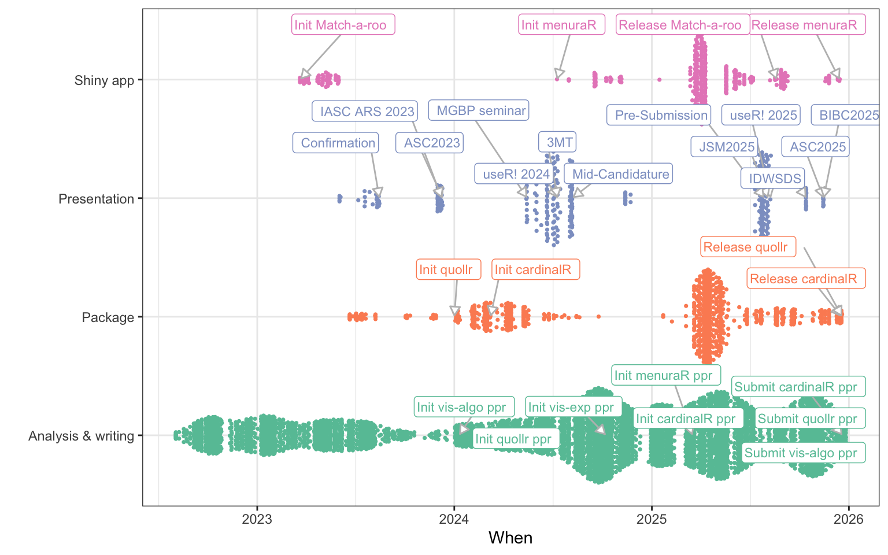

::: {.cell}

:::

# Reproducibility and Availability

All materials associated with this thesis are openly available to support transparency and reproducible research. The thesis is written in Quarto [@jjallaire2024] and is available in both **HTML** and **PDF** formats. The **HTML version**, which includes interactive figures and linked visualizations, is published at
[jayani-lakshika-phd-thesis.netlify](https://jayani-lakshika-phd-thesis.netlify.app). The **PDF version** of the thesis is available at
[github.com/JayaniLakshika/Monash_PhD_thesis/_book/New-Interactive-Visual-Tools-and-Statistical-Methodology-for-Selecting-and-Evaluating-Non-linear-Dimension-Reduction-Layouts-of-High-Dimensional-Data.pdf](https://github.com/JayaniLakshika/Monash_PhD_thesis/blob/main/_book/New-Interactive-Visual-Tools-and-Statistical-Methodology-for-Selecting-and-Evaluating-Non-linear-Dimension-Reduction-Layouts-of-High-Dimensional-Data.pdf). All source code, data, and software used to generate the analyses, figures, and results are maintained in a public GitHub repository at
[github.com/JayaniLakshika/Monash_PhD_thesis](https://github.com/JayaniLakshika/Monash_PhD_thesis), enabling full reproduction of this work.

## Accessibility of figures

To support accessibility, all figures include alt-text. The [autoAlt](https://github.com/numbats/autoAlt) package was used as a starting point for generating these descriptions, which were then reviewed and refined to better reflect the content of each figure and its caption.

## Software availability and usage
<!--scripts/pkg_cran_info.R-->
The software outputs of this research have been made publicly available to support transparency and reproducibility. The R package `quollr`, introduced and used in [Chapter 2](#sec-first-paper) and [Chapter 3](#sec-third-paper), has been on CRAN since March $2024$ and has received $5175$ downloads from the CRAN mirror as of $12^{th}$ January $2026$; its development version is hosted on GitHub at [github.com/jayanilakshika/quollr](https://github.com/jayanilakshika/quollr). The R package `cardinalR`, discussed in [Chapter 4](#sec-fourth-paper), has been available on CRAN since April $2024$ and has received $4407$ downloads from the CRAN mirror as of $12^{th}$ January $2026$, with the latest development version at [github.com/jayanilakshika/cardinalR](https://github.com/jayanilakshika/cardinalR). @fig-pkg-commit gives an overview of my Git commits to these repositories.

<!--scripts/git_commits.R-->

::: {.cell}
::: {.cell-output-display}
{#fig-pkg-commit fig-alt='Two vertically stacked panels show weekly Git commit activity for the R packages cardinalR and quollr. The horizontal axis in each panel represents calendar time, aggregated by week, progressing from earlier to later dates. The vertical axis shows the number of commits made in each week, with scales allowed to differ between panels. Each week is represented by a point, indicating the observed commit count, and a smooth curve overlays the points to show the overall trend in activity over time. Both packages exhibit fluctuating but sustained development, with periods of increased and decreased weekly commits rather than a constant rate. The faceted layout allows comparison of temporal development patterns between the two repositories while preserving their different activity magnitudes.' width=768}
:::
:::

## Web applications

A Shiny application for `quollr`, described in [Chapter 6](#sec-fifth-paper), is accessible via one of the mirror sites at [menurar.netlify.app/](https://menurar.netlify.app/), with its source code available at [github.com/JayaniLakshika/menuraR](https://github.com/JayaniLakshika/menuraR). The survey web application, **Match-a-roo** ([https://ebsmonash.shinyapps.io/Match-a-roo/](https://ebsmonash.shinyapps.io/Match-a-roo/)), was designed and implemented in `Shiny` to collect the data for the experiment discussed in [Chapter 5](#sec-second-paper), participant responses and demographic information. Each subject accessed the survey through the [shinyapps.io](https://www.shinyapps.io/) server.

## Supporting R packages

<!--need to update at the end of writing-->
In addition, a number of R packages were essential in the development of this work, including `tidyverse` [@hadley2019], `ggbeeswarm` [@erik2023], `ggrepel` [@kamil2024], `GGally` [@barret2025], `colorspace` [@achim2020], `scales` [@hadley2025], `patchwork` [@thomas2024], `plotly` [@chapman2020], `crosstalk` [@joe2025], `htmltools` [@joe2024], `quollr` [@jayani2025a], `cardinalR` [@jayani2025b], `detourr` [@casper2025], `geozoo` [@barret2016], `knitr` [@yihui2015], `kableExtra` [@hao2024], `lme4` [@douglas2015], `broom.mixed` [@ben2024], `emmeans` [@russell2025], `mclust` [@scrucca2023], `fpc` [@christian2024], `binom` [@sundar2022], `conflicted` [@hadley2023], `ggforce` [@thomas2025], `here` [@kirill2025], `grid` [@core2025], `gridExtra` [@baptiste2017], and `png` [@simon2022].

## Research workflow and project organization

Presentations, package development, and writing are the three primary types of activities that shape this thesis. Figure @fig-task-commit summarizes my GitHub commits documenting these activities since the start of my PhD, with commits grouped by activity type and annotated with important milestones. It has been a fruitful program.

<!--scripts/git_commits.R-->

::: {.cell}
::: {.cell-output-display}
{#fig-task-commit fig-alt='A single-panel quasirandom scatterplot shows Git commits over time during the PhD, grouped by activity type. The horizontal axis represents time (date of commit), progressing from earlier to later PhD years. The vertical axis lists four categorical activity types: Presentation, Analysis & Writing, Package, and Shiny App. Each commit is shown as a small point, with points horizontally jittered using a quasirandom layout to reduce overlap. Points are coloured by activity type, but no legend is shown. Periods of dense point clusters indicate bursts of commits for a given activity, while sparse regions indicate lower activity. Commit timing varies across activity types, showing that different kinds of work peak at different times rather than occurring uniformly. Selected commits are annotated with text labels and arrows, marking key milestones within each activity category.' width=100%}
:::
:::

